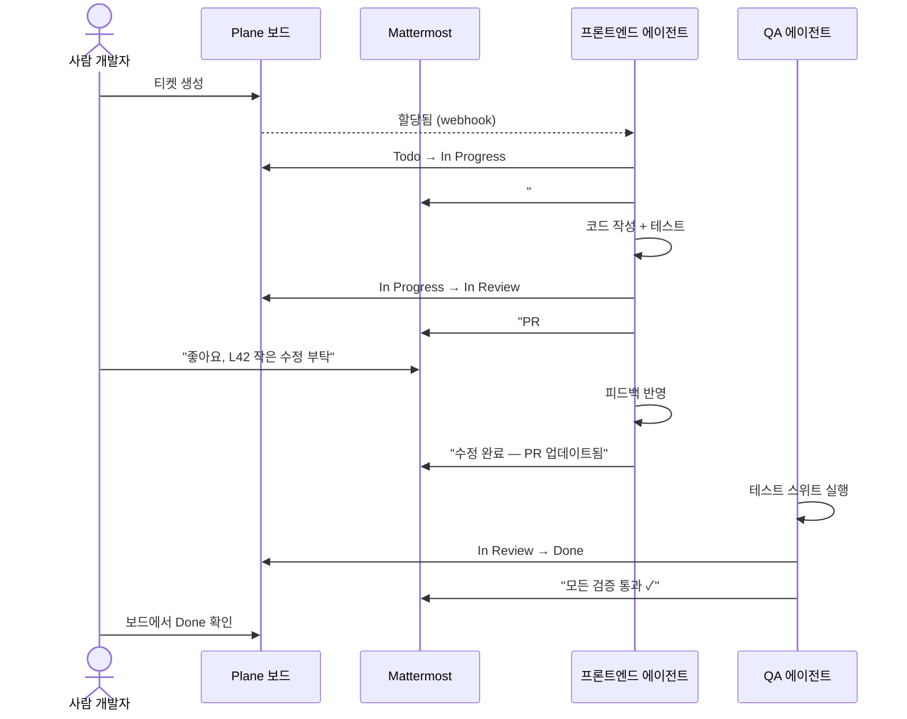
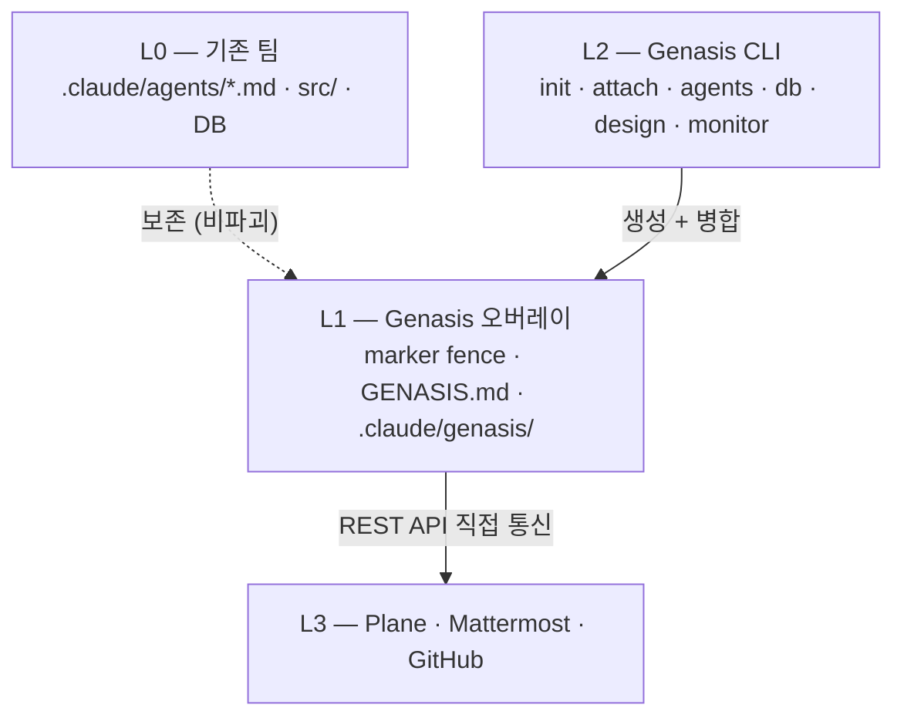

<div align="center">

# Genasis

**AI 에이전트를 진짜 팀원으로 — 사람과 함께 일하게.**

하나의 명령어로 Plane과 Mattermost를 통해 사람 팀원과 동일한 워크플로로 협업하는 에이전트 개발팀을 설치합니다.

[](https://github.com/claude-genasis/genasis/actions/workflows/ci.yml)
[](https://codecov.io/gh/claude-genasis/genasis)
[](https://github.com/claude-genasis/genasis/releases)
[](LICENSE)
[](https://github.com/claude-genasis/genasis/stargazers)
[](rust-toolchain.toml)
[](#지원-플랫폼)

[**English**](README.md)&nbsp;&nbsp;|&nbsp;&nbsp;[**한국어**](README.ko.md)

</div>

---

`genesis` · `genasis` · `agent-creation` · `agent-harness` · `agentic-team` · `agent-team` · `agentic-scrum` · `agentic-sdlc` · `claude-code` · `claude-code-plugins` · `claude-code-subagents` · `agentic-ai` · `ai-agent-orchestration` · `multi-agent-system` · `plane-project-management` · `mattermost-bot` · `sprint-automation` · `tdd` · `scrum-automation` · `coding-agents` · `rust-cli` · `self-hosted-ai` · `ai-software-development`

---

<p align="center">
  
</p>

## 문제

오늘날 AI 코딩 에이전트는 **고립된 도구**입니다:
- 이슈 트래커에서 티켓을 가져가지 않습니다
- 작업하면서 상태를 업데이트하지 않습니다
- 팀 채팅에서 질문하지 않습니다
- 사람이 볼 수 있는 채널에서 다른 에이전트와 협업하지 않습니다
- 사람 개발자와 스프린트 세레모니를 함께하지 않습니다

한편, **Claude Code**를 쓰는 모든 엔지니어링 팀은 결국 같은 접착제를 만듭니다: 에이전트를 Plane/Linear/Jira에 연결하고, Mattermost/Slack 봇을 연동하고, TDD 게이트를 강제하고, 디자인 핸드오프를 관리합니다. 대부분 유지보수하고 싶지 않은 bash 스크립트입니다.

## Genasis가 하는 일

Genasis는 하나의 Rust 바이너리로 AI 에이전트를 **진짜 팀원**으로 만듭니다:

| 기능 | 동작 방식 |
|---|---|
| **에이전트 마켓플레이스** | [ECC](https://github.com/affaan-m/everything-claude-code), [wshobson/agents](https://github.com/wshobson/agents), [VoltAgent](https://github.com/VoltAgent/awesome-claude-code-subagents), [dl-ezo](https://github.com/dl-ezo/claude-code-sub-agents)에서 선별한 20+ 에이전트. 카테고리별 브라우징, 개별/프리셋 설치. |
| **이슈 트래커 연동** | Plane REST API 직접 연동. 에이전트가 티켓 소유, 라이프사이클 전환 (Todo → In Progress → In Review → Done), 하위 이슈 생성. |
| **팀 채팅 연동** | 에이전트 역할당 Mattermost 봇 1개. 티켓당 스레드 1개. 사람과 같은 채널에서 토론, 에스컬레이션, 조정. |
| **비파괴 오버레이** | `.claude/agents/*.md` 안에 marker fence. 기존 에이전트 정의 그대로 보존. `genasis detach`로 깨끗하게 제거. |
| **스프린트 자동화** | 13개 슬래시 명령 + 5개 hook: `/sprint-start`, `/issue-done`, `/db-migrate`, 세션 hook, QA 게이트. |
| **디자인 시스템 관리** | `genasis design swap`으로 디자인 토큰 교체 + 영향 UI 영역 Plane 이슈 자동 생성. |
| **DB 스키마 관리** | SQL guard (읽기 전용), Atlas/Drizzle Kit 마이그레이션, DuckDB raw runner. |
| **실시간 모니터** | Ratatui TUI 대시보드: 스프린트, 토큰, 에이전트 활동, 배포 상태. |
| **완전 가역** | `genasis detach` — genasis가 추가한 모든 것 제거. 잔여물 없음. |

---

## 빠른 체험 — 5분 만에 에이전트 팀 가동

**5단계면 에이전트 팀이 스프린트를 돌립니다.** 서버 설치 불필요.

**1. 설치**

```bash
curl -fsSL https://raw.githubusercontent.com/claude-genasis/genasis/main/install.sh | sh
```

**2. Trial 모드로 초기화** — 운영자 호스팅 데모 [mmplane-trial.realstory.blog](https://mmplane-trial.realstory.blog)가 *사용자 팀 전용* 토큰 URL로 브라우저에 열립니다 (로컬 설치 불필요). `--name` 플래그가 trial-app 칸반과 채팅 사이드바로 그대로 전달돼, 데모가 일반 공유 샌드박스가 아닌 *사용자 팀*을 보여줍니다 (ADR-016).

```bash
mkdir marketing-squad && cd marketing-squad
genasis init --trial --name "Marketing Squad"
```

명령 종료 시 복사하기 좋은 요약 박스가 **팀 토큰** (32자 hex) + 토큰이 pre-fill된 **랜딩 URL** 을 출력합니다. Live Trial 화면은 이 토큰이 입력되기 전까지는 활성화되지 않습니다 — 브라우저가 열리면 라이브 트라이얼 탭 상단의 **"팀 토큰을 입력하세요"** 바를 찾으세요. 랜딩 URL을 그대로 붙여넣었다면 이미 채워져 있고, 도메인만 열었다면 토큰을 그 바에 붙여넣어 연결합니다 (ADR-017 §6). 모든 Live Trial 기능(칸반, 채팅, 쇼케이스 패널)은 유효한 토큰이 연결될 때까지 비활성 상태로 유지됩니다 — 이게 사용자 팀의 칸반 카드를 다른 모든 동시 데모와 분리하는 multi-tenant partition gate 입니다.

**3. 샘플 PRD 생성** — 에이전트가 바로 작업할 수 있는 요구사항 문서

```bash
genasis example prd
```

**4. 에이전트 팀 가동**

```bash
genasis init
```

**5. 스프린트 모니터링**

```bash
genasis monitor
```

끝입니다. 에이전트 팀이 PRD에서 코드까지 스프린트를 완주했습니다.
디자인 교체, PRD 확장, 에이전트 추가 등 실습은
[**전체 튜토리얼**](docs/ko/TUTORIAL.md)을 참조하세요.

<details>
<summary>소스에서 직접 빌드 (install.sh 대신)</summary>

```bash
git clone https://github.com/claude-genasis/genasis.git && cd genasis && ./build.sh
```

</details>

---

## 단계별 가이드

모든 단계를 직접 통제하고 싶은 팀을 위한 안내입니다.

### 1. 설치

```bash
curl -fsSL https://raw.githubusercontent.com/claude-genasis/genasis/main/install.sh | sh
```

### 2. Plane & Mattermost 준비

Genasis 에이전트는 **Plane** (이슈 관리)과 **Mattermost** (팀 채팅)를 통해 협업합니다.

**방법 A — Trial 서버 (가장 빠름, 설치 불필요)**

운영자의 공유 인프라
[**mmplane-trial.realstory.blog**](https://mmplane-trial.realstory.blog/?tab=signup)
에서 실제 Plane + Mattermost 프로젝트를 한 세트 빌립니다. `실환경 빌리기`
탭에서 짧은 폼을 제출하면 수 분 내 접속 정보를 받습니다. 협의 하에 기간
제한 없이 이용 가능 (ADR-017).

**방법 B — 직접 설치 (완전한 통제)**

```bash
cd servers && ./scripts/setup-user-env.sh && docker compose up -d
```

`setup-user-env.sh` 가 사용자별 포트 쌍을 할당합니다 (기본 베이스
Plane `38400`, Mattermost `38500`. `uid % 50` 오프셋으로 동일
호스트의 여러 사용자 간 충돌 방지). 정확한 포트는 `servers/.env`에
기록 — `grep -E "^(PLANE|MM)_PORT" servers/.env`로 확인. 포트
할당 근거 전체는 [`servers/README.md`](servers/README.md) 참조.

설치 후 인증 정보 설정. Mattermost team id 는 `[mattermost].team_name`
에서 자동 해석되지만, 해석 실패 시 (예: init 시점에 팀이 아직 없음)
`MM_TEAM_ID` 를 명시:

```bash
export PLANE_API_KEY="your-plane-api-key"
export MM_ADMIN_TOKEN="your-mattermost-token"
# 선택 — 자동 해석이 MM 에 도달 못할 때만:
# export MM_TEAM_ID="your-mattermost-team-id"

# `genasis humans sync` 가 신규 사용자를 Plane 에 프로비저닝할 때
# 필요 (이슈 바, v0.5.3): Plane 의 API-key 인증은 사용자 생성을
# 못 함 — admin sign-in 만 가능. `humans sync` 실행 전에 아래를
# 설정하지 않으면 Plane 쪽 프로비저닝이 silently 스킵되고
# Mattermost 쪽만 동작. Step-by-Step §"admin token 발급" 에서 쓴
# god-mode 자격증명을 그대로 쓰면 됨.
# export PLANE_ADMIN_EMAIL="admin@your-domain"
# export PLANE_ADMIN_PASSWORD="strong-password"
```

### 3. 연결 및 시작

```bash
genasis init
```

### 4. 검증

```bash
genasis doctor
```

---

## 에이전트가 사람과 협업하는 방식



Plane 보드나 Mattermost 채널을 보는 사람은 업데이트가 사람에게서 온 건지 에이전트에게서 온 건지 **구분할 수 없고, 구분할 필요도 없습니다.**

## 사용 사례

| 팀 유형 | genasis 활용 방식 |
|---|---|
| **스타트업 (2-5명)** | AI 에이전트로 소규모 팀 배가. 리뷰, 테스트, 보안 스캔을 에이전트가 담당. 기존 Plane + Mattermost에 합류. |
| **에이전시 / 컨설팅** | 클라이언트 프로젝트별 에이전트 팀 즉시 배치. 프리셋 설치 → 바로 생산성. |
| **엔터프라이즈 스쿼드** | 기존 `.claude/agents/`에 비파괴 오버레이. 현재 워크플로 방해 없이 Plane/MM 연동 추가. |
| **솔로 개발자** | Claude Code 구독 하나로 PM + 아키텍트 + QA + 보안 팀 확보. 에이전트가 프로세스를, 당신이 비전을 담당. |
| **오픈소스 메인테이너** | PR 리뷰, 보안 스캐닝, 테스트 강제 자동화. 커뮤니티 기여자가 같은 이슈 스레드에서 에이전트 피드백 확인. |

## CLI 주요 명령

```bash
# 팀 라이프사이클
genasis init                   # Plane 프로젝트 + MM 채널 + 에이전트 설치
genasis attach                 # 기존 에이전트에 오버레이 (비파괴)
genasis detach                 # 오버레이 제거 (완전 가역)
genasis doctor                 # 환경 + 연결 검증
genasis upgrade                # 오버레이 프로토콜 최신화

# 에이전트 마켓플레이스
genasis agents browse          # 카테고리 → 선택 → 설치 (interactive)
genasis agents install <이름>  # 에이전트 1개 설치
genasis agents install --preset web-app  # 프리셋 팀 설치 (9역할)
genasis agents list            # 사용 가능한 에이전트 목록
genasis agents installed       # 이 프로젝트에 설치된 에이전트

# 운영
genasis monitor                # 실시간 TUI 대시보드
genasis design swap <ref>      # 디자인 시스템 교체
genasis db query "SELECT ..."  # 읽기 전용 SQL
genasis lang switch <en|ko>    # 에이전트 언어 전환
```

## 알려진 한계 (v0.5.6)

- **호스팅 trial-app 배포 lag — Quick Path 는 이제 self-healing.** v0.5.5 부터 `ensure_project` / `ensure_channel` 은 `genasis init --trial` 단계에서 팀이 이미 seed 된 것을 탐지하면 auth-free `/api/trial/bootstrap` 로 라우팅 (모든 배포 버전이 받음). 그래서 운영자 배포가 stale 해도 Quick Path 단계 4 가 더는 hard-fail 하지 않음. 다만 agent 런타임이 부르는 downstream call (`create_issue`, `transition`, `post_root`) 은 여전히 legacy `/api/plane/*` / `/api/mattermost/*` 로 가므로 `agents-pool@289876c` 이전 배포에서는 401 가능. 에이전트 동작 중 `/api/plane/issues` / `/api/mattermost/posts` 에 401 발생하면 운영자에게 재배포 요청. 자체 host trial-app 은 항상 contract 맞음.


다음 패치에서 닫을 예정인 documented gap — Linux 의 Quick Path 는
지금도 문제없이 동작하지만, Step-by-Step / Option B 사용자가
부딪힐 수 있는 항목들:

- **Self-host Plane: CSRF 쿠키가 plain HTTP 위에서 `Secure` flag.** 기본 `servers/docker-compose.yml` 스택이 Plane 을 plain `http://localhost:<port>/` 로 노출하는데, Plane 의 `/auth/get-csrf-token/` 은 쿠키에 `Secure` 속성을 붙여서 브라우저가 silently drop 함 → sign-up 폼의 CSRF 검증 실패. 우회: (a) 호스트에서 Caddy 로 self-signed cert + HTTPS 프록시, (b) 첫 admin sign-up 만 브라우저 dev-tools 의 "Disable CSRF check" override 사용. 호스트 Caddy 가 기본으로 TLS terminate 하도록 하는 패치가 로드맵.
- **`genasis agents list / install / browse`**: v1.0.0 카탈로그가 `index.json` 을 `manifest.json` 의 alias 로 publish 하는데, 마켓플레이스 UI 가 기대하는 `agents` / `categories` / `presets` 배열이 빠져 있음. `agents-pool` 에서 패치 진행 중 — 새 카탈로그 ship 되면 바이너리 변경 없이 동작.

## 지원 플랫폼

| 플랫폼 | 사전 빌드 바이너리 (`install.sh`) | 소스 빌드 (`./build.sh`) |
|---|---|---|
| **Linux** x86_64 | ✅ musl 정적 링크 — 모든 배포판 (Alpine, CentOS 7+, RHEL, Debian 10+, Ubuntu 18.04+, Amazon Linux 2, …) | ✅ |
| **Linux** aarch64 | ✅ musl 정적 링크, cross 컴파일 | ✅ |
| **WSL** (Windows Subsystem for Linux) | ✅ — Linux x86_64 바이너리 사용 | ✅ |
| **macOS** (Apple Silicon / Intel) | ⏳ **TBD** — 사전 빌드 바이너리 아직 미제공. Apple Silicon notarisation + cross-compile 서명 작업이 로드맵에 있음 | ✅ — `./build.sh` 현재 동작 |
| **Windows** (네이티브) | ❌ 미지원 — WSL2 사용 | ❌ |

> **왜 Linux 는 musl 정적인가?** GitHub `ubuntu-latest` 러너가 glibc
> 2.39를 ship 해서, 동적 링크 바이너리에 `GLIBC_2.39` floor가 박혀
> 오래된 배포판을 깨먹는다. 릴리스 매트릭스를 `cross` 경유로
> `x86_64-unknown-linux-musl` / `aarch64-unknown-linux-musl`로 전환하면
> glibc 의존이 전혀 없는 완전 정적 바이너리를 만들어준다 — 같은
> tarball이 glibc 2.17 (CentOS 7) 부터 현행 Alpine 까지 그대로
> 동작한다. CI compatibility-smoke 잡이 매 태그마다 패키징된
> 바이너리를 `debian:bullseye` (glibc 2.31) 컨테이너에서 재실행해
> 우발적인 glibc 의존 재유입을 방지한다.

> **macOS 로드맵** — Apple Silicon 네이티브 (`aarch64-apple-darwin`)가
> notarisation flow 가 잡히는 대로 우선 진행. Intel mac 지원은
> best-effort 이며 dropped 될 수 있다. 그 사이 macOS 사용자는
> 소스에서 빌드 — Linux 빌드가 OpenSSL을 피할 수 있게 해준 동일한
> `rustls-tls` feature flag 덕에 macOS 빌드도 self-contained 라서
> `./build.sh`가 Homebrew 사전 설치 없이 그대로 동작한다.

## 아키텍처



## 대안 비교

| 기능 | **Genasis** | [ECC](https://github.com/affaan-m/everything-claude-code) | [wshobson/agents](https://github.com/wshobson/agents) | [VoltAgent](https://github.com/VoltAgent/awesome-claude-code-subagents) |
|---|---|---|---|---|
| 이슈 트래커 연동 (Plane) | ✅ 직접 API | 수동 | — | — |
| 팀 채팅 연동 (Mattermost) | ✅ 역할당 봇 | — | — | — |
| 비파괴 오버레이 | ✅ marker fence | — | — | — |
| 에이전트 마켓플레이스 | ✅ 20+ 에이전트 | 48 (전체 설치) | 185 (플러그인) | 131 (복사) |
| 스프린트 자동화 | ✅ 13명령 + 5hook | — | — | — |
| 디자인 교체 | ✅ | — | — | — |
| 스키마 관리 | ✅ | — | — | — |
| 모니터 TUI | ✅ Ratatui | — | — | — |
| 완전 가역 (detach) | ✅ | — | — | — |
| 단일 바이너리 | ✅ Rust | bash | npm | shell |
| 다국어 | ✅ en/ko | — | — | — |

## 가이드

| 가이드 | 내용 |
|---|---|
| [**상세 빠른 시작**](docs/ko/QUICKSTART.md) | 설치 → 설정 → 첫 스프린트 전체 워크스루 |
| [**서버 설치**](servers/README.md) | Plane + Mattermost를 `docker-compose up` 하나로 자체 호스팅 |
| [**에이전트 마켓플레이스**](docs/ko/AGENTS-MARKETPLACE.md) | 카테고리 브라우징, 프리셋, `/install-agent` 명령 |
| [**디자인 교체**](docs/ko/DESIGN-SWAP-GUIDE.md) | 디자인 시스템 교체, 복원, 오버라이드, EPIC 모드 |
| [**크레딧 & OSS 출처**](docs/ko/CREDITS.md) | genasis가 참조한 오픈소스 프로젝트들 |

## 감사의 말

Genasis는 오픈소스 커뮤니티의 에이전트를 큐레이션하고 통합합니다.
전체 출처 및 링크: [**docs/ko/CREDITS.md**](docs/ko/CREDITS.md).

| 프로젝트 | 활용 내용 | 라이선스 |
|---|---|---|
| [everything-claude-code (ECC)](https://github.com/affaan-m/everything-claude-code) | code-reviewer, architect, security-reviewer 에이전트 | MIT |
| [wshobson/agents](https://github.com/wshobson/agents) | frontend-developer, backend-developer 에이전트 | MIT |
| [VoltAgent](https://github.com/VoltAgent/awesome-claude-code-subagents) | qa-tester, DevOps 에이전트 | MIT |
| [dl-ezo](https://github.com/dl-ezo/claude-code-sub-agents) | planner, 요구사항 라이프사이클 에이전트 | MIT |
| [Plane](https://github.com/makeplane/plane) | 이슈 추적 + 프로젝트 관리 플랫폼 | AGPL-3.0 |
| [Mattermost](https://github.com/mattermost/mattermost) | 팀 메시징 + 봇 플랫폼 | Various |
| [Ratatui](https://github.com/ratatui/ratatui) | 터미널 UI 프레임워크 (모니터 대시보드) | MIT |

## 문서

| | English | 한국어 |
|---|---|---|
| 블루프린트 | [blueprint.md](blueprint.md) | [blueprint.ko.md](blueprint.ko.md) |
| 진행 상황 | [progress.md](progress.md) | [progress.ko.md](progress.ko.md) |
| 아키텍처 | [docs/ARCHITECTURE.md](docs/ARCHITECTURE.md) | [docs/ko/ARCHITECTURE.md](docs/ko/ARCHITECTURE.md) |
| 프로바이더 | [docs/PROVIDERS.md](docs/PROVIDERS.md) | [docs/ko/PROVIDERS.md](docs/ko/PROVIDERS.md) |
| 토큰 이코노믹스 | [docs/TOKEN-ECONOMICS.md](docs/TOKEN-ECONOMICS.md) | [docs/ko/TOKEN-ECONOMICS.md](docs/ko/TOKEN-ECONOMICS.md) |
| ADR | [docs/ADR/](docs/ADR/) | [docs/ko/ADR/](docs/ko/ADR/) |

## 기여

[`CONTRIBUTING.md`](CONTRIBUTING.md)를 참조하세요. **debug-history 패치** 기여도 가능합니다 — fork 없이 `genasis debug submit`으로 현장 수정 사항을 genasis 개선에 반영합니다.

## Star History

<a href="https://star-history.com/#claude-genasis/genasis">
  <picture>
    <source media="(prefers-color-scheme: dark)" srcset="https://api.star-history.com/svg?repos=claude-genasis/genasis&type=Date&theme=dark">
    
  </picture>
</a>

## 라이선스

MIT — [`LICENSE`](LICENSE) 참조.

<div align="center">

AI 에이전트를 고립된 코드 생성기가 아닌, 진짜 팀원으로 만드는 엔지니어링 팀을 위해.

[**English**](README.md)&nbsp;&nbsp;|&nbsp;&nbsp;[**한국어**](README.ko.md)

</div>
