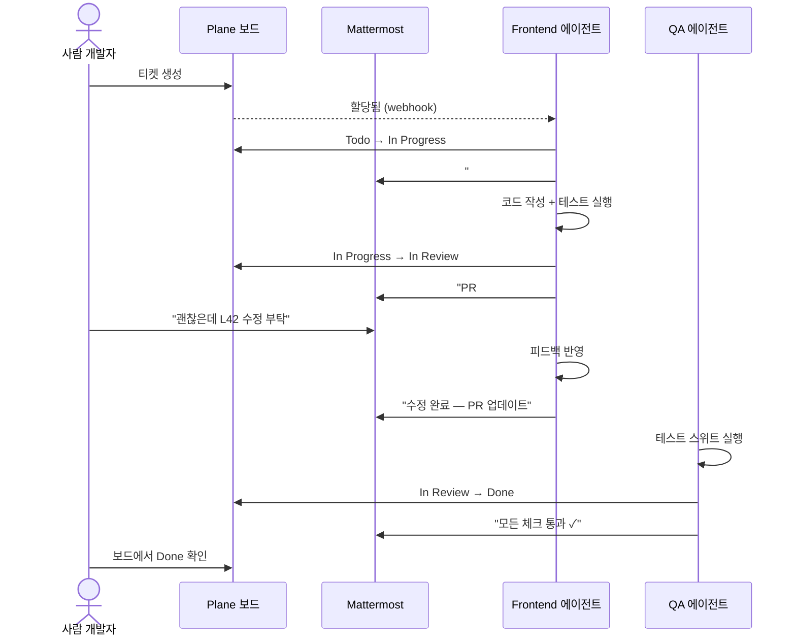
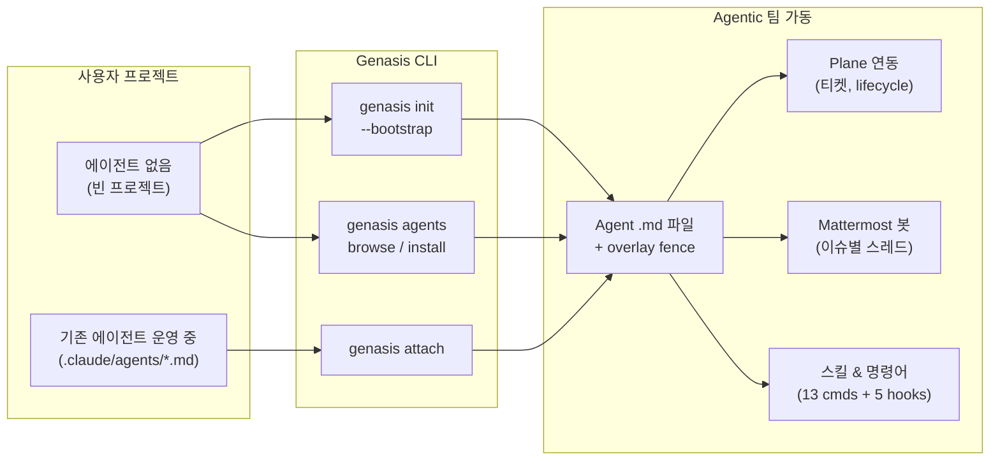
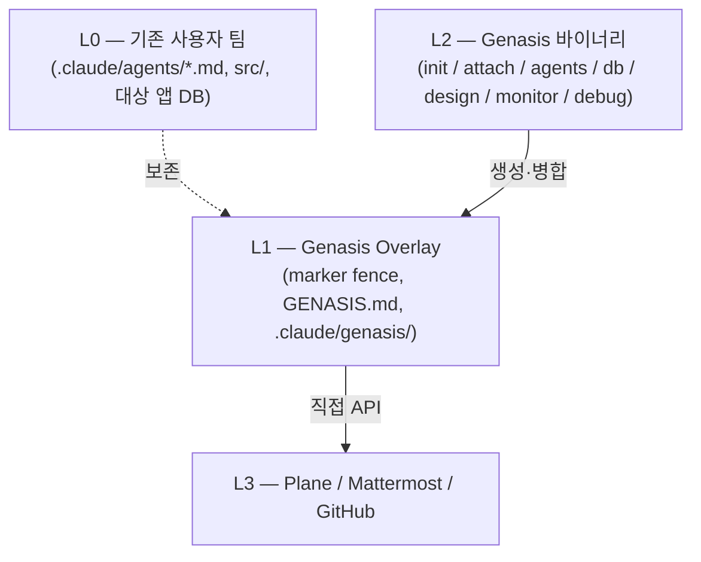

<div align="center">

# Genasis

**AI 에이전트를 사람과 함께하는 정식 팀원으로.**
명령 하나로 Plane과 Mattermost — 사람이 이미 사용하는 도구 — 를 통해 협업하는 완전한 agentic 팀을 설치합니다.

[](https://github.com/claude-genasis/genasis/actions/workflows/ci.yml)
[](https://github.com/claude-genasis/genasis/releases)
[](LICENSE)
[](https://github.com/claude-genasis/genasis/stargazers)
[](https://codecov.io/gh/claude-genasis/genasis)
[](rust-toolchain.toml)

[**한국어**](README.ko.md)&nbsp;·&nbsp;[**English**](README.md)&nbsp;·&nbsp;[새 언어 추가](docs/ko/i18n/CONTRIBUTE-LANG.md)

</div>

---

`claude-code` · `agentic-team` · `agent-orchestration` · `plane-issues` · `mattermost-bot` · `tdd` · `rust-cli` · `multi-agent` · `ratatui` · `i18n` · `한국어` · `에이전트` · `claude-skills`

---

## 문제

오늘날 AI 에이전트는 사일로에 갇혀 있습니다. 코드를 읽고 쓰지만, 팀의 일상 워크플로에 참여하지 않습니다 — 티켓을 가져가지 않고, 이슈 트래커에 상태를 갱신하지 않고, 팀 채팅에서 질문하지 않고, 사람이 쓰는 같은 채널을 통해 서로 조율하지 않습니다.

한편, Claude Code로 팀을 운영하면 결국 같은 6개 레이어를 손으로 짜깁기하게 됩니다 — 이슈 트래킹, 채팅 기반 스크럼, TDD 강제, 디자인 핸드오프, DB 스키마 규율, 에이전트 대시보드. 이 glue의 대부분은 아무도 유지보수하고 싶지 않은 bash입니다.

## Genasis가 하는 일

Genasis는 **단일 Rust 바이너리**로 두 문제를 동시에 해결합니다:

1. **큐레이션된 agentic 팀 설치** — ECC, wshobson, VoltAgent, dl-ezo에서 선별한 20+ 에이전트가 역할, 스킬, 명령어와 함께 제공됩니다. 카테고리별 탐색, 개별 설치, 프리셋(web-app / full-stack / mobile) 설치 모두 가능합니다.

2. **사람의 협업 도구에 연결** — 모든 에이전트가 자체 Plane PAT과 Mattermost 봇을 받습니다. 에이전트가 티켓을 가져가고, 스레드에 상태를 올리고, 질문하고, lifecycle을 전이합니다 (Todo → In Progress → In Review → Done) — 사람 팀이 읽는 같은 보드와 채널에서.

3. **어떤 출발점이든 대응**:
   - **agentic 팀이 없다면?** `genasis init --bootstrap`이 전체 팀 + Plane/Mattermost 프로비저닝까지 처음부터 scaffold합니다.
   - **이미 에이전트를 운영 중이라면?** `genasis attach`가 기존 `.claude/agents/*.md`에 Plane/Mattermost 연동을 marker fence로 비파괴 overlay합니다. fence 밖의 에이전트 정의는 그대로 유지됩니다.

4. **완전 가역** — `genasis detach`가 Genasis가 추가한 모든 것을 제거합니다. Marker fence만. 잔여물 없음.

## 빠른 시작

```bash
curl -fsSL https://raw.githubusercontent.com/claude-genasis/genasis/main/install.sh | sh
```

```bash
sh install.sh --lang ko        # 한국어 에이전트 지시사항
sh install.sh --lang en        # 영어 에이전트 지시사항
sh install.sh --lang both      # 거부됨 — docs/ko/impact-of-multilang-prompts.md 참조
```

## 한눈에 보기

| | |
|---|---|
| **에이전트 카탈로그** | 6개 카테고리 20+ 큐레이션 에이전트. 프리셋: web-app (9), full-stack (11), mobile (9). 런타임에 fetch, 바이너리에 내장 아님. |
| **비파괴 overlay** | `.claude/agents/*.md` 안의 marker fence. `detach`가 모두 제거. |
| **Plane 연동** | 직접 REST API. 에이전트가 티켓 소유, lifecycle 전이, 하위 이슈 생성. upstream/agent-aware Plane 자동 감지. |
| **Mattermost 오케스트레이션** | role별 봇 1개. Plane 이슈별 스레드 1개. 에이전트가 실시간으로 논의·에스컬레이션·조율 — 사람과 함께. |
| **스킬 & 명령어** | 13개 스프린트/이슈 명령어 (`/sprint-start`, `/issue-done`, `/db-migrate`, ...) + 5개 hook (session-start, branch guard, MM sync, ...) 역할별 사전 연결. |
| **TDD 강제** | 모든 In Review → Done 전환에 `unit: pass` + `integration: pass` 전제. |
| **Design hot-swap** | `genasis design swap <ref-url>`가 `docs/design-system.md` 재생성 + 영향 영역 Plane 이슈 자동 발행. |
| **Schema-as-code** | 읽기는 SQL guard, 쓰기는 Atlas / Drizzle Kit / DuckDB raw runner. |
| **Monitor TUI** | Ratatui 대시보드: sprint, tokens, agents, deploy LED, network, log tail. |
| **Debug History** | 상시 드리프트 감지. 필드 수정사항을 `genasis debug submit`으로 genasis 개선에 피드백. |
| **i18n** | 영어/한국어 install-time 선택. atomic `lang switch`. 동시에 한 언어만. |

## 사용법

```bash
# 팀 설정
genasis init                   # 빈 프로젝트 → 팀 + overlay + Plane/MM 프로비저닝
genasis init --bootstrap       # 기본 10개 역할 전체 scaffold
genasis attach                 # 기존 팀 → overlay 부착 (Plane/MM 연동)
genasis detach                 # overlay 제거 (marker fence만)
genasis doctor                 # 환경/도구/locale 검증
genasis upgrade                # overlay 버전 bump (fence hash diff)

# 에이전트 카탈로그
genasis agents browse          # TUI: 카테고리별 에이전트 탐색, 미리보기, 설치
genasis agents install <name>  # 단일 에이전트 설치 (예: frontend-developer)
genasis agents install --preset web-app  # 프리셋 팀 설치 (9개 역할)
genasis agents list            # 사용 가능한 에이전트 목록
genasis agents installed       # 현재 프로젝트에 설치된 것 보기
genasis agents fetch           # 에이전트 카탈로그 다운로드/업데이트

# 운영
genasis monitor                # Ratatui TUI 대시보드
genasis lang status            # 현재 locale
genasis lang switch <en|ko>    # 에이전트 언어 atomic 전환
genasis design swap <ref-url>  # 디자인 시스템 hot-swap
genasis db query "SELECT ..."  # read-only SQL
genasis db migrate             # 스키마 마이그레이션

# 디버그 히스토리 (필드 피드백)
genasis debug status           # 현재 프로젝트 드리프트 요약
genasis debug collect          # 로컬 수정사항에서 익명화 패치 생성
genasis debug submit           # 옵트인: genasis 개선에 패치 기여
```

## 에이전트가 사람과 협업하는 방식



Plane 보드나 Mattermost 채널을 보는 사람이 어떤 업데이트가 사람에게서 온 것인지 에이전트에게서 온 것인지 구분할 수 없고, 구분할 필요도 없습니다.

## Genasis 설치 흐름



## 기여 — Debug History 모델

Genasis는 지속적 개선을 위한 독특한 기여 모델을 사용합니다:

**genasis 저장소를 fork 하거나 clone할 필요가 없습니다.** 그냥 genasis를 사용하세요:

```bash
# 1. genasis를 설치하고 agentic 팀을 평소처럼 운영
genasis attach

# 2. overlay 파일을 수정하여 버그 수정이나 워크플로 적응
#    (genasis가 모든 변경을 자동 추적 — 상시 작동, 설정 불필요)

# 3. 준비되면 익명화된 패치 생성
genasis debug collect

# 4. genasis 개선에 제출 (옵트인, 전송 전 미리보기)
genasis debug submit
#    → 구조화된 패치 데이터로 GitHub Issue 자동 생성
#    → 소스 코드는 절대 포함되지 않음 (overlay diff만)
```

메인테이너가 제출된 패치를 수거하고 로컬 Claude Code (`/debug-review` 스킬)로 처리하여 템플릿 개선을 제안합니다. 기여자는 신호를 제공하고 (무엇이 변경됐고 왜), 메인테이너가 그 신호를 코드로 전환합니다.

일반적인 코드 기여(새 기능, 문서)는 표준 fork + PR — [`CONTRIBUTING.ko.md`](CONTRIBUTING.ko.md) 참조.

## 품질 보증

genasis 팀은 큐레이션된 에이전트 정의가 좋은 개발 결과를 내는지 주기적으로 테스트합니다. 테스트 범위:

- **구조 검증** — frontmatter, tool 선언, overlay 호환성
- **통합** — Plane lifecycle 전이, Mattermost 스레드 생성, 에이전트 간 핸드오프
- **회귀** — 업데이트된 정의가 기존 동작을 깨뜨리지 않는지
- **벤치마크** — 리뷰 정확도, 작업 완수율, 오탐 추적

전체 테스트 방법론은 `agents-pool/agents-test-method.md` 참조.

## 아키텍처



## 비교

| | **Genasis** | ECC | knowledge-work-plugins | claude-code-templates |
|---|---|---|---|---|
| 비파괴 overlay | ✅ | — | — | — |
| Plane (직접 API) | ✅ | 수동 | — | — |
| role별 Mattermost 봇 | ✅ | — | — | — |
| 큐레이션 에이전트 카탈로그 (20+) | ✅ browse/install | — | — | — |
| 스프린트 명령어 + hook | ✅ 13 cmds + 5 hooks | — | — | — |
| Design hot-swap | ✅ | — | — | — |
| Schema-as-code | ✅ | — | — | — |
| Monitor TUI | ✅ Ratatui | — | — | — |
| Debug history 피드백 | ✅ | — | — | — |
| Install-time i18n | ✅ en / ko | — | — | — |
| 단일 Rust 바이너리 | ✅ | bash | npm | npm |

## 문서

| | English | 한국어 |
|---|---|---|
| Blueprint | [`blueprint.md`](blueprint.md) | [`blueprint.ko.md`](blueprint.ko.md) |
| Progress tracker | [`progress.md`](progress.md) | [`progress.ko.md`](progress.ko.md) |
| Architecture | [`docs/ARCHITECTURE.md`](docs/ARCHITECTURE.md) | [`docs/ko/ARCHITECTURE.md`](docs/ko/ARCHITECTURE.md) |
| Providers | [`docs/PROVIDERS.md`](docs/PROVIDERS.md) | [`docs/ko/PROVIDERS.md`](docs/ko/PROVIDERS.md) |
| Genesis 마이그레이션 | [`docs/MIGRATION-FROM-GENESIS.md`](docs/MIGRATION-FROM-GENESIS.md) | [`docs/ko/MIGRATION-FROM-GENESIS.md`](docs/ko/MIGRATION-FROM-GENESIS.md) |
| Token economics | [`docs/TOKEN-ECONOMICS.md`](docs/TOKEN-ECONOMICS.md) | [`docs/ko/TOKEN-ECONOMICS.md`](docs/ko/TOKEN-ECONOMICS.md) |
| Monitor TUI | [`docs/MONITOR.md`](docs/MONITOR.md) | [`docs/ko/MONITOR.md`](docs/ko/MONITOR.md) |
| 다국어 prompt 영향 | [`docs/impact-of-multilang-prompts.md`](docs/impact-of-multilang-prompts.md) | [`docs/ko/impact-of-multilang-prompts.md`](docs/ko/impact-of-multilang-prompts.md) |
| ADR | [`docs/ADR/`](docs/ADR/) | [`docs/ko/ADR/`](docs/ko/ADR/) |

## 상태

Pre-release. M0–M12 + Phase D (design catalog) 완료. **Phase E** (Dynamic Agents Catalog — ADR-011) 진행 중. **Phase F** (Debug History — ADR-012) 설계 완료. 진행은 [`progress.ko.md`](progress.ko.md) 추적.

## Star 추이

<a href="https://star-history.com/#claude-genasis/genasis">
  <picture>
    <source media="(prefers-color-scheme: dark)" srcset="https://api.star-history.com/svg?repos=claude-genasis/genasis&type=Date&theme=dark">
    
  </picture>
</a>

## 라이선스

MIT — [`LICENSE`](LICENSE) 참조.

<div align="center">

AI 에이전트가 코드 생성기가 아니라 진짜 팀원이 되길 원하는 팀을 위해.

[**한국어**](README.ko.md)&nbsp;·&nbsp;[**English**](README.md)

</div>
