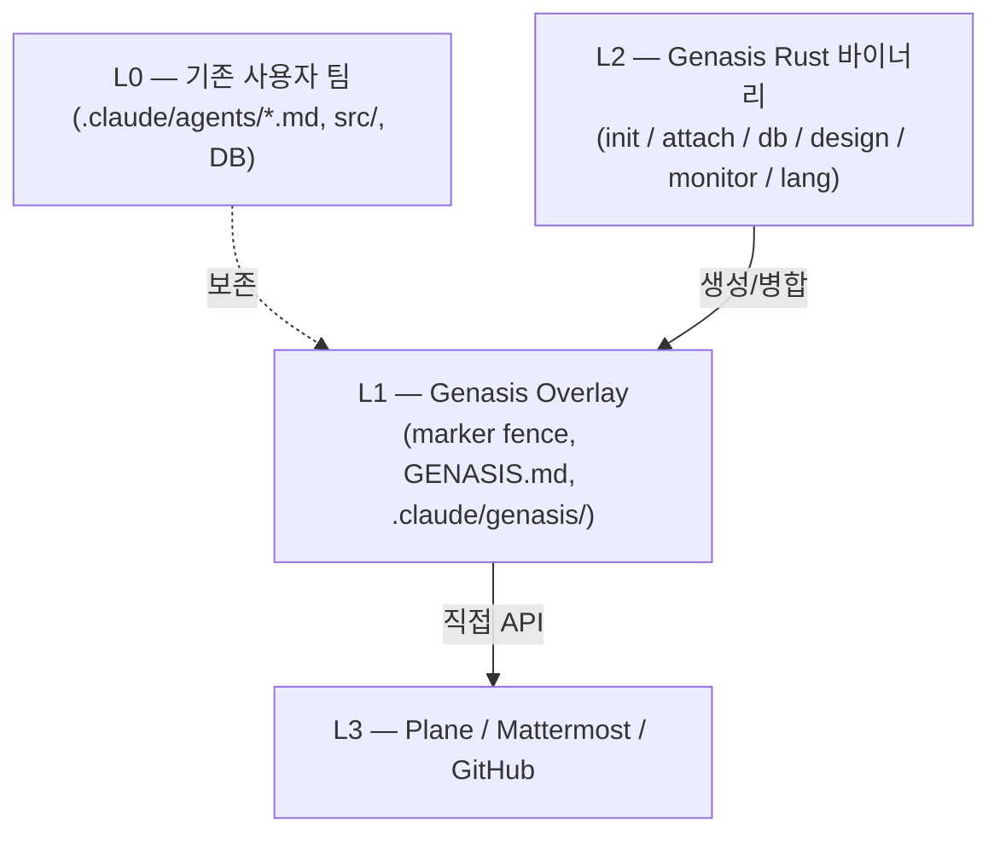

# Genasis

<p align="center">
  <a href="README.md"></a>
  <a href="README.ko.md"></a>
  <a href="docs/ko/i18n/CONTRIBUTE-LANG.md"></a>
</p>

> 🇰🇷 **한국어** | [🇺🇸 English](README.md)

> **Plane × Mattermost × TDD × Design × DB × Monitor — 어떤 Claude Code 에이전트 팀에든 overlay 방식(재작성 X)으로 부착.** curl 한 줄로 설치. 한국어·영어 동시 지원이지만 동시 설치 X — 모델 drift 회피.
>
> 태그: `claude-code` · `agentic-team` · `agent-orchestration` · `plane-issues` · `mattermost-bot` · `tdd` · `rust-cli` · `multi-agent` · `ratatui` · `i18n` · `한국어` · `에이전트` · `클로드` · `claude-skills`

<p align="center">
  <a href="https://github.com/claude-genasis/genasis/actions/workflows/ci.yml"></a>
  <a href="LICENSE"></a>
  <a href="https://github.com/claude-genasis/genasis/releases"></a>
  <a href="https://github.com/claude-genasis/genasis/stargazers"></a>
</p>

---

## 왜 Genasis 인가

- **팀을 다시 짜지 마세요.** Genasis 는 기존 `.claude/agents/*.md` 에 **비파괴 overlay** 를 부착합니다 — marker fence 외부는 한 줄도 건드리지 않습니다.
- **단 하나의 명령으로 Plane + Mattermost + TDD + Design hot-swap + Schema-as-code + Monitor.** 이 레이어들을 직접 짜깁기하는 데 지친 팀을 위한 도구.
- **단일 Rust 바이너리, 설치 시점에 단일 active 언어.** Hot path 에 Python/Node 의존성 없음. 한/영 혼재 컨텍스트 drift 도 없음.

## 빠른 시작

```bash
curl -fsSL https://raw.githubusercontent.com/claude-genasis/genasis/main/install.sh | sh
```

설치기는 `$LANG` 으로 자동 감지하고 한국어/영어 중 선택을 묻습니다. `--lang` 으로 prompt 건너뛰기:

```bash
curl -fsSL .../install.sh | sh -s -- --lang ko        # 한국어
curl -fsSL .../install.sh | sh -s -- --lang en        # 영어
curl -fsSL .../install.sh | sh -s -- --lang both      # 거부됨 — 이유는 아래 ↓
```

`--lang both` 는 의도적으로 거부됩니다. 두 언어를 동시에 overlay 하면 Claude Code 가 응답 중간에 언어를 섞기 시작합니다 ([docs/ko/impact-of-multilang-prompts.md](docs/ko/impact-of-multilang-prompts.md) 참조). 나중에 `genasis lang switch <lang>` 로 atomic 교체하세요.

## 기능

| | |
|---|---|
| 🔗 **Plane 연동** | 직접 REST (MCP 안 씀). upstream vs agent-aware flavor 자동 감지. [문서](docs/ko/PROVIDERS.md) |
| 💬 **Mattermost 봇** | role 별 봇 1개, Plane 이슈별 스레드. |
| 🧪 **TDD 강제** | In Review → Done 전환 전제로 `unit: pass` + `integration: pass` 필수. |
| 🎨 **Design hot-swap** | `genasis design swap <ref-url>` 로 `docs/design-system.md` 재생성 + 영향 영역 Plane 이슈 자동 발행. |
| 🗄 **Schema-as-code** | 읽기는 SQL guard 통과, 쓰기는 Atlas / Drizzle Kit / DuckDB raw runner. |
| 📊 **Monitor TUI** | Ratatui 대시보드: sprint, tokens, agents, deploy LED, network, log tail. |
| 🌐 **i18n** | 영어/한국어 install-time 선택. `--lang both` 거부. `genasis lang switch` 로 atomic 교체. |
| 💰 **Token economics** | RTK 자동 wrap + Anthropic prompt-cache 친화적 stable prefix + trim hook. |

## 데모

(`docs/assets/demo.cast` 의 asciinema 영상은 첫 release 후 추가 예정.)

## 문서

| 문서 | 영어 mirror |
|---|---|
| [`blueprint.ko.md`](blueprint.ko.md) | [`blueprint.md`](blueprint.md) |
| [`progress.ko.md`](progress.ko.md) | [`progress.md`](progress.md) |
| [`docs/ko/ARCHITECTURE.md`](docs/ko/ARCHITECTURE.md) | [`docs/ARCHITECTURE.md`](docs/ARCHITECTURE.md) (영어 번역 대기) |
| [`docs/ko/PROVIDERS.md`](docs/ko/PROVIDERS.md) | [`docs/PROVIDERS.md`](docs/PROVIDERS.md) (영어 번역 대기) |
| [`docs/ko/MIGRATION-FROM-GENESIS.md`](docs/ko/MIGRATION-FROM-GENESIS.md) | [`docs/MIGRATION-FROM-GENESIS.md`](docs/MIGRATION-FROM-GENESIS.md) (영어 번역 대기) |
| [`docs/ko/TOKEN-ECONOMICS.md`](docs/ko/TOKEN-ECONOMICS.md) | [`docs/TOKEN-ECONOMICS.md`](docs/TOKEN-ECONOMICS.md) (영어 번역 대기) |
| [`docs/ko/MONITOR.md`](docs/ko/MONITOR.md) | [`docs/MONITOR.md`](docs/MONITOR.md) (영어 번역 대기) |
| [`docs/ko/impact-of-multilang-prompts.md`](docs/ko/impact-of-multilang-prompts.md) | [`docs/impact-of-multilang-prompts.md`](docs/impact-of-multilang-prompts.md) |
| [ADR-001 ~ ADR-007 (한국어)](docs/ko/ADR/) | [ADR-001 ~ ADR-008 (영어)](docs/ADR/) |

> **번역 상태**: ADR-008 (i18n 결정) 은 영어 source-of-truth. 나머지 영어 mirror 는 stub 상태이며 한국어 canonical 을 가리킵니다. 각 release tag 직전에 release-prep 워크플로가 자동으로 `[i18n] Translation completion for vX.Y.Z` PR 을 엽니다.

## 아키텍처



## 비교

| 기능 | Genasis | ECC | knowledge-work-plugins | claude-code-templates |
|---|---|---|---|---|
| 비파괴 overlay | ✅ | — | — | — |
| Plane 연동 | ✅ 직접 API | 수동 | — | — |
| Mattermost 봇 오케스트레이션 | ✅ agent 별 | — | — | — |
| Design hot-swap | ✅ | — | — | — |
| Schema-as-code | ✅ Atlas/Drizzle/raw | — | — | — |
| Monitor TUI | ✅ Ratatui | — | — | — |
| Install-time i18n (en/ko) | ✅ active singularity | — | — | — |
| 단일 Rust 바이너리 | ✅ | — (bash) | — (npm) | — (npm) |

## 로드맵

마일스톤별 추적은 [`progress.ko.md`](progress.ko.md) 참조. 현재 **M12 — 다국어 지원** 진행 중.

주요 마일스톤:

- M0–M11 (2026-05-03) — workspace 부트스트랩, provider, DB 커널, design hot-swap, monitor TUI, ADR 1–7
- **M12 (현재)** — install-time `--lang` selector, rust-i18n 런타임, 듀얼 트리 문서, release-prep 자동화
- v0.1.0 (예정) — M12.7.b 번역 완성 후 첫 공개 release

## 기여

새 언어 추가 전 [`docs/ko/i18n/CONTRIBUTE-LANG.md`](docs/ko/i18n/CONTRIBUTE-LANG.md) 를 읽으세요. 그 외에는 추가하고 싶은 항목을 Issue 로 열어 마일스톤 추적에 맞춰드립니다.

PR 컨벤션:

- Conventional Commits (`feat / fix / docs / chore / i18n`).
- 모든 user-facing 문자열은 `t!()` 를 거쳐 **`en.yml` 과 `ko.yml` 양쪽**에 들어갑니다.
- 영어 문서 변경은 한국어 mirror 도 같이 갱신하거나 `lint-i18n` warning 을 감수합니다. Release tag 시점엔 drift hard-fail.

## Star 추이

<a href="https://star-history.com/#claude-genasis/genasis">
  
</a>

## 라이선스

MIT — [LICENSE](LICENSE) 참조.

---

### 다른 언어 / Other languages
- 🇰🇷 [한국어](README.ko.md)
- 🇺🇸 [English](README.md)
