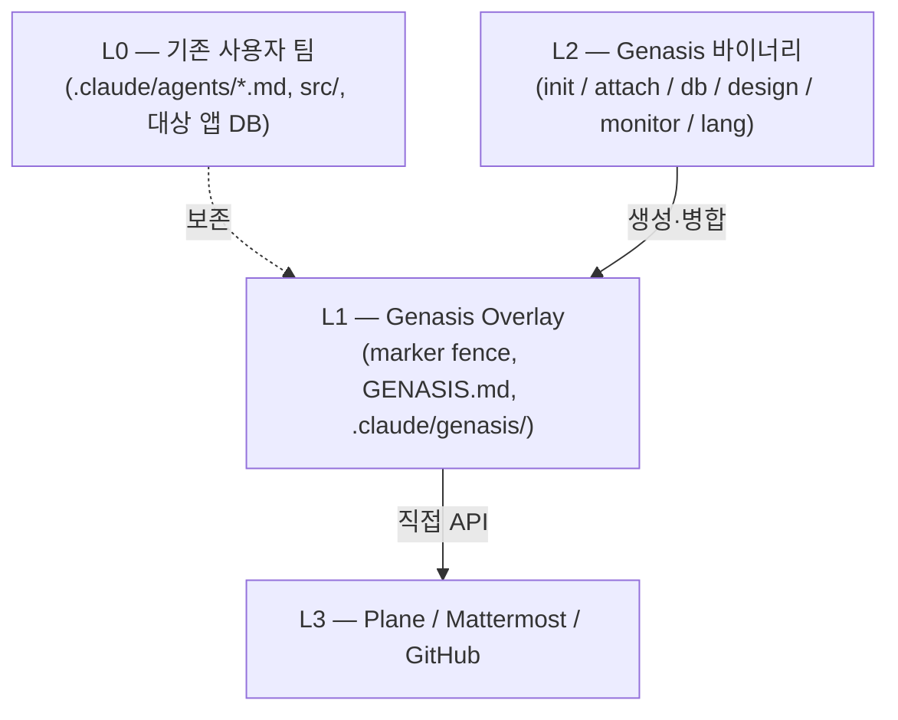

<div align="center">

# Genasis

**Claude Code 용 bolt-on 에이전트 팀 레이어.**
Plane × Mattermost × TDD × Design hot-swap × Schema-as-code × Monitor — 어떤 기존 에이전트 팀에든 비파괴적으로 부착.

[](https://github.com/claude-genasis/genasis/actions/workflows/ci.yml)
[](https://github.com/claude-genasis/genasis/releases)
[](LICENSE)
[](https://github.com/claude-genasis/genasis/stargazers)
[](https://codecov.io/gh/claude-genasis/genasis)
[](rust-toolchain.toml)

[**한국어**](README.ko.md)&nbsp;·&nbsp;[**English**](README.md)&nbsp;·&nbsp;[새 언어 추가](docs/ko/i18n/CONTRIBUTE-LANG.md)

</div>

---

`claude-code` · `agentic-team` · `agent-orchestration` · `plane-issues` · `mattermost-bot` · `tdd` · `rust-cli` · `multi-agent` · `ratatui` · `i18n` · `한국어` · `에이전트` · `클로드` · `claude-skills`

---

## 왜 Genasis 인가

Claude Code 로 팀을 운영하다 보면 같은 6개 레이어를 손으로 짜깁기하게 됩니다 — 이슈 트래킹, 채팅 기반 스크럼, TDD 강제, 디자인 핸드오프, DB 스키마 규율, "지금 팀이 뭐 하고 있나" 대시보드. 각 레이어마다 자기만의 glue 가 필요하고, 대부분은 아무도 유지보수하기 싫어하는 bash 입니다.

Genasis 는 그 6개 레이어를 **단일 Rust 바이너리**로 묶어 기존 `.claude/agents/*.md` 위에 비파괴 overlay 로 부착합니다. marker fence 안만 Genasis 가 관리하고, fence 밖은 작성 그대로 유지됩니다. `genasis detach` 한 번으로 깨끗이 제거 — 완전히 가역적이고 멱등합니다.

그리고 다국어 — **영어 또는 한국어**로 설치하고, `genasis lang switch` 로 atomic 교체할 수 있습니다. 두 언어를 한 에이전트 컨텍스트에 동시에 두는 것은 거부합니다 (Claude Code 가 응답 도중 언어를 섞기 시작하기 때문 — [`docs/ko/impact-of-multilang-prompts.md`](docs/ko/impact-of-multilang-prompts.md) 참조).

## 빠른 시작

```bash
curl -fsSL https://raw.githubusercontent.com/claude-genasis/genasis/main/install.sh | sh
```

설치기는 locale 을 자동 감지하고 한국어/영어 중 하나만 한 번 묻고, 현재 프로젝트에 overlay 를 부착합니다.

```bash
# 명시적 선택
sh install.sh --lang ko
sh install.sh --lang en

# 거부됨 — docs/ko/impact-of-multilang-prompts.md 참조
sh install.sh --lang both
```

## 한눈에 보기

| | |
|---|---|
| **비파괴 overlay** | `.claude/agents/*.md` 안의 marker fence. `detach` 가 모두 제거. |
| **Plane 연동** | 직접 REST. upstream vs. agent-aware flavor 자동 감지. |
| **Mattermost 오케스트레이션** | role 별 봇 1개, Plane 이슈별 스레드 1개. |
| **TDD 강제** | 모든 In Review → Done 전환 전제로 `unit: pass` + `integration: pass`. |
| **Design hot-swap** | `genasis design swap <ref-url>` 가 `docs/design-system.md` 재생성 + 영향 영역 Plane 이슈 자동 발행. |
| **Schema-as-code** | 읽기는 SQL guard, 쓰기는 Atlas / Drizzle Kit / DuckDB raw runner. |
| **Monitor TUI** | Ratatui 대시보드: sprint, tokens, agents, deploy LED, network, log tail. |
| **Debug History** | 상시 드리프트 감지. 필드 수정사항을 옵트인 제출로 genasis 개선에 피드백. 제로 노력, 보안 우선. |
| **i18n** | 영어/한국어 install-time 선택. atomic `lang switch`. 동시에 한 언어만. |

## 사용법

```bash
genasis init              # 빈 프로젝트 → ECC 팀 + overlay + Plane/MM 프로비저닝
genasis attach            # 기존 팀 → overlay 부착
genasis detach            # overlay 제거 (marker fence 만)
genasis doctor            # 환경/도구/locale 상태 검증
genasis upgrade           # overlay 버전 bump (fence 해시 diff)

genasis monitor           # Ratatui TUI

genasis lang status       # 현재 locale + reference docs
genasis lang switch <en|ko>

genasis design swap <reference-url>
genasis db query "SELECT ..."
genasis db migrate

genasis debug status           # 현재 프로젝트 드리프트 요약
genasis debug collect          # 로컬 수정사항에서 익명화 패치 생성
genasis debug submit           # 옵트인: genasis 개선에 패치 기여
```

## 데모

<details>
<summary>30초 설치 + monitor 워크스루 보기 (asciinema)</summary>

[`docs/assets/demo.cast`](docs/assets/demo.cast) 영상은 설치 prompt, locale 확인, overlay 부착, Ratatui monitor 까지 보여줍니다. 재생:

```bash
asciinema play docs/assets/demo.cast
```

</details>

## 아키텍처



## 비교

| | **Genasis** | ECC | knowledge-work-plugins | claude-code-templates |
|---|---|---|---|---|
| 비파괴 overlay | ✅ | — | — | — |
| Plane (직접 API) | ✅ | 수동 | — | — |
| role 별 Mattermost 봇 | ✅ | — | — | — |
| Design hot-swap | ✅ | — | — | — |
| Schema-as-code | ✅ | — | — | — |
| Monitor TUI | ✅ Ratatui | — | — | — |
| Install-time i18n | ✅ en / ko | — | — | — |
| 단일 Rust 바이너리 | ✅ | bash | npm | npm |

## 문서

| | English | 한국어 |
|---|---|---|
| Blueprint | [`blueprint.md`](blueprint.md) | [`blueprint.ko.md`](blueprint.ko.md) |
| Progress tracker | [`progress.md`](progress.md) | [`progress.ko.md`](progress.ko.md) |
| Architecture | [`docs/ARCHITECTURE.md`](docs/ARCHITECTURE.md) | [`docs/ko/ARCHITECTURE.md`](docs/ko/ARCHITECTURE.md) |
| Providers | [`docs/PROVIDERS.md`](docs/PROVIDERS.md) | [`docs/ko/PROVIDERS.md`](docs/ko/PROVIDERS.md) |
| Genesis 마이그레이션 | [`docs/MIGRATION-FROM-GENESIS.md`](docs/MIGRATION-FROM-GENESIS.md) | [`docs/ko/MIGRATION-FROM-GENESIS.md`](docs/ko/MIGRATION-FROM-GENESIS.md) |
| Token economics | [`docs/TOKEN-ECONOMICS.md`](docs/TOKEN-ECONOMICS.md) | [`docs/ko/TOKEN-ECONOMICS.md`](docs/ko/TOKEN-ECONOMICS.md) |
| Monitor TUI | [`docs/MONITOR.md`](docs/MONITOR.md) | [`docs/ko/MONITOR.md`](docs/ko/MONITOR.md) |
| 다국어 prompt 영향 | [`docs/impact-of-multilang-prompts.md`](docs/impact-of-multilang-prompts.md) | [`docs/ko/impact-of-multilang-prompts.md`](docs/ko/impact-of-multilang-prompts.md) |
| ADR | [`docs/ADR/`](docs/ADR/) | [`docs/ko/ADR/`](docs/ko/ADR/) |

> **번역 상태.** ADR-008 (i18n 결정) 과 다섯 개 최상위 아키텍처 문서는 영어 canonical 이고, 한국어 mirror 가 [`docs/ko/`](docs/ko/) 에 있습니다. release-prep 워크플로는 각 release tag 직전에 drift 감지 시 자동으로 `[i18n] Translation completion for vX.Y.Z` PR 을 엽니다.

## 상태

Pre-release. M0–M12 + Phase D (design catalog) 완료. **Phase E** (Dynamic Agents Catalog — ADR-011) 진행 중. **Phase F** (Debug History — ADR-012) 설계 완료: 상시 드리프트 감지가 필드 수정사항을 data-only 기여자 PR + 메인테이너 자동개발로 genasis 개선에 피드백. 진행은 [`progress.ko.md`](progress.ko.md) 추적.

## 기여

처음이신가요? [`CONTRIBUTING.ko.md`](CONTRIBUTING.ko.md) 가 모든 prerequisite (rustup / cargo / OpenSSL / atlas / cargo-llvm-cov / asciinema 등) 와 그 이유를 설명합니다. 새 언어 추가는 4-surface PR ([가이드](docs/ko/i18n/CONTRIBUTE-LANG.md)). 그 외에는 Issue 로 열어 마일스톤 추적에 맞춰드립니다.

PR 컨벤션:

- Conventional Commits (`feat / fix / docs / chore / i18n`).
- 새 user-facing 문자열은 `t!()` 를 거쳐 **`en.yml` 과 `ko.yml` 양쪽**에 들어갑니다.
- 영어 문서 변경은 mirror drift 를 CI 가 warn 하고, release tag 시점엔 hard-fail.

## Star 추이

<a href="https://star-history.com/#claude-genasis/genasis">
  <picture>
    <source media="(prefers-color-scheme: dark)" srcset="https://api.star-history.com/svg?repos=claude-genasis/genasis&type=Date&theme=dark">
    
  </picture>
</a>

## 라이선스

MIT — [`LICENSE`](LICENSE) 참조.

<div align="center">

기능 출시에 시간을 쓰고 싶지, 에이전트 glue 유지보수에 쓰고 싶지 않은 팀을 위해 만들어졌습니다.

[**한국어**](README.ko.md)&nbsp;·&nbsp;[**English**](README.md)

</div>
