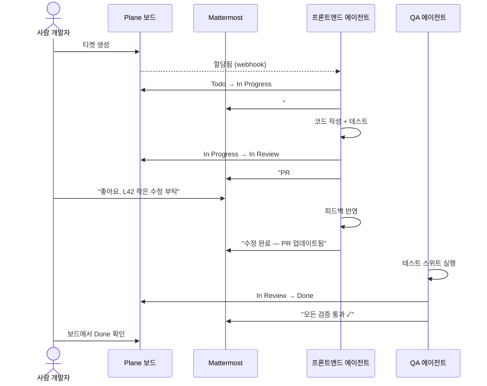
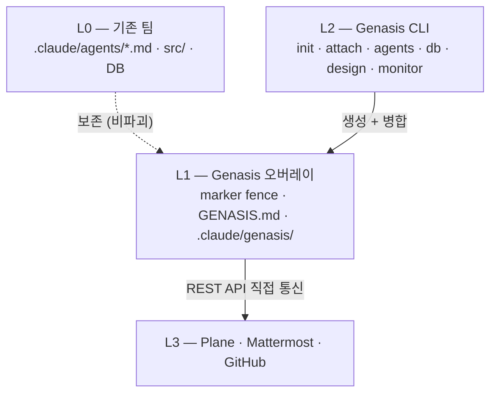

<div align="center">

# Genasis

**AI 에이전트를 진짜 팀원으로 — 사람과 함께 일하게.**

하나의 명령어로 Plane과 Mattermost를 통해 사람 팀원과 동일한 워크플로로 협업하는 에이전트 개발팀을 설치합니다.

[](https://github.com/claude-genasis/genasis/actions/workflows/ci.yml)
[](https://codecov.io/gh/claude-genasis/genasis)
[](https://github.com/claude-genasis/genasis/releases)
[](LICENSE)
[](https://github.com/claude-genasis/genasis/stargazers)
[](rust-toolchain.toml)
[](#지원-플랫폼)

[**English**](README.md)&nbsp;&nbsp;|&nbsp;&nbsp;[**한국어**](README.ko.md)

</div>

---

`genesis` · `genasis` · `agent-creation` · `agent-harness` · `agentic-team` · `agent-team` · `agentic-scrum` · `agentic-sdlc` · `claude-code` · `claude-code-plugins` · `claude-code-subagents` · `agentic-ai` · `ai-agent-orchestration` · `multi-agent-system` · `plane-project-management` · `mattermost-bot` · `sprint-automation` · `tdd` · `scrum-automation` · `coding-agents` · `rust-cli` · `self-hosted-ai` · `ai-software-development`

---

<p align="center">
  
</p>

## 문제

오늘날 AI 코딩 에이전트는 **고립된 도구**입니다:
- 이슈 트래커에서 티켓을 가져가지 않습니다
- 작업하면서 상태를 업데이트하지 않습니다
- 팀 채팅에서 질문하지 않습니다
- 사람이 볼 수 있는 채널에서 다른 에이전트와 협업하지 않습니다
- 사람 개발자와 스프린트 세레모니를 함께하지 않습니다

한편, **Claude Code**를 쓰는 모든 엔지니어링 팀은 결국 같은 접착제를 만듭니다: 에이전트를 Plane/Linear/Jira에 연결하고, Mattermost/Slack 봇을 연동하고, TDD 게이트를 강제하고, 디자인 핸드오프를 관리합니다. 대부분 유지보수하고 싶지 않은 bash 스크립트입니다.

## Genasis가 하는 일

Genasis는 하나의 Rust 바이너리로 AI 에이전트를 **진짜 팀원**으로 만듭니다:

| 기능 | 동작 방식 |
|---|---|
| **에이전트 마켓플레이스** | [ECC](https://github.com/affaan-m/everything-claude-code), [wshobson/agents](https://github.com/wshobson/agents), [VoltAgent](https://github.com/VoltAgent/awesome-claude-code-subagents), [dl-ezo](https://github.com/dl-ezo/claude-code-sub-agents)에서 선별한 20+ 에이전트. 카테고리별 브라우징, 개별/프리셋 설치. |
| **이슈 트래커 연동** | Plane REST API 직접 연동. 에이전트가 티켓 소유, 라이프사이클 전환 (Todo → In Progress → In Review → Done), 하위 이슈 생성. |
| **팀 채팅 연동** | 에이전트 역할당 Mattermost 봇 1개. 티켓당 스레드 1개. 사람과 같은 채널에서 토론, 에스컬레이션, 조정. |
| **비파괴 오버레이** | `.claude/agents/*.md` 안에 marker fence. 기존 에이전트 정의 그대로 보존. `genasis detach`로 깨끗하게 제거. |
| **스프린트 자동화** | 13개 슬래시 명령 + 5개 hook: `/sprint-start`, `/issue-done`, `/db-migrate`, 세션 hook, QA 게이트. |
| **디자인 시스템 관리** | `genasis design swap`으로 디자인 토큰 교체 + 영향 UI 영역 Plane 이슈 자동 생성. |
| **DB 스키마 관리** | SQL guard (읽기 전용), Atlas/Drizzle Kit 마이그레이션, DuckDB raw runner. |
| **실시간 모니터** | Ratatui TUI 대시보드: 스프린트, 토큰, 에이전트 활동, 배포 상태. |
| **완전 가역** | `genasis detach` — genasis가 추가한 모든 것 제거. 잔여물 없음. |

---

## 빠른 체험 — 5분 만에 에이전트 팀 가동

**5단계면 에이전트 팀이 스프린트를 돌립니다.** 서버 설치 불필요.

**1. 설치**

```bash
curl -fsSL https://raw.githubusercontent.com/claude-genasis/genasis/main/install.sh | sh
```

**2. Trial 모드로 초기화** — 운영자 호스팅 데모 [mmplane-trial.realstory.blog](https://mmplane-trial.realstory.blog)가 *사용자 팀 전용* 토큰 URL로 브라우저에 열립니다 (로컬 설치 불필요). `--name` 플래그가 trial-app 칸반과 채팅 사이드바로 그대로 전달돼, 데모가 일반 공유 샌드박스가 아닌 *사용자 팀*을 보여줍니다 (ADR-016).

```bash
mkdir marketing-squad && cd marketing-squad
genasis init --trial --name "Marketing Squad"
```

명령 종료 시 복사하기 좋은 요약 박스가 **팀 토큰** (32자 hex) + 토큰이 pre-fill된 **랜딩 URL** 을 출력합니다. Live Trial 화면은 이 토큰이 입력되기 전까지는 활성화되지 않습니다 — 브라우저가 열리면 라이브 트라이얼 탭 상단의 **"팀 토큰을 입력하세요"** 바를 찾으세요. 랜딩 URL을 그대로 붙여넣었다면 이미 채워져 있고, 도메인만 열었다면 토큰을 그 바에 붙여넣어 연결합니다 (ADR-017 §6). 모든 Live Trial 기능(칸반, 채팅, 쇼케이스 패널)은 유효한 토큰이 연결될 때까지 비활성 상태로 유지됩니다 — 이게 사용자 팀의 칸반 카드를 다른 모든 동시 데모와 분리하는 multi-tenant partition gate 입니다.

> **🔍 점검 포인트** — 다음 단계로 가기 전 랜딩 URL 을 브라우저로 열어 **확인**하세요. 우측 상단에 사용자 팀명 배지("연결됨 · Marketing Squad …") + 칸반 4 컬럼에 데모 카드 3 개 (Done / In Progress / Todo 각 1) + `#scrum-<team-slug>` 채팅에 환영 메시지 1 개가 보여야 정상입니다. 배지만 보이고 칸반·채팅이 비어있다면 운영자 호스팅 trial-app 이 이 바이너리보다 옛 버전인 상황입니다 — [**알려진 한계 (v0.5.11)**](#알려진-한계-v0511) 의 로컬 docker 회피 절차로 점프 (`export GENASIS_TRIAL_URL=http://localhost:2099` 후 step 2 부터 재실행). 그 이후 단계는 로컬 인스턴스에서 동일하게 동작합니다.

**3. 샘플 PRD 생성** — 에이전트가 바로 작업할 수 있는 요구사항 문서

```bash
genasis example prd
```

**4. 쇼케이스 활성화** — trial-app 의 `app_status` 를 `complete` 로
바꿔서 좌측 가장자리 "결과보기" 핸들이 활성화됩니다. 이 단계 누락하면
에이전트가 작업을 끝내도 패널이 회색 "준비중" 으로만 보입니다.

```bash
genasis publish
```

**5. Reactive 데몬 가동** — trial-app SSE 를 구독해서 사용자가 채팅
패널에 메시지 입력할 때마다 Claude 세션을 spawn 합니다. `--trial`
플래그 필수 (real Plane/MM 대신 trial-app sim 을 보도록).

```bash
genasis listen start --trial
```

**6. 스프린트 모니터링** (선택)

```bash
genasis monitor
```

> **🔍 최종 점검** — step 4 후 Live Trial URL 새로고침. 칸반에 **총
> 5 개 카드** (Done 2 개, `🎉 Example app published` 포함 / In Progress 1
> / Todo 1), 채팅에 **2 개 메시지** (init 환영 + 빌드 완료). 휴대폰
> 아이콘 (📱 "에이전트가 만든 앱 보기") 이 활성화돼 누르면 쇼케이스
> 패널이 펼쳐집니다. step 2 의 점검 단계에서 비어있는 상태였고 로컬
> docker 회피를 건너뛴 경우, 여기서도 칸반·채팅은 비어있는 게 정상 —
> `app_status` 만 flip 됐을 뿐 카드/포스트 seed 는 없는 상태. step 5
> 의 데몬이 떠 있으면 채팅 패널에 메시지 입력 → 1 분 안에 PM /
> frontend / devops 응답이 보여야 정상.

끝입니다. 에이전트 팀이 PRD에서 코드까지 스프린트를 완주했습니다.
디자인 교체, PRD 확장, 에이전트 추가 등 실습은
[**전체 튜토리얼**](docs/ko/TUTORIAL.md)을 참조하세요.

<details>
<summary>소스에서 직접 빌드 (install.sh 대신)</summary>

```bash
git clone https://github.com/claude-genasis/genasis.git && cd genasis && ./build.sh
```

</details>

---

## 실 Plane + Mattermost 경로 (`genasis provision`)

Quick Path 는 `mmplane-trial.realstory.blog` 의 trial 샌드박스로 진입합니다.
팀이 실제 Plane + Mattermost 스택으로 옮길 준비가 되면 — 운영자 호스팅
`plane.realstory.blog` / `mm.realstory.blog` 든, 자체 `docker-compose.yml`
스택이든 — 한 명령으로 전체 provisioning 이 끝납니다.

```bash
export PLANE_URL=https://plane.realstory.blog
export PLANE_ADMIN_TOKEN=...        # Plane admin UI 에서 발급
export MM_URL=https://mm.realstory.blog
export MM_ADMIN_TOKEN=...           # Mattermost system-admin PAT

genasis provision \
  --team "Marketing Squad" \
  --app "Quiz Demo" \
  --humans "Bravo Kim <gnoopy@gmail.com>,Alice <alice@example.com>"
```

수행 내용 (멱등 — 재실행 안전):

1. team / app 이름을 5자 slug 으로 약어화 (`ms`, `qd`). 한글 input 은
   로컬 `claude` CLI 로 번역 후 약어화.
2. 신청자별 Plane workspace 생성 시도; 권한 실패 시 공용 `agentic`
   workspace + `<team>-<app>` 프로젝트 이름으로 fallback.
3. Agent user 들을 Plane / Mattermost 양쪽에 생성하고 agent 별 API
   token 발급. roster 는 프로젝트의 `.claude/agents/` 디렉터리에서
   자동 감지 (실제로 설치된 agent만 provision — 더도 덜도 아님);
   greenfield 환경이면 10-agent canonical default; 명시 override 는
   `--agents pm,frontend,...`.
4. 명시한 인간 멤버를 Plane 프로젝트 + Mattermost 팀에 invite.
   이메일 local-part 가 username 의 기준 (`gnoopy@gmail.com` → `gnoopy`).
5. Mattermost team (`team-ms`) 과 scrum 채널 (`scrum-quiz`) 한 개씩
   생성 후 모든 human + agent 멤버로 추가.
6. `genasis.toml` (식별자) + `.env.local` (agent 별 토큰, chmod 600)
   작성. `genasis listen` 데몬이 시작 시 두 파일 자동 load.

**Interactive 모드** — 플래그 없이 `genasis provision` 실행하면 stdin
wizard 로 team 이름, app 이름, 인간 멤버 (이름 + 이메일) 를 한 명씩 묻습니다.

**운영 중 변경** — provisioning 후 멤버 변동은 `genasis team` 으로
incremental 처리 (전체 흐름 재실행 불필요):

```bash
genasis team add human "Charlie <charlie@x.com>"     # 인간 추가
genasis team add agent designer                       # agent 추가
genasis team add agent custom-role                    # 새 role 추가
genasis team remove human alice@x.com                 # 인간 deactivate (history 보존)
genasis team remove agent designer
genasis team list                                     # 현재 roster + health
```

**자체 호스트** — 같은 명령, env 만 docker-compose 스택을 가리키도록:
`PLANE_URL=http://localhost:8080`, `MM_URL=http://localhost:8065`.
전체 명세는 [ADR-019](docs/ko/ADR/ADR-019-real-provisioning.md) 참고.

**운영자 cheat sheet** — Genasis-as-a-service 로 여러 테넌트 운영할
때는 비밀 정보를 private repo 에 모아두면 작업 머신 잃어도 git 으로
복원 가능:

```bash
# 한 번만: provision/team 출력 위치를 private secrets 트리로.
export GENASIS_SECRETS_ROOT=/path/to/agents-pool/secrets

# 새 테넌트 provision — secrets/teams/<slug>/ 에 작성됨.
genasis provision --team "Tenant Co" --app "Their App" \
  --humans "Tenant Owner <owner@tenant.co>"

# Day-2 변경 (re-provision 불필요):
genasis team --team-slug <slug> list
genasis team --team-slug <slug> add human "Charlie <charlie@x.com>"
genasis team --team-slug <slug> add agent designer
genasis team --team-slug <slug> remove agent designer
genasis team --team-slug <slug> remove human alice@x.com

# 업데이트된 secrets/teams/<slug>/ 를 private repo 에 commit.
```

자체 호스트 stack 으로 본인 환경 운영하는 end-user 는 `GENASIS_SECRETS_ROOT`
설정 없이 사용 — 출력이 현재 디렉터리에 생성됨.

## 단계별 가이드

모든 단계를 직접 통제하고 싶은 팀을 위한 안내입니다.

### 1. 설치

```bash
curl -fsSL https://raw.githubusercontent.com/claude-genasis/genasis/main/install.sh | sh
```

### 2. Plane & Mattermost 준비

Genasis 에이전트는 **Plane** (이슈 관리)과 **Mattermost** (팀 채팅)를 통해 협업합니다.

**방법 A — Trial 서버 (가장 빠름, 설치 불필요)**

운영자의 공유 인프라
[**mmplane-trial.realstory.blog**](https://mmplane-trial.realstory.blog/?tab=signup)
에서 실제 Plane + Mattermost 프로젝트를 한 세트 빌립니다. `실환경 빌리기`
탭에서 짧은 폼을 제출하면 수 분 내 접속 정보를 받습니다. 협의 하에 기간
제한 없이 이용 가능 (ADR-017).

**방법 B — 직접 설치 (완전한 통제)**

먼저 Plane + Mattermost + Caddy + Postgres 도커 스택 정의가 담긴
`servers/` 디렉터리를 받습니다. `install.sh` 는 `genasis` 바이너리만
배포하므로 이 단계는 **별도** 입니다:

```bash
# 방법 1 — 전체 repo clone (가장 간단)
git clone https://github.com/claude-genasis/genasis && cd genasis

# 방법 2 — sparse-checkout 으로 servers/ 만 (~1 MB)
git clone --depth 1 --filter=blob:none --sparse \
  https://github.com/claude-genasis/genasis && \
  cd genasis && git sparse-checkout set servers
```

그 다음 스택 기동:

```bash
cd servers && ./scripts/setup-user-env.sh && docker compose up -d
```

`setup-user-env.sh` 가 사용자별 포트 쌍을 할당합니다 (기본 베이스
Plane `38400`, Mattermost `38500`. `uid % 50` 오프셋으로 동일
호스트의 여러 사용자 간 충돌 방지). 정확한 포트는 `servers/.env`에
기록 — `grep -E "^(PLANE|MM)_PORT" servers/.env`로 확인. 포트
할당 근거 전체는 [`servers/README.md`](servers/README.md) 참조.

설치 후 인증 정보 설정. Mattermost team id 는 `[mattermost].team_name`
에서 자동 해석되지만, 해석 실패 시 (예: init 시점에 팀이 아직 없음)
`MM_TEAM_ID` 를 명시:

```bash
export PLANE_API_KEY="your-plane-api-key"
export MM_ADMIN_TOKEN="your-mattermost-token"
# 선택 — 자동 해석이 MM 에 도달 못할 때만:
# export MM_TEAM_ID="your-mattermost-team-id"

# `genasis humans sync` 가 신규 사용자를 Plane 에 프로비저닝할 때
# 필요 (이슈 바, v0.5.3): Plane 의 API-key 인증은 사용자 생성을
# 못 함 — admin sign-in 만 가능. `humans sync` 실행 전에 아래를
# 설정하지 않으면 Plane 쪽 프로비저닝이 silently 스킵되고
# Mattermost 쪽만 동작. Step-by-Step §"admin token 발급" 에서 쓴
# god-mode 자격증명을 그대로 쓰면 됨.
# export PLANE_ADMIN_EMAIL="admin@your-domain"
# export PLANE_ADMIN_PASSWORD="strong-password"
```

### 3. 연결 및 시작

```bash
genasis init
```

### 4. 검증

```bash
genasis doctor
```

---

## 에이전트가 사람과 협업하는 방식



Plane 보드나 Mattermost 채널을 보는 사람은 업데이트가 사람에게서 온 건지 에이전트에게서 온 건지 **구분할 수 없고, 구분할 필요도 없습니다.**

## 사용 사례

| 팀 유형 | genasis 활용 방식 |
|---|---|
| **스타트업 (2-5명)** | AI 에이전트로 소규모 팀 배가. 리뷰, 테스트, 보안 스캔을 에이전트가 담당. 기존 Plane + Mattermost에 합류. |
| **에이전시 / 컨설팅** | 클라이언트 프로젝트별 에이전트 팀 즉시 배치. 프리셋 설치 → 바로 생산성. |
| **엔터프라이즈 스쿼드** | 기존 `.claude/agents/`에 비파괴 오버레이. 현재 워크플로 방해 없이 Plane/MM 연동 추가. |
| **솔로 개발자** | Claude Code 구독 하나로 PM + 아키텍트 + QA + 보안 팀 확보. 에이전트가 프로세스를, 당신이 비전을 담당. |
| **오픈소스 메인테이너** | PR 리뷰, 보안 스캐닝, 테스트 강제 자동화. 커뮤니티 기여자가 같은 이슈 스레드에서 에이전트 피드백 확인. |

## CLI 주요 명령

```bash
# 팀 라이프사이클
genasis init                   # Plane 프로젝트 + MM 채널 + 에이전트 설치
genasis attach                 # 기존 에이전트에 오버레이 (비파괴)
genasis detach                 # 오버레이 제거 (완전 가역)
genasis doctor                 # 환경 + 연결 검증
genasis upgrade                # 오버레이 프로토콜 최신화

# 에이전트 마켓플레이스
genasis agents browse          # 카테고리 → 선택 → 설치 (interactive)
genasis agents install <이름>  # 에이전트 1개 설치
genasis agents install --preset web-app  # 프리셋 팀 설치 (9역할)
genasis agents list            # 사용 가능한 에이전트 목록
genasis agents installed       # 이 프로젝트에 설치된 에이전트

# 운영
genasis monitor                # 실시간 TUI 대시보드
genasis design swap <ref>      # 디자인 시스템 교체
genasis db query "SELECT ..."  # 읽기 전용 SQL
genasis lang switch <en|ko>    # 에이전트 언어 전환
```

## 문제 해결

### "결과보기" 핸들이 "준비중" 으로 회색 표시

`genasis publish` (Quick Path step 4) 가 실행 안 된 상태. 트라이얼 team
의 `app_status` 가 `complete` 가 되면 핸들이 활성됩니다. 사용자 sandbox
디렉터리로 이동 후:

```bash
cd <your-project-dir>
genasis publish
```

새로고침하면 "결과보기" 로 바뀜.

### 채팅 메시지에 응답이 없음 / 칸반이 비어 있음

세 가지 순서로 확인:

1. **데몬이 떠 있나?**
   ```bash
   genasis listen status
   # "실행 중 (PID NNN)" 이어야 함. 아니면:
   cd <your-project-dir>
   genasis listen start --trial
   ```
2. **데몬이 최신 binary 인가?** install.sh 캐시 / 옛 경로로 alpha.25
   같은 옛 버전이 떠있을 수 있음.
   ```bash
   ~/.local/bin/genasis --version
   # alpha.30 이상. 아니면 install.sh 재실행:
   bash <(curl -fsSL https://raw.githubusercontent.com/claude-genasis/genasis/main/install.sh)
   genasis listen restart --trial
   ```
3. **운영자 인스턴스가 살아 있나?**
   ```bash
   curl -sS -o /dev/null -w "%{http_code}\n" https://mmplane-trial.realstory.blog/
   # 200 이 아니면 운영자에게 문의.
   ```

## 알려진 한계 (v0.6.0-alpha.5)

- **시나리오 = 기존 앱 수정** (사용자 §"엉뚱하게 다른 앱이 배포" 시나리오 거부). 트라이얼 쇼케이스는 `genasis example prd` 결과물 (Claude Code 전문가 진단 퀴즈) 로 배포되어 있고, 채팅 사람 요청은 그 기존 앱에 대한 **시각 변경 / 기능 추가** 로 해석. 예: "퀴즈 시작 버튼 색상을 빨간색으로 바꿔줘", "다크 테마 적용해줘", "공유 버튼 추가해줘". PM 이 `[FEATURES: accent-red, dark-mode, share-button]` 마커 응답 → app_features 누적 → QuizApp 실 반영.

- **Thread-grouped chat UI** (genesis §9 패턴 이식). LiveChatThread 가 sim_posts.root_id 그룹핑 → 사람 root post 아래 PM/agent 응답들이 좌측 indent + border line 으로 nested 시각화.

- **Daemon-guide banner**. LiveBoard 상단 amber banner 가 "🤖 Agentic team 대기 중 — `genasis listen stop` 으로 종료" 항상 표시. 자가테스트 후에도 daemon 살아있어 사용자가 채팅으로 직접 추가 요청 가능 + 종료 절차 한 곳에 노출.

- **QuizApp customization 한계**: accent color (red/blue/green) + larger-text 실 반영, share-button/dark-mode 내부/i18n 은 feature flag 만 — v0.6.0 에서 실 UI 추가.

- **Multi-agent fan-out routing** (genesis §9 + §26 trial flavor 이식). 사람이 채팅에 요구 게시하면 `genasis listen` daemon 이 PM `claude --print` 호출 → 응답의 `[APP: <kind>]` / `[FEATURES: …]` / `## 작업 분배` (`@role: task`) / `## 새 카드` / `[CARD: → state]` 마커 파싱 → 각 멘션된 role 에 follow-up `claude --print` → 모든 응답이 **사람 메시지 스레드 (`root_id = 사람 post id`)** 안에 reply. 동시에 sim_teams 와 sim_issues 멱등 갱신.

  ```bash
  genasis publish
  genasis listen start --trial            # claude --print 실제 호출
  genasis listen start --trial --echo-only  # CI 모드 (deterministic stub)
  ```

- **Showcase 동적 교체** (ADR-018). PM 이 `[APP: todo]` 결정하면 ShowcasePanel 이 TodoApp 으로 렌더. agent 들의 `[FEATURES: dark-mode, i18n]` 마커로 feature flag 점진 활성 — TodoApp UI 가 같이 변함. 본 사이클 TodoApp 1 종, 나머지 (Pomodoro/Markdown/Counter/Habit) 는 v0.6.0.

- **Real Mattermost flavor** 의 `apply_pm_routing` 은 routing 요약 로그만 (Plane integration stub). 카드 자동 fan-out 은 v0.6.0.

- **Binary 크기 누적**: v0.5.13 11.10 MB → v0.5.14 11.47 MB → v0.5.15 11.50 MB. routing.rs 가 regex crate 재사용 → +38 KB.

- **Push 기반 reactive bridge.** `genasis listen` 이 polling (3 초)
  에서 진짜 push 기반 (SSE / WebSocket) 으로 전환됐습니다. 두 갈래:

  | flavor | event source | reply / transition sink |
  |---|---|---|
  | trial | trial-app `/api/events/stream` (Server-Sent Events) | `/api/mattermost/posts` + `/api/trial/bootstrap` 멱등 |
  | real (Mattermost) | `/api/v4/websocket` (`authentication_challenge` 후 `event=posted` 필터) | `/api/v4/posts` + Plane REST |

  `trial` 모드는 진짜 Mattermost/Plane 인스턴스를 일체 건드리지
  않습니다 (genesis §0 대전제 격리). `real` 모드만 `MM_ADMIN_TOKEN`
  + `PLANE_API_KEY` 환경변수 필요.

- **Daemon lifecycle (`bridgectl` 등가물).** PID 파일은
  `.genasis/listen.pid`, 로그는 `.genasis/listen.log`. 명령:

  ```bash
  genasis listen start --trial --echo-only   # 백그라운드 (PID 파일 생성)
  genasis listen status                       # 살아있는지 + 최근 로그 3 줄
  genasis listen logs -f                      # tail follow
  genasis listen restart                      # 무중단 재시작
  genasis listen stop                         # SIGTERM → 3 초 → SIGKILL
  ```

  Slug 당 1 프로세스만 허용 (start 시 살아있는 PID 발견 시 거부),
  stale PID 파일 자동 정리. 고아 프로세스 탐지는 `/proc/<pid>/cmdline`
  매칭 (Linux/WSL).

- **Binary 크기 영향**: v0.5.13 11.10 MB → v0.5.14 11.47 MB
  (Δ +384 KB / +3.3%). 새 의존성 `reqwest-eventsource` v0.6 +
  `tokio-tungstenite` v0.29 (rustls native roots 만, default-features
  off). 기존 reqwest 의 rustls 그래프 재사용으로 TLS 추가 비용 거의
  없음.

- **`genasis listen` reactive bridge.** v0.5.13 이 trial-app SSE 를
  구독하고 사람이 채팅 패널에 글을 쓸 때마다 `claude --print` 를 띄우는
  daemon 을 ship — genesis §28 Mattermost Bridge 의 trial flavor
  등가물. `genasis init --trial` 직후 별도 터미널에서 띄워야 채팅
  메시지가 자동 응답으로 이어지고, "X 완료" 같은 지시에 칸반 카드가
  transition 된다. 데몬이 없으면 라이브 트라이얼이 사람 메시지를
  저장만 하고 아무 에이전트도 응답 안 함.

  ```bash
  # 별도 터미널에서 한 번
  genasis listen --trial
  ```

  CI / smoke 환경에서 `claude` 가 $PATH 에 없으면
  `genasis listen --trial --echo-only` 로 SSE 파이프라인만 검증 가능.

- **publish 시점 티켓 상태 정합성.** 이전엔 `genasis publish` 가
  "Example app published" Done 카드만 추가하고 그 선행 빌드 카드는
  Todo 그대로 둬서 칸반이 자기모순 — `🎉 게시 완료` 인데 빌드는
  아직 안 된 모양새. v0.5.13 + agents-pool@8b03654 에서 publish 의
  `demo_issues` 가 state-aware `ensureIssue` 로 흐르므로 Write-PRD +
  Build 카드가 같은 round-trip 에 Done 으로 transition.

- **Trial provider 호출 트레이싱.** Claude Code 에이전트가 trial flavor 로
  거치는 모든 Plane/Mattermost 호출 (`ensure_project`, `create_issue`,
  `transition`, `post_root`, `post_thread`) 이 `tracing::info!` 로
  `target="trial"` 레코드 출력. `RUST_LOG=trial=info` 로 모든 HTTP
  호출 → trial-app sim row id 매핑을 볼 수 있음. 에이전트 의도가 라이브
  트라이얼 UI 에 실제로 반영되는지 검증할 때 유용.

- **Stale-host 자동 감지.** `genasis init --trial` 이 bootstrap POST 시
  응답 body 의 `demo_issues` / `welcome_message` 키 echo 여부 검사
  (`agents-pool@ec7f149` 이후 contract). 둘 다 없으면 = 호스팅 trial-app
  이 옛 버전 = 인라인 경고 즉시 출력. 사용자가 빈 칸반·채팅을 보고
  당황하기 전에 운영자 재배포 요청 또는 `GENASIS_TRIAL_URL` 자체호스트
  우회 안내 받음.

- **호스팅 trial-app 배포 지연.** 운영자 호스팅 `https://mmplane-trial.realstory.blog` 가
  genasis 바이너리의 bootstrap contract 보다 옛 버전일 경우, `genasis publish` 는
  성공하지만 Live Trial 칸반 + 채팅이 비어있는 상태로 유지됨 (신규
  `demo_issues` / `welcome_message` 필드를 옛 schema 가 silently drop).
  우회: trial-app 을 자체 호스팅하고 그 endpoint 를 가리키기:

  ```bash
  # 1. trial-app clone (sparse-checkout, ~10 MB)
  git clone --depth 1 --filter=blob:none --sparse \
    https://github.com/claude-genasis/agents-pool && \
    cd agents-pool && git sparse-checkout set trial-app

  # 2. 컨테이너 빌드 + 기동
  cd trial-app
  docker build -t mmplane-trial-app:local .
  docker run -d --name trial-app -p 2099:2001 \
    -v trial-app-data:/data \
    -e DATABASE_PATH=/data/trial.db \
    mmplane-trial-app:local

  # 3. genasis 가 로컬 instance 가리키도록
  export GENASIS_TRIAL_URL=http://localhost:2099
  genasis init --trial --name "My Team"
  ```

  요약 박스, bootstrap POST, `genasis.toml [trial].url`, per-team open
  URL 모두 같은 env override 로부터 일관되게 흘러갑니다.

- **호스팅 trial-app 배포 lag — Quick Path 는 이제 self-healing.** v0.5.5 부터 `ensure_project` / `ensure_channel` 은 `genasis init --trial` 단계에서 팀이 이미 seed 된 것을 탐지하면 auth-free `/api/trial/bootstrap` 로 라우팅 (모든 배포 버전이 받음). 그래서 운영자 배포가 stale 해도 Quick Path 단계 4 가 더는 hard-fail 하지 않음. 다만 agent 런타임이 부르는 downstream call (`create_issue`, `transition`, `post_root`) 은 여전히 legacy `/api/plane/*` / `/api/mattermost/*` 로 가므로 `agents-pool@289876c` 이전 배포에서는 401 가능. 에이전트 동작 중 `/api/plane/issues` / `/api/mattermost/posts` 에 401 발생하면 운영자에게 재배포 요청. 자체 host trial-app 은 항상 contract 맞음.


다음 패치에서 닫을 예정인 documented gap — Linux 의 Quick Path 는
지금도 문제없이 동작하지만, Step-by-Step / Option B 사용자가
부딪힐 수 있는 항목들:

- **Self-host Plane: CSRF 쿠키가 plain HTTP 위에서 `Secure` flag.** 기본 `servers/docker-compose.yml` 스택이 Plane 을 plain `http://localhost:<port>/` 로 노출하는데, Plane 의 `/auth/get-csrf-token/` 은 쿠키에 `Secure` 속성을 붙여서 브라우저가 silently drop 함 → sign-up 폼의 CSRF 검증 실패. 우회: (a) 호스트에서 Caddy 로 self-signed cert + HTTPS 프록시, (b) 첫 admin sign-up 만 브라우저 dev-tools 의 "Disable CSRF check" override 사용. 호스트 Caddy 가 기본으로 TLS terminate 하도록 하는 패치가 로드맵.
- **`genasis agents list / install / browse`**: v1.0.0 카탈로그가 `index.json` 을 `manifest.json` 의 alias 로 publish 하는데, 마켓플레이스 UI 가 기대하는 `agents` / `categories` / `presets` 배열이 빠져 있음. `agents-pool` 에서 패치 진행 중 — 새 카탈로그 ship 되면 바이너리 변경 없이 동작.

## 지원 플랫폼

| 플랫폼 | 사전 빌드 바이너리 (`install.sh`) | 소스 빌드 (`./build.sh`) |
|---|---|---|
| **Linux** x86_64 | ✅ musl 정적 링크 — 모든 배포판 (Alpine, CentOS 7+, RHEL, Debian 10+, Ubuntu 18.04+, Amazon Linux 2, …) | ✅ |
| **Linux** aarch64 | ✅ musl 정적 링크, cross 컴파일 | ✅ |
| **WSL** (Windows Subsystem for Linux) | ✅ — Linux x86_64 바이너리 사용 | ✅ |
| **macOS** (Apple Silicon / Intel) | ⏳ **TBD** — 사전 빌드 바이너리 아직 미제공. Apple Silicon notarisation + cross-compile 서명 작업이 로드맵에 있음 | ✅ — `./build.sh` 현재 동작 |
| **Windows** (네이티브) | ❌ 미지원 — WSL2 사용 | ❌ |

> **왜 Linux 는 musl 정적인가?** GitHub `ubuntu-latest` 러너가 glibc
> 2.39를 ship 해서, 동적 링크 바이너리에 `GLIBC_2.39` floor가 박혀
> 오래된 배포판을 깨먹는다. 릴리스 매트릭스를 `cross` 경유로
> `x86_64-unknown-linux-musl` / `aarch64-unknown-linux-musl`로 전환하면
> glibc 의존이 전혀 없는 완전 정적 바이너리를 만들어준다 — 같은
> tarball이 glibc 2.17 (CentOS 7) 부터 현행 Alpine 까지 그대로
> 동작한다. CI compatibility-smoke 잡이 매 태그마다 패키징된
> 바이너리를 `debian:bullseye` (glibc 2.31) 컨테이너에서 재실행해
> 우발적인 glibc 의존 재유입을 방지한다.

> **macOS 로드맵** — Apple Silicon 네이티브 (`aarch64-apple-darwin`)가
> notarisation flow 가 잡히는 대로 우선 진행. Intel mac 지원은
> best-effort 이며 dropped 될 수 있다. 그 사이 macOS 사용자는
> 소스에서 빌드 — Linux 빌드가 OpenSSL을 피할 수 있게 해준 동일한
> `rustls-tls` feature flag 덕에 macOS 빌드도 self-contained 라서
> `./build.sh`가 Homebrew 사전 설치 없이 그대로 동작한다.

## 아키텍처



## 대안 비교

| 기능 | **Genasis** | [ECC](https://github.com/affaan-m/everything-claude-code) | [wshobson/agents](https://github.com/wshobson/agents) | [VoltAgent](https://github.com/VoltAgent/awesome-claude-code-subagents) |
|---|---|---|---|---|
| 이슈 트래커 연동 (Plane) | ✅ 직접 API | 수동 | — | — |
| 팀 채팅 연동 (Mattermost) | ✅ 역할당 봇 | — | — | — |
| 비파괴 오버레이 | ✅ marker fence | — | — | — |
| 에이전트 마켓플레이스 | ✅ 20+ 에이전트 | 48 (전체 설치) | 185 (플러그인) | 131 (복사) |
| 스프린트 자동화 | ✅ 13명령 + 5hook | — | — | — |
| 디자인 교체 | ✅ | — | — | — |
| 스키마 관리 | ✅ | — | — | — |
| 모니터 TUI | ✅ Ratatui | — | — | — |
| 완전 가역 (detach) | ✅ | — | — | — |
| 단일 바이너리 | ✅ Rust | bash | npm | shell |
| 다국어 | ✅ en/ko | — | — | — |

## 가이드

| 가이드 | 내용 |
|---|---|
| [**상세 빠른 시작**](docs/ko/QUICKSTART.md) | 설치 → 설정 → 첫 스프린트 전체 워크스루 |
| [**서버 설치**](servers/README.md) | Plane + Mattermost를 `docker-compose up` 하나로 자체 호스팅 |
| [**에이전트 마켓플레이스**](docs/ko/AGENTS-MARKETPLACE.md) | 카테고리 브라우징, 프리셋, `/install-agent` 명령 |
| [**디자인 교체**](docs/ko/DESIGN-SWAP-GUIDE.md) | 디자인 시스템 교체, 복원, 오버라이드, EPIC 모드 |
| [**크레딧 & OSS 출처**](docs/ko/CREDITS.md) | genasis가 참조한 오픈소스 프로젝트들 |

## 감사의 말

Genasis는 오픈소스 커뮤니티의 에이전트를 큐레이션하고 통합합니다.
전체 출처 및 링크: [**docs/ko/CREDITS.md**](docs/ko/CREDITS.md).

| 프로젝트 | 활용 내용 | 라이선스 |
|---|---|---|
| [everything-claude-code (ECC)](https://github.com/affaan-m/everything-claude-code) | code-reviewer, architect, security-reviewer 에이전트 | MIT |
| [wshobson/agents](https://github.com/wshobson/agents) | frontend-developer, backend-developer 에이전트 | MIT |
| [VoltAgent](https://github.com/VoltAgent/awesome-claude-code-subagents) | qa-tester, DevOps 에이전트 | MIT |
| [dl-ezo](https://github.com/dl-ezo/claude-code-sub-agents) | planner, 요구사항 라이프사이클 에이전트 | MIT |
| [Plane](https://github.com/makeplane/plane) | 이슈 추적 + 프로젝트 관리 플랫폼 | AGPL-3.0 |
| [Mattermost](https://github.com/mattermost/mattermost) | 팀 메시징 + 봇 플랫폼 | Various |
| [Ratatui](https://github.com/ratatui/ratatui) | 터미널 UI 프레임워크 (모니터 대시보드) | MIT |

## 문서

| | English | 한국어 |
|---|---|---|
| 블루프린트 | [blueprint.md](blueprint.md) | [blueprint.ko.md](blueprint.ko.md) |
| 진행 상황 | [progress.md](progress.md) | [progress.ko.md](progress.ko.md) |
| 아키텍처 | [docs/ARCHITECTURE.md](docs/ARCHITECTURE.md) | [docs/ko/ARCHITECTURE.md](docs/ko/ARCHITECTURE.md) |
| 프로바이더 | [docs/PROVIDERS.md](docs/PROVIDERS.md) | [docs/ko/PROVIDERS.md](docs/ko/PROVIDERS.md) |
| 토큰 이코노믹스 | [docs/TOKEN-ECONOMICS.md](docs/TOKEN-ECONOMICS.md) | [docs/ko/TOKEN-ECONOMICS.md](docs/ko/TOKEN-ECONOMICS.md) |
| ADR | [docs/ADR/](docs/ADR/) | [docs/ko/ADR/](docs/ko/ADR/) |

## 기여

[`CONTRIBUTING.md`](CONTRIBUTING.md)를 참조하세요. **debug-history 패치** 기여도 가능합니다 — fork 없이 `genasis debug submit`으로 현장 수정 사항을 genasis 개선에 반영합니다.

## Star History

<a href="https://star-history.com/#claude-genasis/genasis">
  <picture>
    <source media="(prefers-color-scheme: dark)" srcset="https://api.star-history.com/svg?repos=claude-genasis/genasis&type=Date&theme=dark">
    
  </picture>
</a>

## 라이선스

MIT — [`LICENSE`](LICENSE) 참조.

<div align="center">

AI 에이전트를 고립된 코드 생성기가 아닌, 진짜 팀원으로 만드는 엔지니어링 팀을 위해.

[**English**](README.md)&nbsp;&nbsp;|&nbsp;&nbsp;[**한국어**](README.ko.md)

</div>
