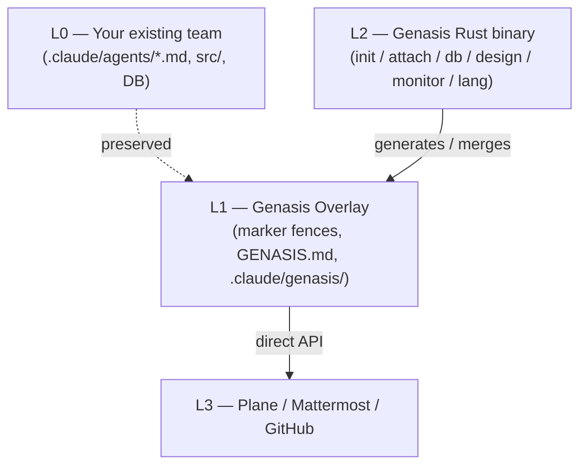

# Genasis

<p align="center">
  <a href="README.md"></a>
  <a href="README.ko.md"></a>
  <a href="docs/i18n/CONTRIBUTE-LANG.md"></a>
</p>

> 🇺🇸 **English** | [🇰🇷 한국어](README.ko.md)

> **Plane × Mattermost × TDD × Design × DB × Monitor — overlay (not rewrite) for any Claude Code agent team.** Install with one curl command. Korean and English supported, single-language at a time, no model drift.
>
> Tags: `claude-code` · `agentic-team` · `agent-orchestration` · `plane-issues` · `mattermost-bot` · `tdd` · `rust-cli` · `multi-agent` · `ratatui` · `i18n` · `한국어` · `에이전트` · `claude-skills`

<p align="center">
  <a href="https://github.com/claude-genasis/genasis/actions/workflows/ci.yml"></a>
  <a href="LICENSE"></a>
  <a href="https://github.com/claude-genasis/genasis/releases"></a>
  <a href="https://github.com/claude-genasis/genasis/stargazers"></a>
</p>

---

## Why Genasis

- **Don't rewrite your team.** Genasis attaches a **non-destructive overlay** onto your existing `.claude/agents/*.md`, leaving everything outside marker fences untouched.
- **One-command Plane + Mattermost + TDD + Design hot-swap + Schema-as-code + Monitor.** Built for teams that are tired of duct-taping these layers themselves.
- **Single Rust binary, single active language at install time.** No Python, no Node runtime in the hot path; no Korean/English mixed-context model drift.

## Quickstart

```bash
curl -fsSL https://raw.githubusercontent.com/claude-genasis/genasis/main/install.sh | sh
```

The installer auto-detects your locale (`$LANG`) and asks you whether to install English or Korean instructions. Skip the prompt with `--lang`:

```bash
curl -fsSL .../install.sh | sh -s -- --lang en        # English
curl -fsSL .../install.sh | sh -s -- --lang ko        # Korean
curl -fsSL .../install.sh | sh -s -- --lang both      # Rejected — see why ↓
```

`--lang both` is rejected by design. Both-language overlays cause Claude Code to drift mid-response (see [docs/impact-of-multilang-prompts.md](docs/impact-of-multilang-prompts.md)). Use `genasis lang switch <lang>` to swap atomically later.

## Features

| | |
|---|---|
| 🔗 **Plane integration** | Direct REST (no MCP). Auto-detects upstream vs agent-aware flavor. [docs](docs/ko/PROVIDERS.md) |
| 💬 **Mattermost bot** | One bot per agent role, threaded per Plane issue. |
| 🧪 **TDD enforcement** | `unit: pass` + `integration: pass` mandatory for In Review → Done. |
| 🎨 **Design hot-swap** | `genasis design swap <ref-url>` regenerates `docs/design-system.md` and emits Plane issues for impacted areas. |
| 🗄 **Schema-as-code** | Read via SQL guard, write via Atlas / Drizzle Kit / DuckDB raw runner. |
| 📊 **Monitor TUI** | Ratatui dashboard: sprint, tokens, agents, deploy LEDs, network, log tail. |
| 🌐 **i18n** | English / Korean install-time selector. `--lang both` rejected. `genasis lang switch` for atomic swaps. |
| 💰 **Token economics** | RTK auto-wrap + Anthropic prompt-cache friendly stable prefix + trim hook. |

## Demo

(asciinema cast lives at `docs/assets/demo.cast` once recorded — wire it after first release.)

## Documentation

| Doc | Korean mirror |
|---|---|
| [`blueprint.md`](blueprint.md) | [`blueprint.ko.md`](blueprint.ko.md) |
| [`progress.md`](progress.md) | [`progress.ko.md`](progress.ko.md) |
| [`docs/ARCHITECTURE.md`](docs/ARCHITECTURE.md) (pending) | [`docs/ko/ARCHITECTURE.md`](docs/ko/ARCHITECTURE.md) |
| [`docs/PROVIDERS.md`](docs/PROVIDERS.md) (pending) | [`docs/ko/PROVIDERS.md`](docs/ko/PROVIDERS.md) |
| [`docs/MIGRATION-FROM-GENESIS.md`](docs/MIGRATION-FROM-GENESIS.md) (pending) | [`docs/ko/MIGRATION-FROM-GENESIS.md`](docs/ko/MIGRATION-FROM-GENESIS.md) |
| [`docs/TOKEN-ECONOMICS.md`](docs/TOKEN-ECONOMICS.md) (pending) | [`docs/ko/TOKEN-ECONOMICS.md`](docs/ko/TOKEN-ECONOMICS.md) |
| [`docs/MONITOR.md`](docs/MONITOR.md) (pending) | [`docs/ko/MONITOR.md`](docs/ko/MONITOR.md) |
| [`docs/impact-of-multilang-prompts.md`](docs/impact-of-multilang-prompts.md) | [`docs/ko/impact-of-multilang-prompts.md`](docs/ko/impact-of-multilang-prompts.md) |
| [ADR-001 ~ ADR-008](docs/ADR/) | [ADR-001 ~ ADR-007 (ko)](docs/ko/ADR/) |

> **Translation status**: ADR-008 (i18n decision) is canonical English. The remaining English mirrors are stubs that point at the Korean canonical. The release-prep workflow auto-opens a `[i18n] Translation completion for vX.Y.Z` PR before each release tag.

## Architecture



## Comparison

| Feature | Genasis | ECC | knowledge-work-plugins | claude-code-templates |
|---|---|---|---|---|
| Non-destructive overlay | ✅ | — | — | — |
| Plane integration | ✅ direct API | manual | — | — |
| Mattermost bot orchestration | ✅ per-agent | — | — | — |
| Design hot-swap | ✅ | — | — | — |
| Schema-as-code | ✅ Atlas/Drizzle/raw | — | — | — |
| Monitor TUI | ✅ Ratatui | — | — | — |
| Install-time i18n (en/ko) | ✅ active singularity | — | — | — |
| Single Rust binary | ✅ | — (bash) | — (npm) | — (npm) |

## Roadmap

See [`progress.md`](progress.md) for the milestone-by-milestone tracker. Currently in **M12 — Internationalization**.

Major milestones:

- M0–M11 (2026-05-03) — workspace bootstrap, providers, DB kernel, design hot-swap, monitor TUI, ADRs 1–7
- **M12 (current)** — install-time `--lang` selector, rust-i18n runtime, dual-tree docs, release-prep automation
- v0.1.0 (planned) — first public release after M12.7.b translation completion lands

## Contributing

Read [`docs/i18n/CONTRIBUTE-LANG.md`](docs/i18n/CONTRIBUTE-LANG.md) before adding a new language. For everything else, open an Issue describing what you want to add and we'll line it up against the milestone tracker.

PR conventions:

- Conventional Commits (`feat / fix / docs / chore / i18n`).
- All user-facing strings go through `t!()` and land in **both** `en.yml` and `ko.yml`.
- All English documentation changes either update the Korean mirror or accept the warning from `lint-i18n`. Release tags hard-fail on drift.

## Star history

<a href="https://star-history.com/#claude-genasis/genasis">
  
</a>

## License

MIT — see [LICENSE](LICENSE).

---

### Other languages / 다른 언어
- 🇺🇸 [English](README.md)
- 🇰🇷 [한국어](README.ko.md)
