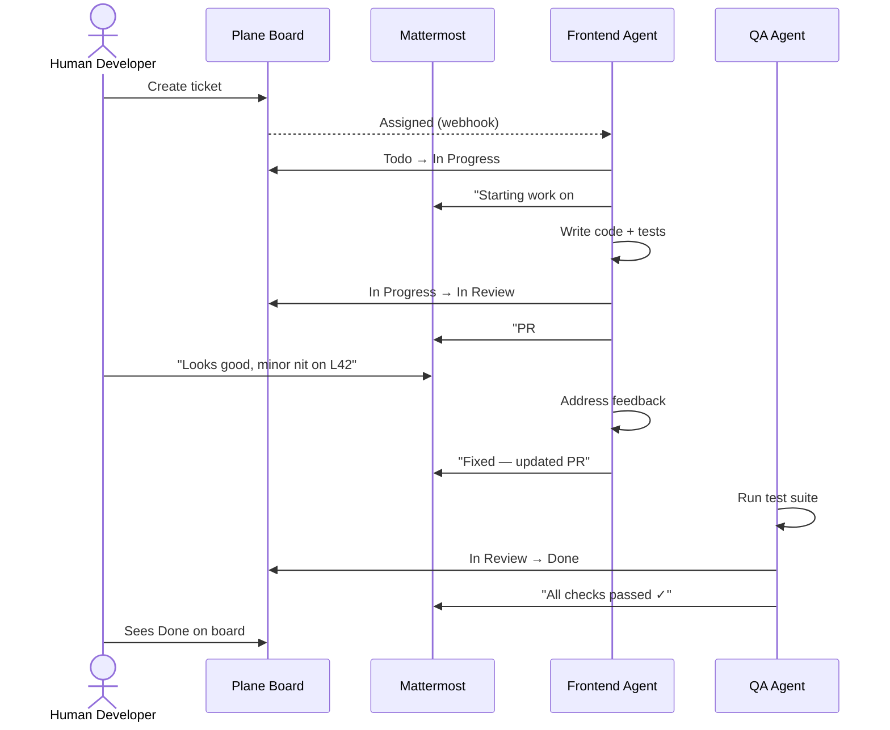
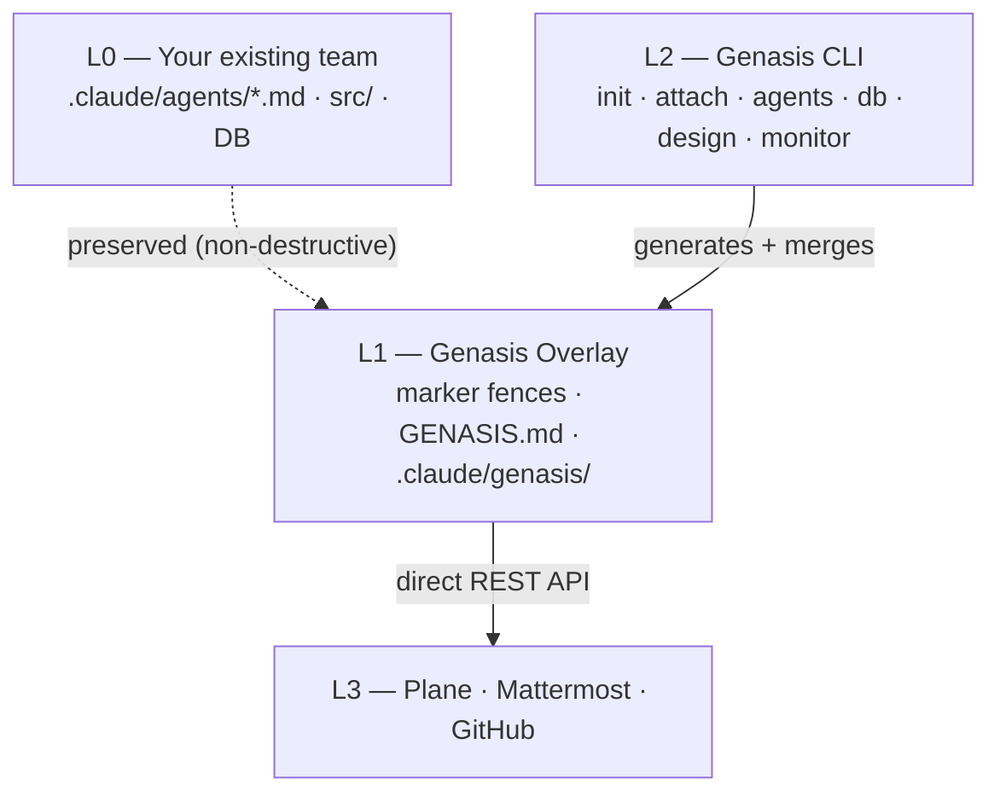

<div align="center">

# Genasis

**AI Agent Orchestration for Real Team Collaboration**

Install a full agentic development team that works alongside humans — picking up tickets in Plane, discussing in Mattermost threads, running sprints, and shipping code through the same workflow your team already uses.

[](https://github.com/claude-genasis/genasis/actions/workflows/ci.yml)
[](https://codecov.io/gh/claude-genasis/genasis)
[](https://github.com/claude-genasis/genasis/releases)
[](LICENSE)
[](https://github.com/claude-genasis/genasis/stargazers)
[](rust-toolchain.toml)
[](#supported-platforms)

[**English**](README.md)&nbsp;&nbsp;|&nbsp;&nbsp;[**한국어**](README.ko.md)

</div>

---

`genesis` · `genasis` · `agent-creation` · `agent-harness` · `agentic-team` · `agent-team` · `agentic-scrum` · `agentic-sdlc` · `claude-code` · `claude-code-plugins` · `claude-code-subagents` · `agentic-ai` · `ai-agent-orchestration` · `multi-agent-system` · `plane-project-management` · `mattermost-bot` · `sprint-automation` · `tdd` · `scrum-automation` · `coding-agents` · `rust-cli` · `self-hosted-ai` · `ai-software-development`

---

<p align="center">
  
</p>

## The Problem

AI coding agents today are **isolated tools**. They generate code when asked, but they don't:
- Pick up tickets from your issue tracker
- Update task status as they work
- Ask clarifying questions in your team chat
- Coordinate with other agents through human-visible channels
- Run through sprint ceremonies alongside your human developers

Meanwhile, every engineering team running **Claude Code** ends up building the same glue: connecting agents to Plane/Linear/Jira, wiring up Mattermost/Slack bots, enforcing TDD gates, managing design hand-offs. Most of that integration is fragile bash scripts that nobody wants to maintain.

## What Genasis Does

Genasis turns AI agents into **real team members** with a single Rust binary:

| Capability | How it works |
|---|---|
| **Curated Agent Marketplace** | 20+ best-of-breed agents from [ECC](https://github.com/affaan-m/everything-claude-code), [wshobson/agents](https://github.com/wshobson/agents), [VoltAgent](https://github.com/VoltAgent/awesome-claude-code-subagents), [dl-ezo](https://github.com/dl-ezo/claude-code-sub-agents). Browse by category, install individually or as presets. |
| **Issue Tracker Integration** | Direct Plane REST API. Agents own tickets, transition lifecycle (Todo → In Progress → In Review → Done), create sub-issues. |
| **Team Chat Integration** | One Mattermost bot per agent role. One thread per ticket. Agents discuss, escalate, coordinate — in the same channels humans read. |
| **Non-destructive Overlay** | Marker fences inside `.claude/agents/*.md`. Your existing agent definitions stay untouched. `genasis detach` removes everything cleanly. |
| **Sprint Automation** | 13 slash commands + 5 hooks pre-wired: `/sprint-start`, `/issue-done`, `/db-migrate`, session hooks, QA gates. |
| **Design System Management** | `genasis design swap` hot-swaps design tokens + auto-generates Plane issues for impacted UI areas. |
| **Database Schema Discipline** | SQL guard (read-only), Atlas/Drizzle Kit migrations, DuckDB raw runner. |
| **Real-time Monitor** | Ratatui TUI dashboard: sprint progress, token usage, agent activity, deploy status. |
| **Fully Reversible** | `genasis detach` removes all genasis-managed content. Zero residue. |

---

## Quick Path — Try Genasis in 5 Minutes

**5 steps to a running agentic team.** No server setup needed.

**1. Install**

```bash
curl -fsSL https://raw.githubusercontent.com/claude-genasis/genasis/main/install.sh | sh
```

**2. Initialize with trial mode** — opens the operator-hosted demo at [mmplane-trial.realstory.blog](https://mmplane-trial.realstory.blog) at *your* team's per-token URL (no local install needed). The `--name` flag carries through into the trial-app kanban + chat sidebar so the demo shows your team, not a generic shared sandbox (ADR-016).

```bash
mkdir marketing-squad && cd marketing-squad
genasis init --trial --name "Marketing Squad"
```

The command ends with a copy-friendly summary that prints the **team token** (32-char hex) and the **landing URL** with the token pre-filled. The Live Trial screen requires this token before it activates — when the browser opens, look for the **"Enter your team token"** bar at the top of the Live trial tab. If you pasted only the landing URL, the token is already filled in; if you arrived at the bare domain, paste the token into that bar to connect (ADR-017 §6). All Live Trial functionality (kanban, chat, showcase panel) stays disabled until a valid token is connected — that's the multi-tenant partition gate that keeps your team's kanban cards separate from every other concurrent demo.

**3. Generate a sample PRD** for your agents to work on

```bash
genasis example prd
```

**4. Start your agentic team**

```bash
genasis init
```

**5. Monitor the sprint**

```bash
genasis monitor
```

That's it. Your agentic team just ran a sprint from PRD to code.
For hands-on exercises (design swap, PRD expansion, adding agents),
see the [**full tutorial**](docs/TUTORIAL.md).

<details>
<summary>Build from source (instead of install.sh)</summary>

```bash
git clone https://github.com/claude-genasis/genasis.git && cd genasis && ./build.sh
```

</details>

---

## Step-by-Step Guide

For teams that want full control over every step.

### 1. Install

```bash
curl -fsSL https://raw.githubusercontent.com/claude-genasis/genasis/main/install.sh | sh
```

### 2. Set Up Plane & Mattermost

Genasis agents collaborate through **Plane** (issue tracking) and **Mattermost** (team chat).

**Option A — Trial Server (fastest, no setup)**

Borrow a real Plane + Mattermost project from the operator's shared
infrastructure at
[**mmplane-trial.realstory.blog**](https://mmplane-trial.realstory.blog/?tab=signup).
Click `Borrow real env` and submit a short form — credentials within
minutes. Available for ongoing use by agreement; no hard time limit
(ADR-017).

**Option B — Self-host (full control)**

```bash
cd servers && docker compose up -d
```

Plane at `localhost:8080`, Mattermost at `localhost:8065`.
See [`servers/README.md`](servers/README.md) for details.

After setup, configure credentials:

```bash
export PLANE_API_KEY="your-plane-api-key"
export MM_ADMIN_TOKEN="your-mattermost-token"
```

### 3. Connect & Launch

```bash
genasis init
```

### 4. Verify

```bash
genasis doctor
```

---

## How Agents Work Alongside Humans



A human reviewing the Plane board or Mattermost channel **cannot — and need not — distinguish** whether an update came from a human or an agent.

## Use Cases

| Team type | How genasis helps |
|---|---|
| **Startup (2-5 devs)** | Multiply your small team with AI agents handling reviews, testing, security scans. Agents join your existing Plane + Mattermost. |
| **Agency / Consultancy** | Spin up a full agentic team per client project. Preset install → immediate delivery capacity. |
| **Enterprise squad** | Bolt genasis onto existing `.claude/agents/` without disrupting current workflows. Non-destructive overlay = zero migration risk. |
| **Solo developer** | Full PM + architect + QA + security team for the price of one Claude Code subscription. Agents handle the process; you handle the vision. |
| **Open-source maintainer** | Automate PR reviews, security scanning, test enforcement. Community contributors see agent feedback in the same issue threads. |

## CLI Reference

```bash
# Team lifecycle
genasis init                   # provision Plane project + MM channel + attach agents
genasis attach                 # overlay onto existing agents (non-destructive)
genasis detach                 # remove overlay (fully reversible)
genasis doctor                 # verify environment + connectivity
genasis upgrade                # update overlay to latest protocol version

# Agent marketplace
genasis agents browse          # interactive category → select → install
genasis agents install <name>  # install one agent
genasis agents install --preset web-app  # install preset team (9 roles)
genasis agents list            # available agents in catalog
genasis agents installed       # what's in this project
genasis agents remove <name>   # uninstall an agent

# Operations
genasis monitor                # real-time TUI dashboard
genasis design swap <ref>      # hot-swap design system
genasis db query "SELECT ..."  # read-only SQL (DDL/DML blocked)
genasis db migrate             # run schema migration
genasis lang switch <en|ko>    # switch agent language atomically

# Continuous improvement
genasis debug status           # local drift summary
genasis debug collect          # generate anonymised patch
genasis debug submit           # contribute to genasis improvement (opt-in)
```

## Supported Platforms

| Platform | Pre-built binary (`install.sh`) | Build from source (`./build.sh`) |
|---|---|---|
| **Linux** x86_64 | ✅ musl-static — runs on every distro (Alpine, CentOS 7+, RHEL, Debian 10+, Ubuntu 18.04+, Amazon Linux 2, …) | ✅ |
| **Linux** aarch64 | ✅ musl-static, cross-compiled | ✅ |
| **WSL** (Windows Subsystem for Linux) | ✅ — uses the Linux x86_64 binary | ✅ |
| **macOS** (Apple Silicon / Intel) | ⏳ **TBD** — pre-built binaries not yet shipped; Apple Silicon notarisation + cross-compile signing on the roadmap | ✅ — `./build.sh` works today |
| **Windows** (native) | ❌ not supported — run inside WSL2 | ❌ |

> **Why musl-static for Linux?** GitHub's `ubuntu-latest` runner ships
> glibc 2.39, which would otherwise bake a `GLIBC_2.39` floor into the
> dynamic-linked binary and break older distros. Switching the release
> matrix to `x86_64-unknown-linux-musl` / `aarch64-unknown-linux-musl`
> via `cross` produces fully statically-linked binaries with no glibc
> dependency at all — the same tarball runs on glibc 2.17 (CentOS 7)
> through current Alpine. A CI compatibility-smoke job re-runs the
> packaged binary inside `debian:bullseye` (glibc 2.31) on every tag
> to guard against accidental re-introduction of a glibc dep.

> **macOS roadmap** — Apple Silicon native (`aarch64-apple-darwin`) is
> the priority once we settle on a notarisation flow. Intel mac
> support is best-effort and may be cut. Until then, macOS users build
> from source — the same `rustls-tls` feature flag that lets the Linux
> build avoid OpenSSL also makes the macOS build self-contained, so
> `./build.sh` "just works" without Homebrew prerequisites.

## Architecture



## Comparison with Alternatives

| Feature | **Genasis** | [ECC](https://github.com/affaan-m/everything-claude-code) | [wshobson/agents](https://github.com/wshobson/agents) | [VoltAgent](https://github.com/VoltAgent/awesome-claude-code-subagents) |
|---|---|---|---|---|
| Issue tracker integration (Plane) | ✅ direct API | manual | — | — |
| Team chat integration (Mattermost) | ✅ bot per role | — | — | — |
| Non-destructive overlay | ✅ marker fences | — | — | — |
| Agent marketplace (browse/install) | ✅ 20+ agents | 48 agents (all-or-nothing) | 185 agents (plugin model) | 131 agents (copy) |
| Sprint automation (commands + hooks) | ✅ 13 + 5 | — | — | — |
| Design system hot-swap | ✅ | — | — | — |
| Schema-as-code | ✅ | — | — | — |
| Real-time monitor TUI | ✅ Ratatui | — | — | — |
| Reversible (clean detach) | ✅ | — | — | — |
| Single binary (no Node/Python) | ✅ Rust | bash | npm | shell |
| i18n (English + Korean) | ✅ | — | — | — |

## Guides

| Guide | Description |
|---|---|
| [**Quickstart (detailed)**](docs/QUICKSTART.md) | Full walkthrough: install → configure → first sprint |
| [**Server Setup**](servers/README.md) | Self-host Plane + Mattermost with one `docker-compose up` |
| [**Agents Marketplace**](docs/AGENTS-MARKETPLACE.md) | Browse categories, presets, `/install-agent` command |
| [**Design Swap**](docs/DESIGN-SWAP-GUIDE.md) | Replace design system, override tokens, EPIC mode |
| [**Credits & OSS Sources**](docs/CREDITS.md) | Open-source projects genasis builds upon |

## Acknowledgments

Genasis curates and integrates agents from the open-source community.
Full attribution with links: [**docs/CREDITS.md**](docs/CREDITS.md).

| Project | What we use | License |
|---|---|---|
| [everything-claude-code (ECC)](https://github.com/affaan-m/everything-claude-code) | code-reviewer, architect, security-reviewer agents | MIT |
| [wshobson/agents](https://github.com/wshobson/agents) | frontend-developer, backend-developer agents | MIT |
| [VoltAgent](https://github.com/VoltAgent/awesome-claude-code-subagents) | qa-tester, DevOps agents | MIT |
| [dl-ezo](https://github.com/dl-ezo/claude-code-sub-agents) | planner, requirements lifecycle agents | MIT |
| [Plane](https://github.com/makeplane/plane) | Issue tracking + project management platform | AGPL-3.0 |
| [Mattermost](https://github.com/mattermost/mattermost) | Team messaging + bot platform | Various |
| [Ratatui](https://github.com/ratatui/ratatui) | Terminal UI framework (monitor dashboard) | MIT |

## Documentation

| | English | 한국어 |
|---|---|---|
| Blueprint | [blueprint.md](blueprint.md) | [blueprint.ko.md](blueprint.ko.md) |
| Progress | [progress.md](progress.md) | [progress.ko.md](progress.ko.md) |
| Architecture | [docs/ARCHITECTURE.md](docs/ARCHITECTURE.md) | [docs/ko/ARCHITECTURE.md](docs/ko/ARCHITECTURE.md) |
| Providers | [docs/PROVIDERS.md](docs/PROVIDERS.md) | [docs/ko/PROVIDERS.md](docs/ko/PROVIDERS.md) |
| Token Economics | [docs/TOKEN-ECONOMICS.md](docs/TOKEN-ECONOMICS.md) | [docs/ko/TOKEN-ECONOMICS.md](docs/ko/TOKEN-ECONOMICS.md) |
| ADRs | [docs/ADR/](docs/ADR/) | [docs/ko/ADR/](docs/ko/ADR/) |

## Contributing

See [`CONTRIBUTING.md`](CONTRIBUTING.md). Genasis also accepts **debug-history patches** — field modifications that feed back into improvement without requiring fork + PR. Run `genasis debug submit` from your project.

## Star History

<a href="https://star-history.com/#claude-genasis/genasis">
  <picture>
    <source media="(prefers-color-scheme: dark)" srcset="https://api.star-history.com/svg?repos=claude-genasis/genasis&type=Date&theme=dark">
    
  </picture>
</a>

## License

MIT — see [`LICENSE`](LICENSE).

<div align="center">

Made for engineering teams that want AI agents to be real team members, not isolated code generators.

[**English**](README.md)&nbsp;&nbsp;|&nbsp;&nbsp;[**한국어**](README.ko.md)

</div>
