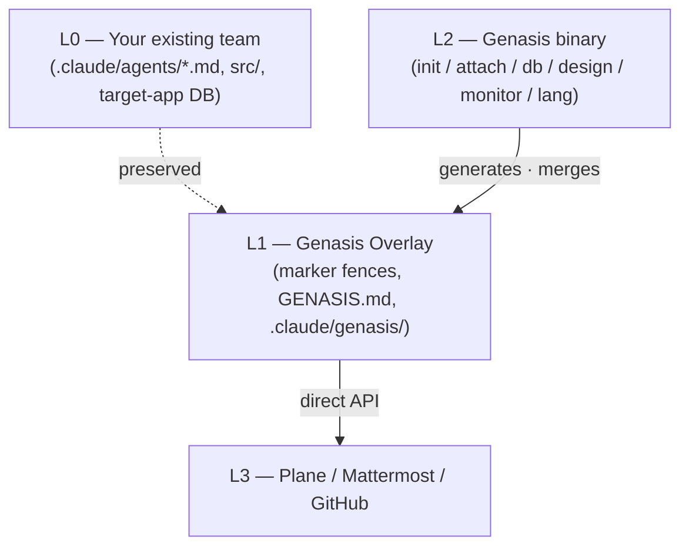

<div align="center">

# Genasis

**Bolt-on agentic team layer for Claude Code.**
Plane × Mattermost × TDD × Design hot-swap × Schema-as-code × Monitor — non-destructively attached to *any* existing agent team.

[](https://github.com/claude-genasis/genasis/actions/workflows/ci.yml)
[](https://github.com/claude-genasis/genasis/releases)
[](LICENSE)
[](https://github.com/claude-genasis/genasis/stargazers)
[](rust-toolchain.toml)

[**English**](README.md)&nbsp;·&nbsp;[**한국어**](README.ko.md)&nbsp;·&nbsp;[Add a language](docs/i18n/CONTRIBUTE-LANG.md)

</div>

---

`claude-code` · `agentic-team` · `agent-orchestration` · `plane-issues` · `mattermost-bot` · `tdd` · `rust-cli` · `multi-agent` · `ratatui` · `i18n` · `한국어` · `에이전트` · `claude-skills`

---

## Why Genasis

Most teams running Claude Code end up duct-taping the same six layers — issue tracking, chat-based scrum, TDD enforcement, design hand-off, database schema discipline, and a "what is the team doing right now" dashboard. They each demand their own glue, and most of the glue is bash that nobody wants to maintain.

Genasis bundles those layers as a **single Rust binary** that attaches a non-destructive overlay onto your existing `.claude/agents/*.md`. Marker fences hold everything Genasis manages; everything outside the fences stays exactly as you wrote it. `genasis detach` removes it cleanly — fully reversible, fully idempotent.

It's localised: install it in **English or Korean**, switch atomically with `genasis lang switch`, and never let two languages share an agent context (Claude Code drifts mid-response when they do — see [`docs/impact-of-multilang-prompts.md`](docs/impact-of-multilang-prompts.md)).

## Quickstart

```bash
curl -fsSL https://raw.githubusercontent.com/claude-genasis/genasis/main/install.sh | sh
```

The installer auto-detects your locale, asks once whether you want English or Korean instructions, and bolts the overlay onto your current project.

```bash
# explicit
sh install.sh --lang en
sh install.sh --lang ko

# rejected — see docs/impact-of-multilang-prompts.md
sh install.sh --lang both
```

## At a glance

| | |
|---|---|
| **Non-destructive overlay** | Marker fences inside `.claude/agents/*.md`. `detach` removes everything. |
| **Plane integration** | Direct REST. Auto-detects upstream vs. agent-aware flavor. |
| **Mattermost orchestration** | One bot per agent role; one thread per Plane issue. |
| **TDD enforcement** | `unit: pass` + `integration: pass` gate every In Review → Done. |
| **Design hot-swap** | `genasis design swap <ref-url>` regenerates `docs/design-system.md` and emits Plane issues for impacted areas. |
| **Schema-as-code** | Read via SQL guard, write via Atlas / Drizzle Kit / DuckDB raw runner. |
| **Monitor TUI** | Ratatui dashboard: sprint, tokens, agents, deploy LEDs, network, log tail. |
| **i18n** | English / Korean install-time selector. Atomic `lang switch`. Single-language at a time. |

## Usage

```bash
genasis init              # blank project → ECC team + overlay + Plane/MM provisioning
genasis attach            # existing team → bolt overlay on
genasis detach            # remove overlay (marker fences only)
genasis doctor            # verify env / tools / locale state
genasis upgrade           # bump overlay version (fence-hash diff)

genasis monitor           # Ratatui TUI

genasis lang status       # current locale + reference docs
genasis lang switch <en|ko>

genasis design swap <reference-url>
genasis db query "SELECT ..."
genasis db migrate
```

## Demo

<details>
<summary>Watch a 30-second install + monitor walkthrough (asciinema)</summary>

The cast at [`docs/assets/demo.cast`](docs/assets/demo.cast) shows the install prompt, the locale confirmation, an overlay attach, and the Ratatui monitor. View it with:

```bash
asciinema play docs/assets/demo.cast
```

</details>

## Architecture



## Comparison

| | **Genasis** | ECC | knowledge-work-plugins | claude-code-templates |
|---|---|---|---|---|
| Non-destructive overlay | ✅ | — | — | — |
| Plane (direct API) | ✅ | manual | — | — |
| Mattermost bot per role | ✅ | — | — | — |
| Design hot-swap | ✅ | — | — | — |
| Schema-as-code | ✅ | — | — | — |
| Monitor TUI | ✅ Ratatui | — | — | — |
| Install-time i18n | ✅ en / ko | — | — | — |
| Single Rust binary | ✅ | bash | npm | npm |

## Documentation

| | English | 한국어 |
|---|---|---|
| Blueprint | [`blueprint.md`](blueprint.md) | [`blueprint.ko.md`](blueprint.ko.md) |
| Progress tracker | [`progress.md`](progress.md) | [`progress.ko.md`](progress.ko.md) |
| Architecture | [`docs/ARCHITECTURE.md`](docs/ARCHITECTURE.md) | [`docs/ko/ARCHITECTURE.md`](docs/ko/ARCHITECTURE.md) |
| Providers | [`docs/PROVIDERS.md`](docs/PROVIDERS.md) | [`docs/ko/PROVIDERS.md`](docs/ko/PROVIDERS.md) |
| Migrating from Genesis | [`docs/MIGRATION-FROM-GENESIS.md`](docs/MIGRATION-FROM-GENESIS.md) | [`docs/ko/MIGRATION-FROM-GENESIS.md`](docs/ko/MIGRATION-FROM-GENESIS.md) |
| Token economics | [`docs/TOKEN-ECONOMICS.md`](docs/TOKEN-ECONOMICS.md) | [`docs/ko/TOKEN-ECONOMICS.md`](docs/ko/TOKEN-ECONOMICS.md) |
| Monitor TUI | [`docs/MONITOR.md`](docs/MONITOR.md) | [`docs/ko/MONITOR.md`](docs/ko/MONITOR.md) |
| Multilingual prompt impact | [`docs/impact-of-multilang-prompts.md`](docs/impact-of-multilang-prompts.md) | [`docs/ko/impact-of-multilang-prompts.md`](docs/ko/impact-of-multilang-prompts.md) |
| ADRs | [`docs/ADR/`](docs/ADR/) | [`docs/ko/ADR/`](docs/ko/ADR/) |

> **Translation status.** ADR-008 (i18n decision) and the five top-level architecture docs are canonical English; the Korean mirrors live under [`docs/ko/`](docs/ko/). The release-prep workflow auto-opens a `[i18n] Translation completion for vX.Y.Z` PR before each release tag whenever drift is detected.

## Status

Pre-release. Functionality below the M11 line is in place; M12 (i18n) is wrapping up. Track progress in [`progress.md`](progress.md).

## Contributing

Adding a new language is a four-surface PR ([guide](docs/i18n/CONTRIBUTE-LANG.md)). Everything else: open an Issue, we'll line it up against the milestone tracker.

PR conventions:

- Conventional Commits (`feat / fix / docs / chore / i18n`).
- New user-facing strings go through `t!()` and land in **both** `en.yml` and `ko.yml`.
- English doc edits warn on mirror drift in CI; release tags hard-fail.

## Star history

<a href="https://star-history.com/#claude-genasis/genasis">
  <picture>
    <source media="(prefers-color-scheme: dark)" srcset="https://api.star-history.com/svg?repos=claude-genasis/genasis&type=Date&theme=dark">
    
  </picture>
</a>

## License

MIT — see [`LICENSE`](LICENSE).

<div align="center">

Made for teams that would rather ship features than maintain agent glue.

[**English**](README.md)&nbsp;·&nbsp;[**한국어**](README.ko.md)

</div>
