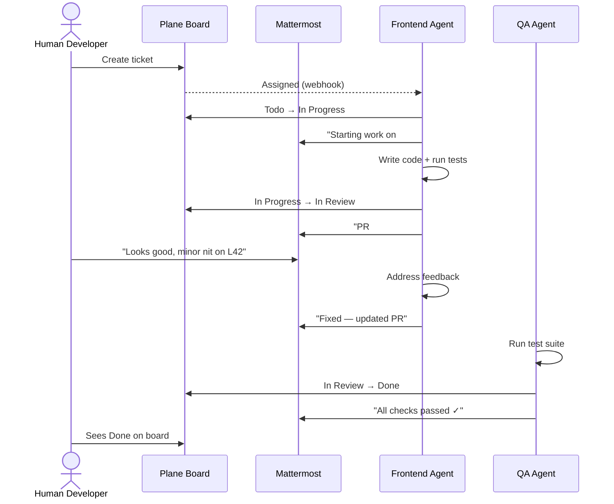
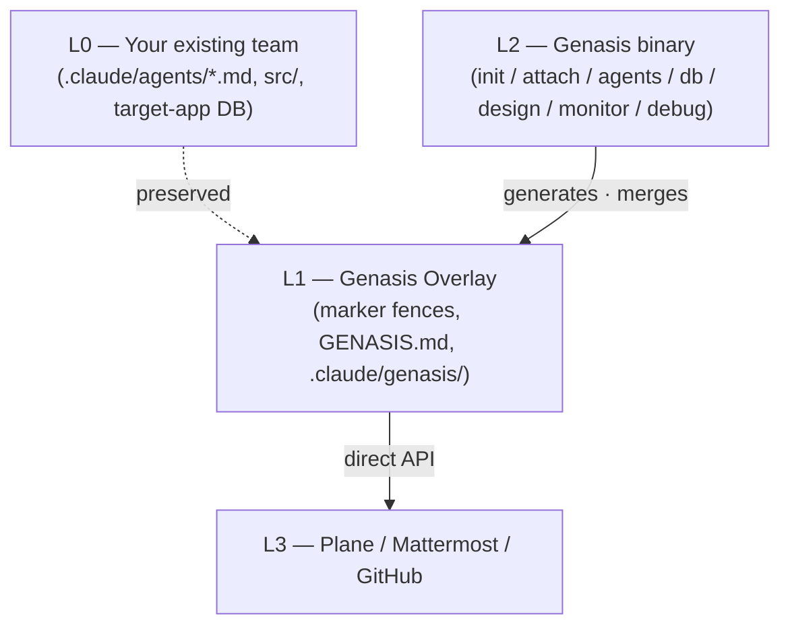

<div align="center">

# Genasis

**Make AI agents first-class team members — alongside humans.**
One command to install a full agentic team that collaborates through Plane and Mattermost, the same tools your human team already uses.

[](https://github.com/claude-genasis/genasis/actions/workflows/ci.yml)
[](https://github.com/claude-genasis/genasis/releases)
[](LICENSE)
[](https://github.com/claude-genasis/genasis/stargazers)
[](https://codecov.io/gh/claude-genasis/genasis)
[](rust-toolchain.toml)

[**English**](README.md)&nbsp;·&nbsp;[**한국어**](README.ko.md)&nbsp;·&nbsp;[Add a language](docs/i18n/CONTRIBUTE-LANG.md)

</div>

---

`claude-code` · `agentic-team` · `agent-orchestration` · `plane-issues` · `mattermost-bot` · `tdd` · `rust-cli` · `multi-agent` · `ratatui` · `i18n` · `한국어` · `에이전트` · `claude-skills`

---

## The Problem

AI agents today live in a silo. They read code and write code, but they don't participate in the team's daily workflow — they don't pick up tickets, update status in the issue tracker, ask questions in the team chat, or coordinate with each other through the same channels humans use.

Meanwhile, every team running Claude Code ends up duct-taping the same six layers: issue tracking, chat-based scrum, TDD enforcement, design hand-off, DB schema discipline, and an agent dashboard. Most of that glue is bash that nobody wants to maintain.

## What Genasis Does

Genasis solves both problems with a **single Rust binary**:

1. **Installs a curated agentic team** — 20+ best-of-breed agents (from ECC, wshobson, VoltAgent, dl-ezo) with pre-configured roles, skills, and commands. Browse by category, install individually or as presets (web-app / full-stack / mobile).

2. **Wires them into human collaboration tools** — Every agent gets its own Plane PAT and Mattermost bot. Agents pick up tickets, post status updates, ask questions in threads, and transition issues through the lifecycle (Todo → In Progress → In Review → Done) — all in the same boards and channels your human team reads.

3. **Works for any starting point**:
   - **No agentic team yet?** `genasis init --bootstrap` scaffolds the full team + Plane/Mattermost provisioning from scratch.
   - **Already running agents?** `genasis attach` non-destructively overlays Plane/Mattermost integration onto your existing `.claude/agents/*.md` via marker fences. Your agent definitions stay untouched outside the fence.

4. **Fully reversible** — `genasis detach` removes everything Genasis added. Marker fences only. Zero residue.

## Quickstart

```bash
curl -fsSL https://raw.githubusercontent.com/claude-genasis/genasis/main/install.sh | sh
```

```bash
sh install.sh --lang en        # English agent instructions
sh install.sh --lang ko        # Korean agent instructions
sh install.sh --lang both      # rejected — see docs/impact-of-multilang-prompts.md
```

## At a Glance

| | |
|---|---|
| **Agents Catalog** | 20+ curated agents across 6 categories. Presets: web-app (9), full-stack (11), mobile (9). Fetched at runtime, not baked into the binary. |
| **Non-destructive overlay** | Marker fences inside `.claude/agents/*.md`. `detach` removes everything. |
| **Plane integration** | Direct REST API. Agents own tickets, transition lifecycle, create sub-issues. Auto-detects upstream vs. agent-aware Plane. |
| **Mattermost orchestration** | One bot per agent role. One thread per Plane issue. Agents discuss, escalate, and coordinate in real-time — alongside humans. |
| **Skills & Commands** | 13 sprint/issue commands (`/sprint-start`, `/issue-done`, `/db-migrate`, ...) + 5 hooks (session-start, branch guard, MM sync, ...) pre-wired per role. |
| **TDD enforcement** | `unit: pass` + `integration: pass` gates every In Review → Done transition. |
| **Design hot-swap** | `genasis design swap <ref-url>` regenerates `docs/design-system.md` and emits Plane issues for impacted areas. |
| **Schema-as-code** | Read via SQL guard, write via Atlas / Drizzle Kit / DuckDB raw runner. |
| **Monitor TUI** | Ratatui dashboard: sprint, tokens, agents, deploy LEDs, network, log tail. |
| **Debug History** | Always-on drift detection. Your field modifications feed back into genasis improvement via `genasis debug submit`. |
| **i18n** | English / Korean install-time selector. Atomic `lang switch`. Single-language at a time. |

## Usage

```bash
# Team setup
genasis init                   # blank project → bootstrap team + overlay + Plane/MM provisioning
genasis init --bootstrap       # scaffold all 10 default agent roles from scratch
genasis attach                 # existing team → bolt overlay on (Plane/MM integration)
genasis detach                 # remove overlay (marker fences only)
genasis doctor                 # verify env / tools / locale state
genasis upgrade                # bump overlay version (fence-hash diff)

# Agents catalog
genasis agents browse          # TUI: browse agents by category, preview, install
genasis agents install <name>  # install a single agent (e.g., frontend-developer)
genasis agents install --preset web-app  # install preset team (9 roles)
genasis agents list            # list available agents
genasis agents installed       # show what's installed in this project
genasis agents fetch           # download/update agents catalog

# Operations
genasis monitor                # Ratatui TUI dashboard
genasis lang status            # current locale
genasis lang switch <en|ko>    # switch agent language atomically
genasis design swap <ref-url>  # hot-swap design system
genasis db query "SELECT ..."  # read-only SQL
genasis db migrate             # schema migration

# Debug history (field feedback)
genasis debug status           # drift summary for current project
genasis debug collect          # generate anonymised patch from local modifications
genasis debug submit           # opt-in: contribute patch to genasis improvement
```

## How Agents Collaborate with Humans



A human reviewing the Plane board or Mattermost channel cannot — and need not — distinguish whether an update came from a human or an agent.

## How Genasis Gets Installed

```mermaid
flowchart LR
    subgraph starting["Your Project"]
        A0["No agents yet<br/>(blank project)"]
        A1["Existing agents<br/>(.claude/agents/*.md)"]
    end

    subgraph genasis["Genasis CLI"]
        B0["genasis init<br/>--bootstrap"]
        B1["genasis attach"]
        B2["genasis agents<br/>browse / install"]
    end

    subgraph result["Agentic Team Running"]
        C1["Agent .md files<br/>+ overlay fences"]
        C2["Plane integration<br/>(tickets, lifecycle)"]
        C3["Mattermost bots<br/>(thread per issue)"]
        C4["Skills & Commands<br/>(13 cmds + 5 hooks)"]
    end

    A0 --> B0
    A0 --> B2
    A1 --> B1
    B0 --> C1
    B1 --> C1
    B2 --> C1
    C1 --> C2
    C1 --> C3
    C1 --> C4
```



## Contributing — Debug History Model

Genasis uses a unique contribution model for continuous improvement:

**You don't need to fork or clone the genasis repo.** Just use genasis in your project:

```bash
# 1. Install genasis and run your agentic team as usual
genasis attach

# 2. Modify overlay files to fix bugs or adapt to your workflow
#    (genasis tracks all changes automatically — always-on, zero-config)

# 3. When ready, generate an anonymised patch
genasis debug collect

# 4. Submit to genasis improvement (opt-in, preview before sending)
genasis debug submit
#    → creates a GitHub Issue with structured patch data
#    → your source code is NEVER included (overlay diffs only)
```

The maintainer collects submitted patches and processes them via local Claude Code (`/debug-review` skill) to propose template improvements. Contributors provide signal (what changed and why); the maintainer turns that signal into code.

For traditional code contributions (new features, docs), standard fork + PR applies — see [`CONTRIBUTING.md`](CONTRIBUTING.md).

## Quality Assurance

The genasis team periodically tests all curated agent definitions to ensure they produce good development outcomes. Testing covers:

- **Structural validation** — frontmatter, tool declarations, overlay compatibility
- **Integration** — Plane lifecycle transitions, Mattermost thread creation, cross-agent handoff
- **Regression** — updated definitions don't break existing behaviors
- **Benchmarks** — review accuracy, task completion rate, false positive tracking

See `agents-pool/agents-test-method.md` for the full testing methodology.

## Architecture



## Comparison

| | **Genasis** | ECC | knowledge-work-plugins | claude-code-templates |
|---|---|---|---|---|
| Non-destructive overlay | ✅ | — | — | — |
| Plane (direct API) | ✅ | manual | — | — |
| Mattermost bot per role | ✅ | — | — | — |
| Curated agents catalog (20+) | ✅ browse/install | — | — | — |
| Sprint commands + hooks | ✅ 13 cmds + 5 hooks | — | — | — |
| Design hot-swap | ✅ | — | — | — |
| Schema-as-code | ✅ | — | — | — |
| Monitor TUI | ✅ Ratatui | — | — | — |
| Debug history feedback | ✅ | — | — | — |
| Install-time i18n | ✅ en / ko | — | — | — |
| Single Rust binary | ✅ | bash | npm | npm |

## Documentation

| | English | 한국어 |
|---|---|---|
| Blueprint | [`blueprint.md`](blueprint.md) | [`blueprint.ko.md`](blueprint.ko.md) |
| Progress tracker | [`progress.md`](progress.md) | [`progress.ko.md`](progress.ko.md) |
| Architecture | [`docs/ARCHITECTURE.md`](docs/ARCHITECTURE.md) | [`docs/ko/ARCHITECTURE.md`](docs/ko/ARCHITECTURE.md) |
| Providers | [`docs/PROVIDERS.md`](docs/PROVIDERS.md) | [`docs/ko/PROVIDERS.md`](docs/ko/PROVIDERS.md) |
| Migrating from Genesis | [`docs/MIGRATION-FROM-GENESIS.md`](docs/MIGRATION-FROM-GENESIS.md) | [`docs/ko/MIGRATION-FROM-GENESIS.md`](docs/ko/MIGRATION-FROM-GENESIS.md) |
| Token economics | [`docs/TOKEN-ECONOMICS.md`](docs/TOKEN-ECONOMICS.md) | [`docs/ko/TOKEN-ECONOMICS.md`](docs/ko/TOKEN-ECONOMICS.md) |
| Monitor TUI | [`docs/MONITOR.md`](docs/MONITOR.md) | [`docs/ko/MONITOR.md`](docs/ko/MONITOR.md) |
| Multilingual prompt impact | [`docs/impact-of-multilang-prompts.md`](docs/impact-of-multilang-prompts.md) | [`docs/ko/impact-of-multilang-prompts.md`](docs/ko/impact-of-multilang-prompts.md) |
| ADRs | [`docs/ADR/`](docs/ADR/) | [`docs/ko/ADR/`](docs/ko/ADR/) |

## Status

Pre-release. M0–M12 + Phase D (design catalog) complete. **Phase E** (Dynamic Agents Catalog — ADR-011) in progress. **Phase F** (Debug History — ADR-012) designed. Track progress in [`progress.md`](progress.md).

## Star history

<a href="https://star-history.com/#claude-genasis/genasis">
  <picture>
    <source media="(prefers-color-scheme: dark)" srcset="https://api.star-history.com/svg?repos=claude-genasis/genasis&type=Date&theme=dark">
    
  </picture>
</a>

## License

MIT — see [`LICENSE`](LICENSE).

<div align="center">

Made for teams that want AI agents to be real team members, not just code generators.

[**English**](README.md)&nbsp;·&nbsp;[**한국어**](README.ko.md)

</div>
