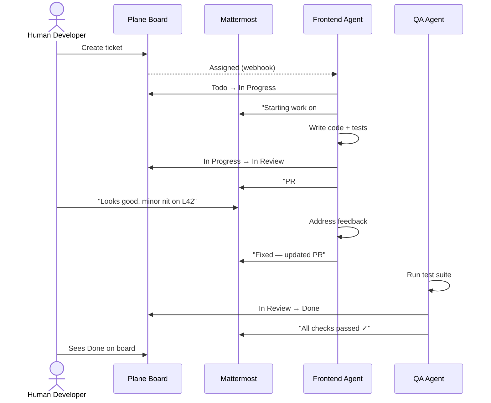
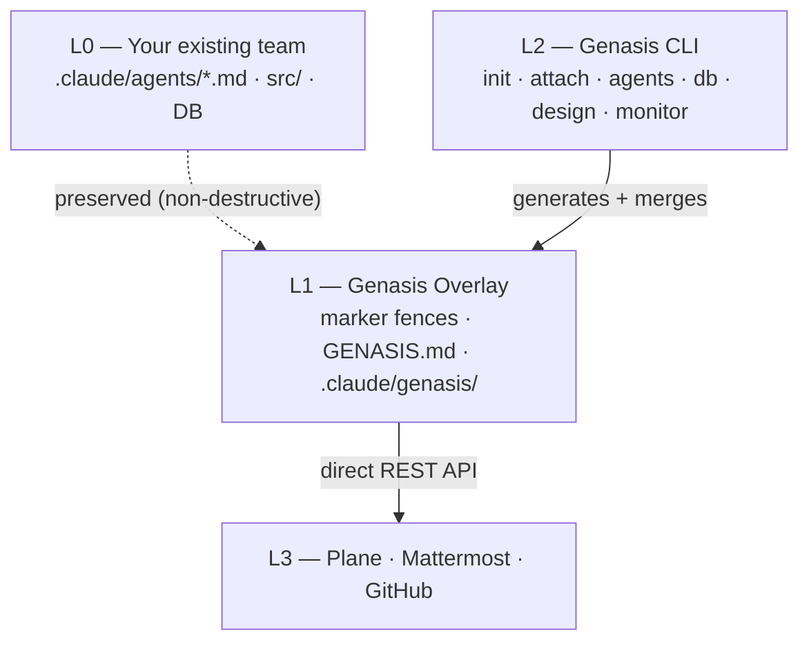

<div align="center">

# Genasis

**AI Agent Orchestration for Real Team Collaboration**

Install a full agentic development team that works alongside humans — picking up tickets in Plane, discussing in Mattermost threads, running sprints, and shipping code through the same workflow your team already uses.

[](https://github.com/claude-genasis/genasis/actions/workflows/ci.yml)
[](https://codecov.io/gh/claude-genasis/genasis)
[](https://github.com/claude-genasis/genasis/releases)
[](LICENSE)
[](https://github.com/claude-genasis/genasis/stargazers)
[](rust-toolchain.toml)
[](#supported-platforms)

[**English**](README.md)&nbsp;&nbsp;|&nbsp;&nbsp;[**한국어**](README.ko.md)

</div>

---

`genesis` · `genasis` · `agent-creation` · `agent-harness` · `agentic-team` · `agent-team` · `agentic-scrum` · `agentic-sdlc` · `claude-code` · `claude-code-plugins` · `claude-code-subagents` · `agentic-ai` · `ai-agent-orchestration` · `multi-agent-system` · `plane-project-management` · `mattermost-bot` · `sprint-automation` · `tdd` · `scrum-automation` · `coding-agents` · `rust-cli` · `self-hosted-ai` · `ai-software-development`

---

<p align="center">
  
</p>

## The Problem

AI coding agents today are **isolated tools**. They generate code when asked, but they don't:
- Pick up tickets from your issue tracker
- Update task status as they work
- Ask clarifying questions in your team chat
- Coordinate with other agents through human-visible channels
- Run through sprint ceremonies alongside your human developers

Meanwhile, every engineering team running **Claude Code** ends up building the same glue: connecting agents to Plane/Linear/Jira, wiring up Mattermost/Slack bots, enforcing TDD gates, managing design hand-offs. Most of that integration is fragile bash scripts that nobody wants to maintain.

## What Genasis Does

Genasis turns AI agents into **real team members** with a single Rust binary:

| Capability | How it works |
|---|---|
| **Curated Agent Marketplace** | 20+ best-of-breed agents from [ECC](https://github.com/affaan-m/everything-claude-code), [wshobson/agents](https://github.com/wshobson/agents), [VoltAgent](https://github.com/VoltAgent/awesome-claude-code-subagents), [dl-ezo](https://github.com/dl-ezo/claude-code-sub-agents). Browse by category, install individually or as presets. |
| **Issue Tracker Integration** | Direct Plane REST API. Agents own tickets, transition lifecycle (Todo → In Progress → In Review → Done), create sub-issues. |
| **Team Chat Integration** | One Mattermost bot per agent role. One thread per ticket. Agents discuss, escalate, coordinate — in the same channels humans read. |
| **Non-destructive Overlay** | Marker fences inside `.claude/agents/*.md`. Your existing agent definitions stay untouched. `genasis detach` removes everything cleanly. |
| **Sprint Automation** | 13 slash commands + 5 hooks pre-wired: `/sprint-start`, `/issue-done`, `/db-migrate`, session hooks, QA gates. |
| **Design System Management** | `genasis design swap` hot-swaps design tokens + auto-generates Plane issues for impacted UI areas. |
| **Database Schema Discipline** | SQL guard (read-only), Atlas/Drizzle Kit migrations, DuckDB raw runner. |
| **Real-time Monitor** | Ratatui TUI dashboard: sprint progress, token usage, agent activity, deploy status. |
| **Fully Reversible** | `genasis detach` removes all genasis-managed content. Zero residue. |

---

## Quick Path — Try Genasis in 5 Minutes

**5 steps to a running agentic team.** No server setup needed.

**1. Install**

```bash
curl -fsSL https://raw.githubusercontent.com/claude-genasis/genasis/main/install.sh | sh
```

**2. Initialize with trial mode** — opens the operator-hosted demo at [mmplane-trial.realstory.blog](https://mmplane-trial.realstory.blog) at *your* team's per-token URL (no local install needed). The `--name` flag carries through into the trial-app kanban + chat sidebar so the demo shows your team, not a generic shared sandbox (ADR-016).

```bash
mkdir marketing-squad && cd marketing-squad
genasis init --trial --name "Marketing Squad"
```

The command ends with a copy-friendly summary that prints the **team token** (32-char hex) and the **landing URL** with the token pre-filled. The Live Trial screen requires this token before it activates — when the browser opens, look for the **"Enter your team token"** bar at the top of the Live trial tab. If you pasted only the landing URL, the token is already filled in; if you arrived at the bare domain, paste the token into that bar to connect (ADR-017 §6). All Live Trial functionality (kanban, chat, showcase panel) stays disabled until a valid token is connected — that's the multi-tenant partition gate that keeps your team's kanban cards separate from every other concurrent demo.

> **🔍 Sanity check** — open the landing URL now (before continuing). You should see your team name in the top-right "연결됨 / Connected" badge **and** three demo cards in the kanban (one each in Done / In Progress / Todo) **plus** a welcome message in the `#scrum-<team-slug>` chat panel. If the badge is there but the kanban + chat are empty, the operator-hosted trial-app is older than this binary — jump to [**Known limitations (v0.5.11)**](#known-limitations-v0511) for the one-command local-docker workaround (`export GENASIS_TRIAL_URL=http://localhost:2099` then re-run from step 2). Everything below still works the same way against your local instance.

**3. Generate a sample PRD** for your agents to work on

```bash
genasis example prd
```

**4. Open the URL + start chatting** — `init --trial` already
flipped the trial-app's `app_status` to `complete` *and* started the
reactive daemon in the background, so the Live Trial URL is fully
live. Type into the chat panel; PM / frontend / devops agents reply
within a minute.

**5. (Optional) Generate a sample PRD** for the agents to chew on

```bash
genasis example prd
```

**6. (Optional) Watch the sprint**

```bash
genasis monitor       # sprint + tokens + agents + log TUI
genasis status        # daemon status + URL + recent activity
genasis logs -f       # follow the daemon log
```

**Stop when done**

```bash
genasis stop          # background daemon stops
```

> **🔍 Sanity check** — refresh the Live Trial URL after `init --trial`.
> The kanban should show seeded cards, the chat panel should show
> 2 system messages, and the left-edge "결과보기" handle is
> clickable (not grayed-out "준비중"). If the handle is gray, the
> auto-publish step inside `init` failed — re-run `genasis publish`
> manually.

That's it. Your agentic team just ran a sprint from PRD to code.
For hands-on exercises (design swap, PRD expansion, adding agents),
see the [**full tutorial**](docs/TUTORIAL.md).

<details>
<summary>Build from source (instead of install.sh)</summary>

```bash
git clone https://github.com/claude-genasis/genasis.git && cd genasis && ./build.sh
```

</details>

---

## Real Plane + Mattermost path (`genasis provision`)

The Quick Path puts you in the trial sandbox at
`mmplane-trial.realstory.blog`. When you're ready to move your team
onto a real Plane + Mattermost stack — either the operator-hosted
`plane.realstory.blog` / `mm.realstory.blog`, or your own
`docker-compose.yml` stack — one command provisions everything.

```bash
export PLANE_URL=https://plane.realstory.blog
export PLANE_ADMIN_TOKEN=...        # generate from Plane admin UI
export MM_URL=https://mm.realstory.blog
export MM_ADMIN_TOKEN=...           # Mattermost system-admin PAT

genasis provision \
  --team "Marketing Squad" \
  --app "Quiz Demo" \
  --humans "Bravo Kim <gnoopy@gmail.com>,Alice <alice@example.com>"
```

What it does (idempotent — re-runs are safe):

1. Translates and abbreviates the team / app names into 5-char slugs
   (`ms`, `qd`). Hangul input is translated via your local `claude`
   CLI first, then abbreviated.
2. Tries to create a per-team Plane workspace; on permission failure
   falls back to a shared `agentic` workspace + `<team>-<app>` project
   name.
3. Creates agent users in both Plane and Mattermost and issues
   per-agent API tokens. The roster is auto-detected from the
   project's `.claude/agents/` directory if present (so the agents
   actually installed in the project get provisioned, no more, no
   less); falls back to the 10-agent canonical default in a
   greenfield setup; overridable with `--agents pm,frontend,...`.
4. Invites the listed humans into the Plane project and the
   Mattermost team. The email's local-part seeds the suggested
   username (`gnoopy@gmail.com` → `gnoopy`).
5. Creates one Mattermost team (`team-ms`) and one scrum channel
   (`scrum-quiz`) with every human and agent as a member.
6. Writes `genasis.toml` (identifiers) and `.env.local` (per-agent
   tokens, chmod 600). The `genasis listen` daemon picks up both at
   startup.

**Interactive mode** — run `genasis provision` with no flags and you
get a stdin wizard asking for team name, app name, and each human's
name + email one at a time.

**Day-2 churn** — once provisioned, use `genasis team` for
incremental changes without re-running the full flow:

```bash
genasis team add human "Charlie <charlie@x.com>"     # invite a new human
genasis team add agent designer                       # hire an additional agent
genasis team add agent custom-role                    # hire a brand-new role
genasis team remove human alice@x.com                 # deactivate (history preserved)
genasis team remove agent designer
genasis team list                                     # current roster + health
```

**Self-host** — same command, just point the env at your local
docker-compose stack: `PLANE_URL=http://localhost:8080`,
`MM_URL=http://localhost:8065`. See [ADR-019](docs/ADR/ADR-019-real-provisioning.md)
for the full specification.

**Operator cheat sheet** — running Genasis-as-a-service for several
tenants? Stash per-tenant secrets in a private repo so they survive
workstation loss and are recoverable from git history:

```bash
# One-time: point provision/team at the secrets store.
export GENASIS_SECRETS_ROOT=/path/to/agents-pool/secrets

# Provision a new tenant — writes secrets/teams/<slug>/.
genasis provision --team "Tenant Co" --app "Their App" \
  --humans "Tenant Owner <owner@tenant.co>"

# Day-2 changes (no need to re-provision):
genasis team --team-slug <slug> list
genasis team --team-slug <slug> add human "Charlie <charlie@x.com>"
genasis team --team-slug <slug> add agent designer
genasis team --team-slug <slug> remove agent designer
genasis team --team-slug <slug> remove human alice@x.com

# Commit the updated secrets/teams/<slug>/ to your private repo.
```

End-users running `genasis` against their own self-hosted stack
omit `GENASIS_SECRETS_ROOT` — outputs land in the project directory
they're in.

## Step-by-Step Guide

For teams that want full control over every step.

### 1. Install

```bash
curl -fsSL https://raw.githubusercontent.com/claude-genasis/genasis/main/install.sh | sh
```

### 2. Set Up Plane & Mattermost

Genasis agents collaborate through **Plane** (issue tracking) and **Mattermost** (team chat).

**Option A — Trial Server (fastest, no setup)**

Borrow a real Plane + Mattermost project from the operator's shared
infrastructure at
[**mmplane-trial.realstory.blog**](https://mmplane-trial.realstory.blog/?tab=signup).
Click `Borrow real env` and submit a short form — credentials within
minutes. Available for ongoing use by agreement; no hard time limit
(ADR-017).

**Option B — Self-host (full control)**

First fetch the `servers/` directory that contains the Plane +
Mattermost + Caddy + Postgres docker stack. `install.sh` only ships
the `genasis` binary, so this step is **separate**:

```bash
# Option 1 — full repo clone (simplest)
git clone https://github.com/claude-genasis/genasis && cd genasis

# Option 2 — sparse-checkout only the servers/ dir (~1 MB)
git clone --depth 1 --filter=blob:none --sparse \
  https://github.com/claude-genasis/genasis && \
  cd genasis && git sparse-checkout set servers
```

Then bring the stack up:

```bash
cd servers && ./scripts/setup-user-env.sh && docker compose up -d
```

`setup-user-env.sh` allocates a per-user port pair (default base
`38400` for Plane, `38500` for Mattermost, with a `uid % 50` offset
so multiple users on the same host don't collide). The exact ports
land in `servers/.env` — `grep -E "^(PLANE|MM)_PORT" servers/.env`
to see what was assigned. See [`servers/README.md`](servers/README.md)
for the full port-allocation rationale.

After setup, configure credentials. On Mattermost the team id is
auto-resolved from `[mattermost].team_name`, but if the lookup
fails (e.g. the team doesn't exist yet at init time) set
`MM_TEAM_ID` explicitly:

```bash
export PLANE_API_KEY="your-plane-api-key"
export MM_ADMIN_TOKEN="your-mattermost-token"
# Optional — only when auto-resolution can't reach MM:
# export MM_TEAM_ID="your-mattermost-team-id"

# For `genasis humans sync` to provision new humans into Plane
# (issue 바, v0.5.3): Plane's API-key auth can't create users —
# only admin sign-in can. Set these BEFORE `humans sync` runs,
# otherwise the Plane half of provisioning is silently skipped
# and only the Mattermost half lands. The same credentials you
# used to bootstrap Plane via god-mode (Step-by-Step §"Provision
# admin tokens") apply.
# export PLANE_ADMIN_EMAIL="admin@your-domain"
# export PLANE_ADMIN_PASSWORD="strong-password"
```

### 3. Connect & Launch

```bash
genasis init
```

### 4. Verify

```bash
genasis doctor
```

---

## How Agents Work Alongside Humans



A human reviewing the Plane board or Mattermost channel **cannot — and need not — distinguish** whether an update came from a human or an agent.

## Use Cases

| Team type | How genasis helps |
|---|---|
| **Startup (2-5 devs)** | Multiply your small team with AI agents handling reviews, testing, security scans. Agents join your existing Plane + Mattermost. |
| **Agency / Consultancy** | Spin up a full agentic team per client project. Preset install → immediate delivery capacity. |
| **Enterprise squad** | Bolt genasis onto existing `.claude/agents/` without disrupting current workflows. Non-destructive overlay = zero migration risk. |
| **Solo developer** | Full PM + architect + QA + security team for the price of one Claude Code subscription. Agents handle the process; you handle the vision. |
| **Open-source maintainer** | Automate PR reviews, security scanning, test enforcement. Community contributors see agent feedback in the same issue threads. |

## CLI Reference

```bash
# Team lifecycle
genasis init                   # provision Plane project + MM channel + attach agents
genasis attach                 # overlay onto existing agents (non-destructive)
genasis detach                 # remove overlay (fully reversible)
genasis doctor                 # verify environment + connectivity
genasis upgrade                # update overlay to latest protocol version

# Agent marketplace
genasis agents browse          # interactive category → select → install
genasis agents install <name>  # install one agent
genasis agents install --preset web-app  # install preset team (9 roles)
genasis agents list            # available agents in catalog
genasis agents installed       # what's in this project
genasis agents remove <name>   # uninstall an agent

# Operations
genasis monitor                # real-time TUI dashboard
genasis design swap <ref>      # hot-swap design system
genasis db query "SELECT ..."  # read-only SQL (DDL/DML blocked)
genasis db migrate             # run schema migration
genasis lang switch <en|ko>    # switch agent language atomically

# Continuous improvement
genasis debug status           # local drift summary
genasis debug collect          # generate anonymised patch
genasis debug submit           # contribute to genasis improvement (opt-in)
```

## Trial-app deployment model

Where does your trial-app actually run?

| Option | URL | Best for |
|--------|-----|----------|
| **A. Operator-hosted (default)** | `https://mmplane-trial.realstory.blog` | Quickest demo. No extra setup. UI updates ship from the genasis maintainer. |
| **B. Self-hosted trial-app** | `GENASIS_TRIAL_URL=http://localhost:2099` | Air-gapped demos, custom UI mods, working offline. |

Both paths use the **same** `genasis` CLI flow — only the URL the
daemon and browser point at changes.

### Option A — operator-hosted (you already have this if you ran the Quick Path)

The browser hits `mmplane-trial.realstory.blog`, the daemon on your
machine talks to the same host via its REST + SSE API, and your
agents' built apps stream out of `vite dev` on your localhost via
the trial-app's reverse-proxy at `/dev/<token>/`. Nothing else to
install.

If you ever see the kanban + chat panel falling behind the daemon
logs (cards not transitioning, chat replies missing), the most
likely cause is the SSE stream dropping during an operator restart
or a network blip. alpha.37+ adds auto-reconnect for both the chat
and kanban; older builds need a manual page reload.

### Option B — self-host the trial-app

The trial-app's source is in the operator's private repo
(`agents-pool/trial-app/`), but the runtime artifact is published to
GitHub Container Registry. Add it to your local stack:

```bash
cd servers
# Edit docker-compose.yml — uncomment the trial-app service block
docker compose up -d trial-app   # listens on :2099 by default

# Point your CLI + browser at the local instance
export GENASIS_TRIAL_URL=http://localhost:2099
cd ~/my-project
genasis init --trial --name "X"
# The init banner prints http://localhost:2099/?team=...  ← open this
```

(Image publish + the docker-compose service block are the
`v0.6.0-alpha.38+` follow-up; until then self-host requires building
the trial-app from a clone of the agents-pool repo you've been
granted access to.)

## Troubleshooting

### "결과보기" 핸들이 "준비중" 으로만 보임

`genasis publish` (Quick Path step 4) 가 실행되지 않은 상태. 트라이얼
team 의 `app_status` 가 `complete` 가 되면 핸들이 활성됩니다. 사용자
sandbox 디렉터리로 이동 후:

```bash
cd <your-project-dir>
genasis publish
```

새로고침하면 "결과보기" 로 바뀜.

### 채팅에 메시지 보내도 응답이 오지 않음 / 칸반에도 안 보임

세 가지 가능성을 순서대로 확인:

1. **데몬이 떠 있나?**
   ```bash
   genasis listen status
   # "실행 중 (PID NNN)" 이 나와야 함. 아니면:
   cd <your-project-dir>
   genasis listen start --trial
   ```
2. **데몬이 최신 binary 인가?** install.sh 의 캐시 / 옛 경로 이슈로
   alpha.25 같은 옛 버전이 떠 있을 수 있음.
   ```bash
   /home/$USER/.local/bin/genasis --version
   # alpha.30 이상이어야 함. 아니면 install.sh 재실행:
   bash <(curl -fsSL https://raw.githubusercontent.com/claude-genasis/genasis/main/install.sh)
   genasis listen restart --trial
   ```
3. **운영자 인스턴스가 살아 있나?**
   ```bash
   curl -sS -o /dev/null -w "%{http_code}\n" https://mmplane-trial.realstory.blog/
   # 200 이 안 나오면 운영자에게 문의.
   ```

## Known limitations (v0.5.20)

- **시나리오 = 기존 앱 수정** (사용자가 v0.5.15 의 "전체 앱 교체" 시나리오를 거부). 트라이얼의 쇼케이스는 `genasis example prd` 결과물 (Claude Code 전문가 진단 퀴즈) 로 배포돼 있고, 채팅 패널의 사람 요청은 **그 기존 앱에 대한 시각 변경 / 기능 추가** 로 해석됩니다. 예: "퀴즈 시작 버튼 색상을 빨간색으로 바꿔줘", "다크 테마 적용해줘", "결과 화면에 공유 버튼 추가해줘". PM 이 `[FEATURES: accent-red, dark-mode, share-button]` 같은 마커로 응답 → app_features 누적 → QuizApp 이 실 반영.

- **Thread-grouped chat UI** (genesis §9 패턴). LiveChatThread 가 sim_posts 의 `root_id` 그룹핑 → 사람 root post 아래에 PM/agent 응답들이 좌측 indent + border line 으로 nested 시각화. 자가테스트 / 사용자 직접 사용 모두 thread 구조가 한눈에 보임.

- **Daemon-guide banner**. LiveBoard 상단의 amber 색 banner 가 항상 표시: "🤖 Agentic team 대기 중 — `genasis listen stop` 으로 종료". 자가테스트 끝나도 daemon 살아있어 사용자가 채팅으로 직접 추가 요청 가능, 종료 절차는 한 곳에 노출.

- **QuizApp customization 한계**: accent color (red/blue/green) + larger-text 는 실 반영. `share-button`, `dark-mode` (앱 내부), `i18n` 의 실 UI 는 feature flag 만 활성 → v0.6.0 에서 실제 UI 추가.

- **Multi-agent fan-out routing** (genesis §9 + §26 의 trial flavor 이식). 사람이 채팅에 요구를 게시하면 `genasis listen` daemon 이 PM `claude --print` 호출 → 응답에서 `[APP: <kind>]`, `[FEATURES: …]`, `## 작업 분배` (`@role: task`), `## 새 카드` (`"<title>" [@assignee] [state=todo]`), `[CARD: <title> → <state>]` 마커 파싱 → 각 멘션된 role 에 follow-up `claude --print` → 모든 응답이 사람 메시지의 **스레드 안 (`root_id = 사람 post id`)** 에 reply. 동시에 sim_teams.app_kind / app_features 와 sim_issues 의 신규 카드/transition 이 멱등 갱신.

  ```bash
  # PRD 작성 후
  genasis publish

  # 별도 터미널
  genasis listen start --trial            # claude --print 실제 호출
  genasis listen start --trial --echo-only  # CI 모드, deterministic stub
  ```

- **Showcase 동적 교체** (ADR-018). PM 이 `[APP: todo]` 라고 결정하면 sim_teams.app_kind 가 갱신되고 ShowcasePanel 이 TodoApp 을 렌더. agent 들이 `[FEATURES: dark-mode, i18n]` 같은 마커로 feature flag 를 점진적으로 활성화하면 TodoApp UI 가 같이 변함 (dark-mode 토글, i18n EN/KO, search, priority 등). 본 사이클은 TodoApp 1 종 — Pomodoro/Markdown/Counter/Habit 은 v0.6.0 로드맵.

- **Real Mattermost flavor** 의 `apply_pm_routing` 은 routing 요약 로그만 emit (Plane integration stub). real Mattermost+Plane 환경에서 카드 INSERT/PATCH 까지 자동 fan-out 하려면 `PLANE_API_KEY` 기반 REST 통합 — v0.6.0 작업.

- **Binary 크기 누적**: v0.5.13 11.10 MB → v0.5.14 11.47 MB → v0.5.15 11.50 MB. routing.rs 가 기존 regex crate 재사용으로 +38 KB.

- **Push-based reactive bridge.** `genasis listen` 이 polling (3 초)
  에서 진짜 push 기반 (SSE / WebSocket) 으로 전환됐습니다. 두 갈래:

  | flavor | event source | reply / transition sink |
  |---|---|---|
  | trial | trial-app `/api/events/stream` (Server-Sent Events) | `/api/mattermost/posts` + `/api/trial/bootstrap` 멱등 |
  | real (Mattermost) | `/api/v4/websocket` (`authentication_challenge` 후 `event=posted` 필터) | `/api/v4/posts` + Plane REST |

  `trial` 모드는 진짜 Mattermost/Plane 인스턴스를 일체 건드리지
  않습니다 (genesis §0 대전제 격리 보존). `real` 모드만 `MM_ADMIN_TOKEN`
  + `PLANE_API_KEY` 환경변수를 요구합니다.

- **Daemon lifecycle (`bridgectl` 등가물).** PID 파일은
  `.genasis/listen.pid`, 로그는 `.genasis/listen.log`. 명령 매트릭스:

  ```bash
  genasis listen start --trial --echo-only   # 백그라운드 (PID 파일 생성)
  genasis listen status                       # 살아있는지 + 최근 로그 3 줄
  genasis listen logs -f                      # tail follow
  genasis listen restart                      # 무중단 재시작
  genasis listen stop                         # SIGTERM → 3 초 → SIGKILL
  ```

  Slug 당 1 프로세스만 허용 (`start` 시 살아있는 PID 발견 시 거부),
  stale PID 파일 자동 정리. 고아 프로세스 탐지는 `/proc/<pid>/cmdline`
  매칭 (Linux/WSL).

- **Binary 크기 영향**: v0.5.13 11.10 MB → v0.5.14 11.47 MB
  (Δ +384 KB / +3.3%). 새 의존성 `reqwest-eventsource` v0.6 +
  `tokio-tungstenite` v0.29 (rustls native roots 만, default-features
  off). 기존 reqwest 의 rustls 그래프 재사용으로 TLS 추가 비용 거의
  없음.

- **`genasis listen` reactive bridge.** v0.5.13 ships a daemon that
  subscribes to the trial-app SSE stream and spawns `claude --print`
  whenever a human posts in the chat panel — implements genesis §28
  Mattermost Bridge for the trial flavor. Run it in a second terminal
  after `genasis init --trial` so chat messages get auto-responses
  + kanban cards transition on directive ("X 완료"). Without the
  daemon, the live trial UI captures human messages but no agent
  answers them.

  ```bash
  # one-time, in a separate terminal
  genasis listen --trial
  ```

  CI / smoke environments without `claude` on $PATH can use
  `genasis listen --trial --echo-only` to verify the SSE pipeline
  end-to-end without the LLM hop.

- **Ticket state coherence on publish.** Previously `genasis publish`
  seeded a "Build the example app published" Done card while the
  prerequisite Build card stayed in Todo (kanban contradicted its own
  narrative). v0.5.13 + agents-pool@8b03654 routes publish's
  `demo_issues` through the now state-aware `ensureIssue` helper, so
  publishing flips Write-PRD + Build cards to Done in one round-trip.

- **Trial provider call tracing.** All Plane/Mattermost calls a Claude
  Code agent makes through the trial flavor (`ensure_project`,
  `create_issue`, `transition`, `post_root`, `post_thread`) now emit
  `tracing::info!` records with `target="trial"`. Enable visibility with
  `RUST_LOG=trial=info` to see every HTTP call → trial-app sim row
  correlation. Useful when verifying that an agent's intent is actually
  landing on the live trial UI.

- **Stale-host detection.** When `genasis init --trial` POSTs to the
  bootstrap endpoint, the response is now inspected for `demo_issues`
  and `welcome_message` echo keys (added in `agents-pool@ec7f149`).
  Missing keys = the operator-hosted trial-app is older than this
  binary's contract → an inline warning surfaces immediately so the
  user knows to expect an empty kanban + chat and can either ask the
  operator to redeploy or self-host via `GENASIS_TRIAL_URL`.

- **Hosted trial-app deployment lag.** When the operator-hosted
  `https://mmplane-trial.realstory.blog` is older than the genasis
  binary's bootstrap contract, `genasis publish` succeeds but the
  Live Trial kanban + chat stay empty (the new `demo_issues` /
  `welcome_message` fields are silently dropped by the older schema).
  Workaround: self-host the trial-app and point the binary at it
  before running `genasis init --trial`:

  ```bash
  # 1. Clone the trial-app (sparse-checkout, ~10 MB)
  git clone --depth 1 --filter=blob:none --sparse \
    https://github.com/claude-genasis/agents-pool && \
    cd agents-pool && git sparse-checkout set trial-app

  # 2. Build + run the container
  cd trial-app
  docker build -t mmplane-trial-app:local .
  docker run -d --name trial-app -p 2099:2001 \
    -v trial-app-data:/data \
    -e DATABASE_PATH=/data/trial.db \
    mmplane-trial-app:local

  # 3. Point genasis at the local instance
  export GENASIS_TRIAL_URL=http://localhost:2099
  genasis init --trial --name "My Team"
  ```

  The summary box, the bootstrap POST, `genasis.toml [trial].url`,
  and the per-team open URL all flow from the same env override.

- **Hosted trial-app deployment lag is now self-healing for the Quick Path.** v0.5.5 routes `ensure_project` and `ensure_channel` through the auth-free `/api/trial/bootstrap` (which all deployed trial-app versions accept) when the binary detects the team was already seeded by `genasis init --trial`. The Quick Path therefore no longer hard-errors at step 4 against a stale operator deployment. Downstream **agent-driven** calls (`create_issue`, `transition`, `post_root`) still target the legacy `/api/plane/*` and `/api/mattermost/*` endpoints — these may still 401 when the deployed trial-app precedes `agents-pool@289876c`. If your agents fail at runtime with a 401 to `/api/plane/issues` or `/api/mattermost/posts`, ask the operator to redeploy. Self-hosted trial-app always matches the contract.


These are documented gaps the next patch will close — none block
the Quick Path on Linux today, but Step-by-Step / Option B users
may hit them:

- **Self-hosted Plane: CSRF cookies are `Secure`-flagged over plain HTTP.** The default `servers/docker-compose.yml` stack exposes Plane on plain `http://localhost:<port>/`, but Plane's `/auth/get-csrf-token/` endpoint sets the cookie with the `Secure` attribute, so browsers silently drop it and the sign-up form fails CSRF validation. Workarounds: (a) run Caddy on the host with a self-signed cert and proxy HTTPS → the compose stack, (b) use a browser dev-tools "Disable CSRF check" override for the initial admin sign-up. A patch that terminates TLS at the host Caddy by default is on the roadmap.
- **`genasis agents list / install / browse`**: the v1.0.0 catalog publishes `index.json` as an alias of `manifest.json`, which lacks the `agents` / `categories` / `presets` arrays the marketplace UI expects. Patch tracked in `agents-pool` — once a fresh catalog ships, these commands light up without binary changes.

## Supported Platforms

| Platform | Pre-built binary (`install.sh`) | Build from source (`./build.sh`) |
|---|---|---|
| **Linux** x86_64 | ✅ musl-static — runs on every distro (Alpine, CentOS 7+, RHEL, Debian 10+, Ubuntu 18.04+, Amazon Linux 2, …) | ✅ |
| **Linux** aarch64 | ✅ musl-static, cross-compiled | ✅ |
| **WSL** (Windows Subsystem for Linux) | ✅ — uses the Linux x86_64 binary | ✅ |
| **macOS** (Apple Silicon / Intel) | ⏳ **TBD** — pre-built binaries not yet shipped; Apple Silicon notarisation + cross-compile signing on the roadmap | ✅ — `./build.sh` works today |
| **Windows** (native) | ❌ not supported — run inside WSL2 | ❌ |

> **Why musl-static for Linux?** GitHub's `ubuntu-latest` runner ships
> glibc 2.39, which would otherwise bake a `GLIBC_2.39` floor into the
> dynamic-linked binary and break older distros. Switching the release
> matrix to `x86_64-unknown-linux-musl` / `aarch64-unknown-linux-musl`
> via `cross` produces fully statically-linked binaries with no glibc
> dependency at all — the same tarball runs on glibc 2.17 (CentOS 7)
> through current Alpine. A CI compatibility-smoke job re-runs the
> packaged binary inside `debian:bullseye` (glibc 2.31) on every tag
> to guard against accidental re-introduction of a glibc dep.

> **macOS roadmap** — Apple Silicon native (`aarch64-apple-darwin`) is
> the priority once we settle on a notarisation flow. Intel mac
> support is best-effort and may be cut. Until then, macOS users build
> from source — the same `rustls-tls` feature flag that lets the Linux
> build avoid OpenSSL also makes the macOS build self-contained, so
> `./build.sh` "just works" without Homebrew prerequisites.

## Architecture



## Comparison with Alternatives

| Feature | **Genasis** | [ECC](https://github.com/affaan-m/everything-claude-code) | [wshobson/agents](https://github.com/wshobson/agents) | [VoltAgent](https://github.com/VoltAgent/awesome-claude-code-subagents) |
|---|---|---|---|---|
| Issue tracker integration (Plane) | ✅ direct API | manual | — | — |
| Team chat integration (Mattermost) | ✅ bot per role | — | — | — |
| Non-destructive overlay | ✅ marker fences | — | — | — |
| Agent marketplace (browse/install) | ✅ 20+ agents | 48 agents (all-or-nothing) | 185 agents (plugin model) | 131 agents (copy) |
| Sprint automation (commands + hooks) | ✅ 13 + 5 | — | — | — |
| Design system hot-swap | ✅ | — | — | — |
| Schema-as-code | ✅ | — | — | — |
| Real-time monitor TUI | ✅ Ratatui | — | — | — |
| Reversible (clean detach) | ✅ | — | — | — |
| Single binary (no Node/Python) | ✅ Rust | bash | npm | shell |
| i18n (English + Korean) | ✅ | — | — | — |

## Guides

| Guide | Description |
|---|---|
| [**Quickstart (detailed)**](docs/QUICKSTART.md) | Full walkthrough: install → configure → first sprint |
| [**Server Setup**](servers/README.md) | Self-host Plane + Mattermost with one `docker-compose up` |
| [**Agents Marketplace**](docs/AGENTS-MARKETPLACE.md) | Browse categories, presets, `/install-agent` command |
| [**Design Swap**](docs/DESIGN-SWAP-GUIDE.md) | Replace design system, override tokens, EPIC mode |
| [**Credits & OSS Sources**](docs/CREDITS.md) | Open-source projects genasis builds upon |

## Acknowledgments

Genasis curates and integrates agents from the open-source community.
Full attribution with links: [**docs/CREDITS.md**](docs/CREDITS.md).

| Project | What we use | License |
|---|---|---|
| [everything-claude-code (ECC)](https://github.com/affaan-m/everything-claude-code) | code-reviewer, architect, security-reviewer agents | MIT |
| [wshobson/agents](https://github.com/wshobson/agents) | frontend-developer, backend-developer agents | MIT |
| [VoltAgent](https://github.com/VoltAgent/awesome-claude-code-subagents) | qa-tester, DevOps agents | MIT |
| [dl-ezo](https://github.com/dl-ezo/claude-code-sub-agents) | planner, requirements lifecycle agents | MIT |
| [Plane](https://github.com/makeplane/plane) | Issue tracking + project management platform | AGPL-3.0 |
| [Mattermost](https://github.com/mattermost/mattermost) | Team messaging + bot platform | Various |
| [Ratatui](https://github.com/ratatui/ratatui) | Terminal UI framework (monitor dashboard) | MIT |

## Documentation

| | English | 한국어 |
|---|---|---|
| Blueprint | [blueprint.md](blueprint.md) | [blueprint.ko.md](blueprint.ko.md) |
| Progress | [progress.md](progress.md) | [progress.ko.md](progress.ko.md) |
| Architecture | [docs/ARCHITECTURE.md](docs/ARCHITECTURE.md) | [docs/ko/ARCHITECTURE.md](docs/ko/ARCHITECTURE.md) |
| Providers | [docs/PROVIDERS.md](docs/PROVIDERS.md) | [docs/ko/PROVIDERS.md](docs/ko/PROVIDERS.md) |
| Token Economics | [docs/TOKEN-ECONOMICS.md](docs/TOKEN-ECONOMICS.md) | [docs/ko/TOKEN-ECONOMICS.md](docs/ko/TOKEN-ECONOMICS.md) |
| ADRs | [docs/ADR/](docs/ADR/) | [docs/ko/ADR/](docs/ko/ADR/) |

## Contributing

See [`CONTRIBUTING.md`](CONTRIBUTING.md). Genasis also accepts **debug-history patches** — field modifications that feed back into improvement without requiring fork + PR. Run `genasis debug submit` from your project.

## Star History

<a href="https://star-history.com/#claude-genasis/genasis">
  <picture>
    <source media="(prefers-color-scheme: dark)" srcset="https://api.star-history.com/svg?repos=claude-genasis/genasis&type=Date&theme=dark">
    
  </picture>
</a>

## License

MIT — see [`LICENSE`](LICENSE).

<div align="center">

Made for engineering teams that want AI agents to be real team members, not isolated code generators.

[**English**](README.md)&nbsp;&nbsp;|&nbsp;&nbsp;[**한국어**](README.ko.md)

</div>
