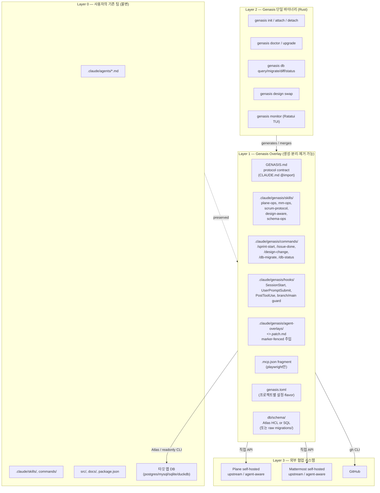

> English: [blueprint.md](blueprint.md)

# Genasis — Blueprint v1.0

> 단일 프로젝트용 11k줄 bash 스크립트(`create-agentic-team.sh`, 통칭 "Genesis")의 후속.
> 임의의 agentic team에 Plane / Mattermost / TDD / Design / Schema-as-code / 모니터링 레이어를
> **비파괴 overlay** 방식으로 부착하는 Rust 기반 프레임워크.

---

## 0. 전제·목적·비목적

### 목적
1. 기존에 ECC, knowledge-work-plugins, claude-code-templates 등을 쓰던 개발자가
   **자기 팀을 재작성하지 않고도** Plane + Mattermost 협업 + TDD/SDD + Design hot-swap +
   Schema-as-code DB 운영 + 모니터링을 얹을 수 있게 한다.
2. 사용자가 **명령행 한 줄 + TUI 가이드**로 부착·제거·업그레이드를 수행할 수 있게 한다.
3. 다른 사람이 fork·기여할 수 있도록 **모듈 분리**된 GitHub 리포로 배포한다.

### 비목적 (Non-Goals)
- agent prompt 자체를 새로 만드는 것 (사용자의 기존 팀을 존중)
- Plane / Mattermost 자체를 대체하는 것
- 다중 프로젝트(monorepo) 1차 릴리즈 지원 (단일 프로젝트만)
- Web UI 제공 (TUI만)

### 대전제 (Genesis §0 계승)
- 사람 ↔ 팀 모든 소통은 Plane(티켓) + Mattermost(대화) 두 채널로만
- 운영자가 `claude` CLI를 직접 타이핑하는 것은 bridge 장애 시 예외
- 1 이슈 = 1 Mattermost 스레드 = 1 Plane 티켓 (1:1:1)

---

## 1. 페르소나

| 페르소나 | 상황 | Genasis 사용 흐름 |
|---|---|---|
| **A. 신규 개발자** | agentic team 처음 — 빈 폴더 | `genasis init` → 기본 ECC + overlay + Plane/MM 프로비저닝 |
| **B. 기존 ECC 사용자** | `.claude/agents/` 보유, Plane/MM 미연결 | `genasis attach` → marker fence 주입 + 도구 연결 |
| **C. 다른 agentic 시스템 사용자** | claude-code-templates 등 비-ECC | detector 가 자산 구조 인식 후 동일 overlay 적용 |
| **D. 마이그레이션** | 기존 Genesis bash 스크립트 기반 사용자 | `genasis migrate-from-genesis` (옵션) |

---

## 2. 3-Layer 아키텍처 (Overlay 모델)



### 핵심 원칙

| 원칙 | 의미 |
|---|---|
| **비파괴(Non-destructive)** | Layer 0 파일은 marker fence 안만 수정. fence 밖은 0줄도 변경 금지 |
| **가역(Reversible)** | `genasis detach` 한 번이면 모든 fence·overlay 제거, 원본 복원 |
| **Idempotent** | `genasis attach` 반복 실행해도 동일 결과 |
| **Dry-run first** | 모든 변경은 TUI에서 diff 미리보기 → [Apply] 키 입력 후 적용 |

---

## 3. Overlay Engine — Marker Fence 사양

### 3.1 Fence 형식

```markdown
<!-- GENASIS:BEGIN role=frontend version=1.0 hash=a1b2c3d4 -->
## (Genasis Overlay) Plane/Mattermost 계약
- 내 PAT: ${PLANE_TOKEN_FRONTEND}, 봇: ${MM_TOKEN_FRONTEND}
- 소유 판정·lifecycle·멘션 규약 → @GENASIS.md §"Lifecycle"
- DB 조회: `genasis db query "..."` (read-only)
- DB 변경: `genasis db migrate` (PR 필수)
- 이 블록은 `genasis detach` 시 자동 제거됩니다.
<!-- GENASIS:END -->
```

### 3.2 주입 규칙

- 위치: agent `.md` 의 frontmatter 종료 직후 (`---` 두 번째 다음 줄)
- 한 파일당 fence 1개만 (중복 주입 금지)
- `hash` 는 fence 내용의 SHA-256 prefix 8자 — `genasis upgrade` 가 변경 감지 키로 사용
- `version` 은 Genasis overlay 스펙 버전 — 마이그레이션 시 사용

### 3.3 Detector — 사용자 팀 자산 인식

```
genasis attach 실행 시:
1. .claude/agents/*.md scan
2. 각 파일의 frontmatter `name`, `tools`, `description` 추출
3. 매칭 테이블로 role 추론:
   - planner / architect / pm / frontend / backend / qa / designer / security / devops / code-reviewer
4. 매칭 안 되는 agent → "custom"으로 분류, fence 주입 옵션 제시
5. 누락 role → 사용자에게 "추가하시겠습니까?" 질의
```

### 3.4 Conflict 처리

- fence 안 내용을 사람이 손댄 흔적 감지(hash 불일치) → 해당 fence는 skip + warning 로그
- `genasis detach --force` 만 강제 제거 (default 보호)

---

## 4. Genasis CLI Surface

### 4.1 명령 트리

```
genasis
├── init                기본 팀(ECC) + overlay + 프로비저닝까지 한 번에
├── attach              기존 팀에 overlay만 부착
├── detach              overlay 제거 (fence 안만)
├── doctor              설정·환경·도구 검증
├── upgrade             overlay 버전 업그레이드 (fence hash 비교 후 갱신)
├── monitor             Ratatui TUI 모니터링·간단 배포
├── design
│   ├── swap <url>      design-system.md 교체 + 영향 분석 + 티켓 생성
│   └── status          현재 design-system 메타데이터 표시
├── db
│   ├── query <SQL>     read-only SQL 실행 (DB driver 자동 dispatch + DDL/DML 차단)
│   ├── schema          현재 스키마 dump (공통 포맷)
│   ├── migrate         Atlas/raw runner 호출
│   ├── diff            코드 schema vs 실제 DB 차이
│   ├── status          마이그레이션 적용 이력
│   └── doctor          DB 권한·연결 검증
├── plane               Plane API thin wrapper (debug용)
├── mm                  Mattermost API thin wrapper (debug용)
└── version
```

### 4.2 install.sh — 얇은 launcher (본체 아님)

본체는 `genasis/` 소스 트리(Rust workspace) 전체이며, CI 가 cross-compile 한 정적 바이너리를 GitHub Releases 에 업로드한다. `install.sh` 는 **그 자산을 다운로드하는 진입점**일 뿐이다.

GitHub repo `install.sh` 한 줄 가이드:

```bash
curl -fsSL https://raw.githubusercontent.com/<OWNER>/genasis/main/install.sh | sh
```

`install.sh` 동작:

1. **OS·아키텍처 감지** — `uname -s`, `uname -m` → `linux-x86_64` / `linux-arm64` / `macos-arm64` / `macos-x86_64` (Windows 는 1차 미지원, WSL 안내)
2. **선결 패키지 검사 + OS별 설치 가이드** — 아래 §4.3 참조
3. GitHub Releases (`releases/latest`) 에서 해당 OS·아키텍처 자산(`genasis-{ver}-{os}-{arch}.tar.gz`) URL 결정
4. 다운로드 + `sha256` 검증 + 해제
5. `~/.local/bin/genasis` (없으면 `/usr/local/bin/genasis`, `sudo` 필요 시 안내) 설치
6. PATH 안내 (`~/.bashrc` / `~/.zshrc` 가이드)
7. `--no-run` 플래그가 없으면 `genasis attach` 자동 실행 → TUI 시작

컨트리뷰터·디버그 빌드 경로:
```bash
git clone https://github.com/<OWNER>/genasis
cd genasis
cargo build --release   # target/release/genasis
```

소스 빌드는 `install.sh` 가 하지 않는다 (속도·안정성).

### 4.3 선결 패키지 검사 — OS별 설치 가이드

`install.sh` 가 OS 를 감지한 뒤, 각 패키지가 있는지 확인하고 **누락된 것만 OS별 명령으로 안내**한다 (자동 설치는 안 함 — 사용자 권한·의존성 충돌 회피).

| 패키지 | 용도 | 검사 방법 |
|---|---|---|
| `git` | 사용자 repo 작업 필수 | `git --version` |
| `curl` | install.sh 자체에서 사용 | (이미 사용 중이면 OK) |
| `tar` / `gunzip` | 자산 해제 | `tar --version` |
| `node` (≥18) + `npx` | Plane 사용자 자동 발급 (Playwright sub-process) | `node --version` |
| `gh` (GitHub CLI) | branch protection·PR 자동화 | `gh --version` |
| `atlas` | DB 스키마 변경 (postgres/mysql/sqlite) | `atlas version` |
| `psql` / `mysql` / `sqlite3` / `duckdb` | DB read-only 조회 (사용 DB 만 필요) | `which …` |
| `rtk` | 토큰 절감 (선택) | `rtk --version` |
| `claude` (Claude Code CLI) | agent 실행 환경 | `claude --version` |

#### 안내 매트릭스 (예시)

```
[검사] node (>=18) — 누락
  Linux (Debian/Ubuntu):
    sudo apt update && sudo apt install -y nodejs npm
    또는 nvm: curl -fsSL https://raw.githubusercontent.com/nvm-sh/nvm/master/install.sh | bash
  Linux (RHEL/Fedora):
    sudo dnf install -y nodejs npm
  Linux (Arch):
    sudo pacman -S nodejs npm
  macOS (Homebrew):
    brew install node
  macOS (MacPorts):
    sudo port install nodejs20
```

`install.sh` 는:
1. 누락된 패키지 목록 출력 (필수 vs 선택 구분)
2. 감지된 OS·배포판에 맞는 설치 명령만 보여줌
3. 모든 필수가 OK 일 때만 다음 단계 진행
4. 선택 항목 누락 시 경고만 출력하고 계속 진행

OS 감지:

| 플랫폼 | 감지 키 |
|---|---|
| Linux | `/etc/os-release` 의 `ID` (`debian`, `ubuntu`, `rhel`, `fedora`, `arch`, `opensuse`, `alpine` 등) |
| macOS | `uname -s == Darwin`, Homebrew(`brew --version`) / MacPorts(`port version`) 검사 |
| 기타 | 가이드 미제공, 수동 설치 안내 |

#### Doctor 와의 관계

설치 후 `genasis doctor` 가 동일 검사를 다시 수행해 사용자에게 누락 사항을 재공지한다 (`install.sh` 미실행 / 부분 실행 환경 보호).

`<OWNER>` 는 사용자가 fork 시 교체 (1차에는 placeholder).

---

## 5. Provider Adapters & Flavor 시스템

### 5.1 Flavor 개념

같은 도구지만 인스턴스마다 페이로드/인증이 다른 변종을 추상화.

### 5.2 Plane

```
crates/genasis-providers/src/plane/
├── mod.rs                    # PlaneProvider trait
├── upstream.rs               # makeplane 공식
├── agent_aware.rs       # agent 구분 필드 처리
├── detect.rs                 # health endpoint 추론
└── factory.rs
```

- trait: `create_issue / transition_state / assign / list_cycle_issues / set_label / list_states / list_labels / create_cycle / list_workspace_members`
- flavor 선택: `genasis.toml` `[plane] flavor = "auto"` (또는 `"upstream"` / `"agent-aware"`)
- `auto` 감지: `GET /api/v1/health` 응답 헤더/필드로 판별, 실패 시 명시 지정 요구

### 5.3 Mattermost

동일한 패턴(`upstream`, `agent_aware`, `detect`).

### 5.4 GitHub

`gh` CLI 위임. flavor 불필요.

### 5.5 Plane 사용자 자동 발급 (Playwright)

- Rust에서 Node sub-process spawn
- 스크립트는 `crates/genasis-cli/scripts/provision-plane-users.mjs` 그대로 (Genesis 자산 포팅)
- stdout JSON으로 결과 반환

---

## 6. Schema Kernel & DB 운영

### 6.1 채널 분리

| 작업 | 도구 | 강제 방식 |
|---|---|---|
| **Read** (SELECT, EXPLAIN, DESCRIBE) | `genasis db query` | SQL lex 검사 + DB read-only 계정/세션 |
| **Write** (DDL, 마이그레이션) | `genasis db migrate` → Atlas (또는 DuckDB raw runner) | PR 필수 + qa 게이트 통과 후만 적용 |

### 6.2 SQL Guard (read-only 강제)

`genasis db query` 가 받은 SQL을 lex해 다음 키워드 첫 토큰이면 reject:
`INSERT, UPDATE, DELETE, DROP, ALTER, CREATE, TRUNCATE, GRANT, REVOKE, MERGE, REPLACE, CALL, EXEC, ATTACH, DETACH`
추가로 DB 측에서도 read-only 강제:

| Driver | Read-only 강제 |
|---|---|
| postgres | `BEGIN ISOLATION LEVEL READ ONLY READ ONLY` 트랜잭션 |
| mysql | read-only 사용자 계정 (`genasis db doctor` 가 권한 검증) |
| sqlite | `PRAGMA query_only = 1` |
| duckdb | `duckdb -readonly` 모드 |

### 6.3 Schema-as-code

- Default: **Atlas** (HCL declarative)
- 자동 감지: 사용자 repo에 `drizzle.config.ts` 또는 `schema.ts` 가 있고 `drizzle-orm` 의존성 → Drizzle Kit 모드 (`genasis db migrate` 가 `drizzle-kit` 위임)
- DuckDB: Atlas 미지원 → `db/migrations/` raw SQL 페어(`*.up.sql` / `*.down.sql`) + Genasis 자체 runner

### 6.4 마이그레이션 lifecycle

```
1. architect agent → schema 변경안을 db/schema/*.hcl 또는 *.up.sql 작성
2. PR 생성 → CI 에서 `genasis db diff` 실행, plan 출력
3. database-reviewer agent → 안전성·인덱스·롤백 리뷰
4. qa ✅ → merge
5. 운영: 담당 agent가 staging 에서 `genasis db migrate --env staging` → 검증 → `--env prod`
6. 결과를 Plane 이슈 댓글 + Mattermost 스레드에 자동 보고
```

---

## 7. Design-System Hot-Swap

### 7.1 단일 진실 — `docs/design-system.md`

- Genesis 운영 규칙 그대로 계승
- attach 시 누락이면 placeholder + bootstrap flag 자동 생성

### 7.2 swap protocol

```
genasis design swap <reference_url>
  ↓
1. /ui-style-extractor 호출 (designer agent)
2. 신·구 design-system.md diff
3. 영향 컴포넌트 분류 (색상·타이포·레이아웃·컴포넌트)
4. Plane 에 IMPROVEMENT 라벨 이슈 자동 생성 (영향 영역별)
5. Mattermost 루트 메시지 "🚨 DESIGN CHANGE" 공지
6. 모든 In-Progress agent → WIP 커밋 → 스레드 ✅
7. designer 가 phase 1~5 진행
8. 변경 완료 시 `git tag design-system-v{N}`
```

### 7.3 agent 자동 인식

- Marker fence 안에 `참조: docs/design-system.md` 가 명시됨
- 따라서 design-system.md 파일을 통째로 교체해도 agent prompt 수정 불필요

---

## 8. Hooks · Skills · Commands 카탈로그

### 8.1 Hooks (`.claude/genasis/hooks/`)

| 이름 | 트리거 | 동작 |
|---|---|---|
| `session-start.sh` | SessionStart | rtk 설치 확인, GENASIS.md 로드 알림 |
| `pre-tool-branch-guard.js` | PreToolUse Bash | main 브랜치 직접 commit 차단 |
| `pre-tool-worktree-guard.js` | PreToolUse Bash | parallel 모드에서 잘못된 워크트리 작업 차단 |
| `post-tool-mm-sync.sh` | PostToolUse Bash | git commit 직후 Mattermost 스레드 자동 reply (옵션) |
| `post-tool-trim.sh` | PostToolUse | 큰 tool 결과 자동 요약 (Token Economics §10) |
| `user-prompt-submit-mm.sh` | UserPromptSubmit | 사람이 보낸 첫 메시지에 GENASIS.md 컨텍스트 주입 |

### 8.2 Skills (`.claude/genasis/skills/`)

| Skill | 목적 |
|---|---|
| `scrum-protocol` | lifecycle·멘션·DoD 규약 (GENASIS.md 참조) |
| `plane-ops` | curl 예제 + Rust CLI wrapper 사용법 |
| `mm-ops` | 동일 |
| `design-aware` | design-system.md 우선 참조 강제 |
| `schema-ops` | `genasis db query/migrate/diff` 사용법 |
| `tdd-enforce` | unit/integration/E2E 작성 순서 |

### 8.3 Slash commands (`.claude/genasis/commands/`)

`/sprint-start`, `/sprint-end`, `/sprint-status`, `/sprint-rescue`, `/sprint-reconcile`,
`/intake-review`, `/issue-link`, `/issue-done`, `/issue-block`,
`/design-change`, `/db-migrate`, `/db-status`,
`/agent-handoff`, `/agent-resume`, `/check-inbox`, `/record-progress`

→ Genesis 자산을 Tera 템플릿으로 포팅. 파일 자체는 markdown.

---

## 9. TDD/SDD/Security 강제 메커니즘

### 9.1 TDD (Genesis §14 계승)

- 테스트 이름에 Plane 티켓 ID 포함 강제 (lint hook)
- 단위·통합 = 개발 agent 본인, E2E = qa
- In Progress → In Review 전환 전제: `unit: pass`, `integration: pass` PR 본문 자기 보고
- 누락 시 qa 가 즉시 In Review → In Progress 반려

### 9.2 SDD (Spec-Driven)

- `docs/PRD.md` + `docs/design-system.md` 가 단일 진실
- 모든 이슈 description 에 `📘 참조 필수: PRD.md §..., docs/design-system.md §...` 자동 주입
- PRD.md / design-system.md mtime 변경 시 PM agent 가 모든 In Progress 이슈 스레드에 "📘 PRD/Design 갱신" 알림

### 9.3 Security

- ECC `security-reviewer` agent 자산 그대로 활용 (재작성 금지)
- branch protection: `genasis attach` 가 GitHub repo 의 main 에 PR 필수·force push 금지·linear history 자동 설정
- Secrets scan: `genasis doctor` 가 `.env*` git 추적 여부 검사
- DB write는 Atlas만 (§6.1)

---

## 10. Token Economics

### 10.1 RTK (Rust Token Killer) 통합

- `genasis attach` 가 `which rtk` 검사
- 미설치면 TUI에서 "RTK가 토큰 60~90% 절감해줍니다. 설치할까요? [Y/n]" 안내
- 설치 후 `~/.claude/settings.json` hook에 RTK 자동 등록
- `genasis monitor` 위젯이 `rtk gain --json` 파싱해 누적 절감 표시

### 10.2 Anthropic Prompt Cache 활용

- GENASIS.md 를 stable prefix로 배치
- CLAUDE.md 의 빈번 변경 영역과 분리 → cache invalidation 최소화
- attach 시 사용자 CLAUDE.md 분석 후 변동성 높은 섹션을 GENASIS.md 외부로 분리 권고

### 10.3 Trim Hook

- `.claude/genasis/hooks/post-tool-trim.sh`: tool 결과가 N KB 초과면 head/tail + "(... truncated K lines)" 로 압축
- 임계값은 `genasis.toml [token_economics] trim_threshold_kb = 32` 로 조정

### 10.4 비채택

- mcp-cache, fastmcp 등 — 유지보수 불확실 또는 효과 제한
- 자체 genasis-mcp-proxy — 1차 릴리즈 미포함 (사용자 결정)

---

## 11. `genasis monitor` (Ratatui TUI)

### 11.1 위젯 레이아웃

```
┌──── Sprint ────────────────┐ ┌──── Tokens ──────────────────────┐
│ Cycle: spring-25-w18       │ │ RTK saved: 1.2M tokens (이번주)  │
│ D-day: 2일 남음            │ │ MCP calls: 142, cache hit 38%   │
│ Todo:6  In:3  Review:1  Done:8 │ Anthropic cache: HIT 91%       │
└────────────────────────────┘ └──────────────────────────────────┘
┌──── Agents 활동 ────────────────────────────────────────────────┐
│ frontend  ● 02:13 ago  SCZ-42 In Progress                      │
│ backend   ● 00:08 ago  SCZ-43 In Review                        │
│ qa        ◌ 14:00 ago  idle                                    │
│ designer  ◌ 03:42:00 ago idle                                  │
└────────────────────────────────────────────────────────────────┘
┌──── 배포 ──────────────────────────────────────┐ ┌── Network ──┐
│ ● dev  http://localhost:3000   🔄 REFRESHED   │ │ Plane: 1.2K │
│ ● prod https://app.example.com  OK            │ │ MM:    340  │
│ Last build: 5분 전 (sha a1b2c3d)              │ │ GH:    87   │
│ [b]uild [d]eploy [r]ollback [o]pen [v]isited  │ │ Bytes: 12MB │
└────────────────────────────────────────────────┘ └─────────────┘
┌──── 로그 tail ──────────────────────────────────────────────────┐
│ 19:42:01 [pm] /sprint-status executed                          │
│ 19:42:33 [frontend] feat/42-login pushed                       │
└────────────────────────────────────────────────────────────────┘
```

### 11.2 키 바인딩

| 키 | 동작 |
|---|---|
| `1`~`5` | 위젯 포커스 |
| `o` | 포커스된 URL 열기 (xdg-open / open) |
| `b` | `genasis.toml [deploy.build]` 명령 실행 (stream) |
| `d` | `genasis.toml [deploy.cmd]` 명령 실행 |
| `r` | rollback 메뉴 (git tag 목록) |
| `v` | 현재 dev/prod URL을 visited 처리 (REFRESHED 배지 제거) |
| `q` | quit |

### 11.3 데이터 소스

| 위젯 | 데이터 |
|---|---|
| Sprint | Plane API (5초 폴) |
| Tokens · RTK | `rtk gain --json` (60초 폴) |
| Agents 활동 | `.pm-delegations/*`, `logs/agent-launches/*`, git commit 로그 |
| 배포 LED | dev/prod URL HEAD probe (10초 폴) |
| REFRESHED 배지 | `dist/` 또는 `.next/` 의 manifest 해시 변화 + visited flag |
| Network | `genasis-cli` 가 측정한 HTTP 통계 (`~/.cache/genasis/net.json`) |
| 로그 tail | tokio file-watch |

### 11.4 배포·롤백 동작

- `genasis.toml`:
  ```toml
  [deploy]
  build = "pnpm build"
  cmd_dev = "pnpm dev --port 3000"
  cmd_prod = "vercel deploy --prod"
  rollback = "git revert HEAD && git push"
  ```
- 사용자가 `b` 누르면 sub-process spawn, stdout 위젯에 stream
- 빌드 완료 후 manifest 해시 자동 비교 → REFRESHED 배지 갱신

---

## 12. Repository 구조 (Rust workspace)

```
genasis/                                  # GitHub repo root (소스 본체)
├── README.md
├── blueprint.md
├── progress.md
├── LICENSE                               # MIT
├── install.sh                            # release 자산 다운로드 launcher (~150줄, 본체 아님)
├── Cargo.toml                            # workspace
├── Cargo.lock
├── rust-toolchain.toml                   # 1.78+
├── rustfmt.toml
├── clippy.toml
├── .editorconfig
├── .gitignore
│
├── crates/                               # === 소스 본체 ===
│   ├── genasis-cli/                      # 진입점, clap v4
│   │   ├── Cargo.toml
│   │   ├── src/
│   │   │   ├── main.rs
│   │   │   ├── cmd_init.rs
│   │   │   ├── cmd_attach.rs
│   │   │   ├── cmd_detach.rs
│   │   │   ├── cmd_doctor.rs
│   │   │   ├── cmd_upgrade.rs
│   │   │   ├── cmd_design.rs
│   │   │   ├── cmd_db.rs
│   │   │   ├── cmd_monitor.rs
│   │   │   ├── cmd_plane.rs
│   │   │   ├── cmd_mm.rs
│   │   │   ├── cmd_version.rs
│   │   │   └── tui_attach.rs             # attach 시각화 TUI
│   │   └── scripts/
│   │       ├── provision-plane-users.mjs
│   │       └── package.json              # Node deps for Playwright
│   ├── genasis-core/                     # Cargo.toml + src/{lib, config, env, fs, marker, error}.rs
│   ├── genasis-overlay/                  # Cargo.toml + src/{lib, detector, role_inference, merger, validator, dry_run}.rs
│   ├── genasis-providers/
│   │   ├── Cargo.toml
│   │   └── src/
│   │       ├── lib.rs
│   │       ├── plane/{mod,upstream,agent_aware,detect,factory}.rs
│   │       ├── mattermost/{mod,upstream,agent_aware,detect,factory}.rs
│   │       └── github.rs
│   ├── genasis-db/
│   │   ├── Cargo.toml
│   │   └── src/
│   │       ├── lib.rs
│   │       ├── kernel.rs
│   │       ├── guard.rs
│   │       └── adapters/{mod,postgres,mysql,sqlite,duckdb,atlas,drizzle_kit}.rs
│   ├── genasis-design/                   # extractor / change_protocol / diff / ticket_emitter
│   ├── genasis-tui/                      # Ratatui 공통 컴포넌트 (theme, widgets/*)
│   ├── genasis-monitor/                  # genasis monitor 본체 (app, state, widgets/*, actions/*)
│   └── genasis-templates/                # Tera 템플릿 모음 (include_dir!() 빌드 임베드)
│       ├── Cargo.toml
│       ├── src/lib.rs
│       └── templates/
│           ├── GENASIS.md.tera
│           ├── genasis.toml.tera
│           ├── env.agents.tera
│           ├── mcp.json.tera
│           ├── design-system.md.tera
│           ├── agent-overlays/<role>.patch.md.tera   (10개 role)
│           ├── commands/*.md.tera                     (16개)
│           ├── skills/<skill>/SKILL.md.tera           (6개)
│           └── hooks/*.tera                           (6개)
│
├── docs/
│   ├── ARCHITECTURE.md
│   ├── PROVIDERS.md
│   ├── MIGRATION-FROM-GENESIS.md
│   ├── TOKEN-ECONOMICS.md
│   ├── MONITOR.md
│   └── ADR/
│       ├── ADR-000-template.md
│       ├── ADR-001-overlay-marker-fence.md
│       ├── ADR-002-rust-single-binary.md
│       ├── ADR-003-direct-api-not-mcp.md
│       ├── ADR-004-db-channel-separation.md
│       ├── ADR-005-flavor-system.md
│       ├── ADR-006-token-economics.md
│       └── ADR-007-monitor-tui.md
│
├── tests/
│   ├── golden/                           # 부착 시나리오 픽스처 (input/expected 페어)
│   │   ├── ecc-only/{input,expected}/
│   │   ├── kw-plugins/{input,expected}/
│   │   ├── blank/{input,expected}/
│   │   ├── legacy-bash-genesis/{input,expected}/
│   │   ├── with-drizzle/{input,expected}/
│   │   └── with-duckdb/{input,expected}/
│   ├── e2e/{attach_detach,upgrade,db_query_guard,design_swap}.rs
│   └── unit/{marker_idempotent,role_inference,sql_guard}.rs
│
└── .github/
    ├── workflows/
    │   ├── ci.yml                        # cargo fmt / clippy / test / golden 비교
    │   ├── release.yml                   # cross-compile + GitHub Release 업로드
    │   └── nightly-e2e.yml               # 야간 실 Plane/MM E2E
    ├── ISSUE_TEMPLATE/{bug,feature}.md
    └── PULL_REQUEST_TEMPLATE.md
```

**역할 분리**:
- 위 트리 전체 = **소스 본체** (GitHub 에 그대로 push)
- CI(`release.yml`) = cross-compile → GitHub Releases 자산 업로드
- `install.sh` = release 자산만 다운로드하는 얇은 launcher
- 컨트리뷰터 = `cargo build --release` 로 직접 빌드

### 의존성

| crate | 라이브러리 |
|---|---|
| CLI | `clap` v4, `anyhow`, `thiserror` |
| TUI | `ratatui` 0.27+, `crossterm`, `tui-textarea` |
| Templates | `tera` 1.x |
| HTTP | `reqwest` (rustls), `tokio` |
| DB CLI dispatch | `tokio::process::Command` |
| File watch | `notify` 6.x |
| Logging | `tracing`, `tracing-subscriber` |
| Config | `serde`, `toml`, `serde_json` |
| TUI form | `tui-input`, `tui-prompts` |

---

## 13. 마이그레이션 — Genesis → Genasis

| Genesis 파일/기능 | Genasis 위치 | 변환 방식 |
|---|---|---|
| `create-agentic-team.sh` STEP 1~9 | `cmd_init.rs` + `cmd_attach.rs` | bash heredoc → Tera 템플릿 |
| `setup-agentic-team-v2.sh` | `cmd_attach.rs` (incremental 모드) | overlay-only 분리 |
| `rollback-agentic-team.sh` | `cmd_detach.rs` | marker fence 제거 + 템플릿 파일 삭제 |
| `ls-mm-channel.sh` / `rm-mm-channel.sh` | `genasis mm channel list/rm` | provider 의 thin wrapper |
| `.claude/agents/*.md` (Genesis 원본 팀 커스텀) | `crates/genasis-templates/templates/agent-overlays/*.patch.md.tera` | fence 부분만 추출, 나머지는 사용자 팀에 위임 |
| `.claude/commands/*.md` | `templates/commands/*.tera` | 그대로 |
| Plane user provisioning Playwright | `scripts/provision-plane-users.mjs` | 그대로 (Node sub-process) |
| `scripts/agent-monitor.sh` | `genasis monitor` (Ratatui) | 전면 재작성 |

기존 Genesis bash 팀 사용자: `genasis migrate-from-genesis` (옵션 명령) 제공 — `.env.agents` / `.mcp.json` / Plane 프로젝트 ID 등을 `genasis.toml` 로 변환.

---

## 14. Testing 전략

### 14.1 골든 픽스처 repo

`tests/golden/` 아래에 시나리오별 mini repo:

| 픽스처 | 시나리오 |
|---|---|
| `ecc-only/` | ECC 기본만 설치된 빈 프로젝트 → attach 동작 검증 |
| `kw-plugins/` | knowledge-work-plugins 사용자 → attach |
| `blank/` | `.claude/` 없음 → init |
| `legacy-bash-genesis/` | 기존 bash Genesis 스크립트로 셋업한 팀 — 마이그레이션 대상 |
| `with-drizzle/` | drizzle-orm 이미 있는 경우 → DB adapter 자동 선택 |
| `with-duckdb/` | duckdb 사용자 → raw SQL runner |

각 픽스처에 `expected/` 디렉토리로 attach 후 결과를 정적 비교.

### 14.2 단위 테스트

- Marker fence 주입·제거 idempotency
- SQL guard lex
- Provider flavor 추론

### 14.3 E2E

- `genasis init` → real Plane (test workspace) → real MM → DoD 게이트 통과 시뮬레이션
- 야간 CI 1회 (느림)

---

## 15. 1차 릴리즈 범위 (DoR)

✅ 포함
- `init`, `attach`, `detach`, `doctor`, `upgrade`
- Plane / MM provider (upstream + agent-aware + auto)
- DB query / migrate (Atlas + Drizzle Kit + DuckDB raw)
- design swap protocol
- monitor TUI (Sprint·Token·Agent·Deploy·Network·Log 위젯)
- RTK 통합, prompt cache 권고, trim hook
- Marker fence engine + golden fixture 6종
- install.sh
- ADR-001 ~ ADR-007

❌ 미포함 (2차 이후)
- genasis-mcp-proxy (D13 결정)
- 다중 프로젝트 / 모노레포
- 커뮤니티 기여 컴포넌트 (mcp-cache 등)
- Web UI

---

## 16. ADR 목록 (요약)

| ID | 제목 | 결정 |
|---|---|---|
| ADR-001 | Overlay = Marker Fence | 비파괴 가역 idempotent |
| ADR-002 | Rust 단일 바이너리 | Python+Rust 혼합 기각 |
| ADR-003 | Plane/MM = 직접 API | 자체 MCP 서버 기각 |
| ADR-004 | DB 채널 분리 | read=CLI guard, write=Atlas |
| ADR-005 | Provider Flavor 시스템 | upstream + custom + auto |
| ADR-006 | Token Economics 단계화 | RTK + Anthropic cache + trim hook (proxy 미포함) |
| ADR-007 | Monitor = Ratatui 1차 포함 | TUI 단일 binary 컴포넌트 |
| ADR-008 | i18n install-time selector | active context = single language |
| ADR-009 | Design catalog delegation | `npx getdesign` 위임, vendor 안 함 |
| ADR-010 | Default team bootstrap (M14) | base + patch 2-layer, default OFF, ECC vendor 안 함 |

---

## 17. 위험·완화

| 위험 | 완화 |
|---|---|
| Marker fence 사용자 손상 | hash 검증 + skip + warning |
| Atlas DuckDB 미지원 | raw SQL runner fallback |
| Provider flavor 잘못 감지 | `--flavor` 명시 옵션 + doctor 가 mismatch 감지 |
| Rust 빌드 어려움 | install.sh 가 정적 바이너리 다운로드 (사용자는 컴파일 불필요) |
| RTK 미설치 환경 | optional, 미설치면 graceful 무시 |
| Mattermost bridge 장애 | Genesis §0 의 비상 복구 경로 그대로 계승 |
| Playwright 변경 | Node sub-process로 격리, 실패 시 명시 안내 |

---

## 18. 다음 단계

`progress.md` 의 M0~M10 마일스톤을 따라 진행. 각 마일스톤 완료 시:
- ADR 갱신
- 골든 픽스처 회귀
- progress.md 의 todo 항목을 완료 처리
- 이 문서(`blueprint.md`)는 변경 없이 유지하되, 중대한 결정 변경 시 새 ADR + blueprint 버전 bump

---

## 19. Internationalization (i18n) — M12

### 19.1 배경 / 결정 근거

genasis 는 OSS 로 다른 나라 개발자가 fork·기여할 수 있어야 한다. 동시에 한국어
사용자(genasis 메인테이너 + 한국 OSS 도입자)도 모국어 가이드로 설치·운영할 수 있어야
한다. M12 는 이 두 요구를 동시에 충족하면서 **agent prompt 의 다국어 혼재로
인한 모델 동작 불안정**을 회피하는 것이 목표다.

조사 결과(`docs/impact-of-multilang-prompts.md` 전문 참조) 핵심 결론:

- **두 언어를 한 agent context 에 동시에 넣으면 안 된다**.
  Claude Code 자체에 언어 drift 버그가 존재
  ([anthropics/claude-code#46846](https://github.com/anthropics/claude-code/issues/46846),
  [#24941](https://github.com/anthropics/claude-code/issues/24941))하며,
  학술 연구(arXiv 2406.20052) 도 한국어·일본어가 line/word-level confusion
  최약점 언어로 지적.
- **OSS Claude Code 템플릿 생태계 전체가 영어 단일 컨텍스트**(awesome-claude-code,
  aitmpl.com, awesome-claude-code-toolkit 등) — 우리만 다국어 동시 운영하는 것은
  contrarian 선택.
- **prompt cache 도 prefix 가 byte 단위라 두 언어가 prefix 에 들어가면 cache 비용 ↑**.
- 그러나 **사용자가 한국어로 협업하기를 원할 권리는 명백** — genasis 도 한국어로
  운영하는 팀에서 출발했고, 한국어 권역 OSS 도입을 막을 이유 없음.

따라서 M12 의 정책은:

> **설치 시점에 정확히 한 언어를 선택**한다(`--lang en|ko`, default 는
> `$LANG` 자동 감지). 선택된 언어의 agent overlay·skills·commands·GENASIS.md·
> Tera 템플릿만 `.claude/` 와 사용자 repo 에 active 로 들어가고, 다른 언어는
> `docs/i18n/<lang>/` 에 **passive reference 문서로만** 존재한다. `--lang both`
> 는 명시적으로 거부 + 사유 안내 (`docs/impact-of-multilang-prompts.md` 인용).

### 19.2 정책 — Source of Truth 와 우선순위

| 영역 | Source of Truth | 미러 | 비고 |
|---|---|---|---|
| 메인 문서 (`README.md`, `blueprint.md`, `progress.md`) | **English** | `README.ko.md`, `blueprint.ko.md`, `progress.ko.md` | OSS 컨벤션 — GitHub 기본 표시는 영어 |
| `docs/*.md`, `docs/ADR/*.md` | **English** | `docs/ko/*.md`, `docs/ko/ADR/*.md` 트리 | 트리 형태가 ADR 다수 묶음에 유리 |
| Rust user-facing 메시지 (`eprintln!`, `tracing`, clap help) | **English (key)** | `crates/genasis-cli/i18n/{en,ko}.ftl` | 런타임 `--lang` / `LANG` 으로 분기. `fluent-rs` 채택 (§19.4) |
| TUI(`genasis monitor`) 라벨·키 안내 | **English (key)** | 위 i18n bundle 공유 | runtime 분기 |
| `install.sh` 안내 | **English (default)** + `--lang ko` 분기 | inline `case` 블록 | 외부 의존성 추가 회피 — 단일 sh 안에 영/한 메시지 두 벌 |
| Tera 템플릿 (`crates/genasis-templates/templates/`) | **English (default)** + `templates/ko/` 미러 | `templates/{en,ko}/...` | 설치 시 active 트리 1개만 사용자 repo 에 복사 |
| 골든 픽스처 README (`tests/golden/*/README.md`) | **English** | 없음 | 픽스처는 시나리오 자체가 영어로 통일 |
| `.github/ISSUE_TEMPLATE/`, `PULL_REQUEST_TEMPLATE.md` | **English** | 없음 | GitHub UI 단일 |

원칙:

1. **English-first commit rule** — 새 문서·새 메시지·새 템플릿·새 fluent key
   는 영어로 먼저 작성. 한국어는 미러로만 추가 (반대 방향 금지).
2. **Active-language singularity** — 사용자 repo 의 `.claude/` 안에는
   `[i18n] active = "<lang>"` 로 선언된 한 언어의 산출물만 존재.
   다른 언어 사본은 `docs/genasis-i18n-reference/<other-lang>/` 같은
   non-`@import` 위치에만 둠.
3. **drift 게이트 3-tier (release-gate translation completion)**:
   - **일반 PR (`ci.yml`)** → `lint-i18n --warn` 은 **warn only**
     (`::warning::` 출력, exit 0). 컨트리뷰터가 영어 또는 한국어 한쪽만
     올려도 머지 가능 — PR 회전 보존.
   - **`release-prep` PR** (`release/v*` 브랜치 또는 PR title 에 `[release]` 라벨)
     → `lint-i18n --strict` **hard-fail**. 자동화된 "translation completion"
     PR (§19.9.4) 이 빠진 mirror 를 채울 때까지 release 브랜치는 머지 불가.
   - **태그 시점 (`release.yml`)** → 동일 `--strict` 검증 1회 더. 보호 redundancy.

   효과: 일상 개발은 한쪽 언어만 올려도 문제 없고, `vX.Y.Z` 태그 직전에
   "번역 마감 PR" 이 자동 또는 수동으로 mirror 를 채워야 release 가 통과한다.
   사용자가 제안한 "배포 전 빠진 번역을 맞추는 과정" 그대로의 운영 모델.
4. **언어 식별자** — BCP-47 ISO 코드(`en`, `ko`). 영어가 default 이므로
   `docs/en/` 은 두지 않고 평면 위치 사용; 한국어는 `docs/ko/` 트리.
5. **공식적으로 지원하는 active 언어는 1차에 `en`·`ko` 둘**. 추가 언어는
   M12 종료 후 컨트리뷰터 PR 단위로 `templates/<lang>/` + `docs/<lang>/` +
   `i18n/<lang>.ftl` 3개를 함께 제출하는 조건으로 수용.

### 19.3 설치 시점 언어 선택 — `install.sh` + `genasis init` (interactive prompt)

#### 19.3.1 명령행 인자 (default 경로)

`--lang` 가 가장 우선이고, 없으면 interactive prompt 가 뜬다 (TTY 일 때).
non-TTY (CI, pipe) 환경에서는 `$LANG` 자동 감지로 fallback.

```bash
# Path 1 — 명시 지정 (인자가 진실, prompt 없이 즉시 진행)
curl -fsSL https://raw.githubusercontent.com/<OWNER>/genasis/main/install.sh | sh -s -- --lang ko
curl -fsSL .../install.sh | sh -s -- --lang en

# Path 2 — 인자 없이 실행 → interactive prompt
curl -fsSL .../install.sh | sh
#   → §19.3.3 의 prompt 화면 표시

# Path 3 — non-TTY (CI 등) — prompt 불가, $LANG 자동 감지로 fallback
echo | sh install.sh
#   → $LANG=ko_KR.* 이면 ko, 외 en. 결정 사유를 stdout 에 명시 출력

# 거부 케이스
curl -fsSL .../install.sh | sh -s -- --lang both
#   → 에러 + docs/impact-of-multilang-prompts.md 링크 + 권장 대안 안내
```

`install.sh` 의 언어 결정 알고리즘:

```
if --lang 인자 있음:
    active_lang = 인자 값  ('both' 면 거부)
    skip prompt
elif TTY 이고 stdin 이 interactive:
    active_lang = §19.3.3 prompt 결과
else:
    active_lang = $LANG 파싱 (ko_KR.* → ko, 외 → en)
    print "Detected $LANG=... → using --lang $active_lang (override with --lang en|ko)"
```

#### 19.3.2 binary 동작

1. binary 다운로드는 항상 동일 (genasis CLI 자체에 i18n bundle 내장).
2. binary 실행 시 결정된 언어로 호출:
   ```sh
   "$INSTALL_PATH" attach --lang "$ACTIVE_LANG"
   ```
3. `attach` 가 다시 §19.3.3 의 confirmation 단계를 자체 표시 (install.sh 우회로
   직접 binary 를 받은 사용자에게도 같은 안내 보장).
4. 모든 install.sh 안내 메시지(누락 패키지 가이드 등)도 결정된 언어로 출력.

#### 19.3.3 Interactive language selection prompt (install.sh 와 `genasis attach` 공통)

사용자가 **무엇이 어떤 언어로 설치되는지** 명확히 알고 동의한 뒤에만 진행한다.
prompt 본문은 결정된 언어로 출력 (default 는 `$LANG` 추정).

```
┌─────────────────────────────────────────────────────────────────────┐
│ Genasis — Agentic Team Language Setup                              │
│ Genasis — 에이전트 팀 언어 설정                                       │
├─────────────────────────────────────────────────────────────────────┤
│                                                                     │
│ Choose the language for your agent team's instructions.            │
│ 에이전트 팀 지침의 언어를 선택하세요.                                  │
│                                                                     │
│ The selected language will be installed into:                      │
│ 선택한 언어는 다음 위치에 설치됩니다:                                  │
│   • .claude/agents/*.md      (overlay fence body)                  │
│   • .claude/genasis/skills/  (scrum, plane-ops, mm-ops, ...)       │
│   • .claude/genasis/commands/ (/sprint-start, /issue-done, ...)    │
│   • .claude/genasis/hooks/   (session-start, branch-guard, ...)    │
│   • GENASIS.md               (protocol contract — @import'd by     │
│                               your CLAUDE.md)                       │
│                                                                     │
│ ⚠ Only ONE language goes into agent context. Mixing two languages  │
│   causes Claude to drift between them mid-response (see            │
│   docs/impact-of-multilang-prompts.md). You can switch later with  │
│   `genasis lang switch <lang>`.                                    │
│ ⚠ 에이전트 컨텍스트에는 한 언어만 들어갑니다. 두 언어를 동시에 넣으면 │
│   Claude 가 응답 중 언어를 섞기 시작합니다. 나중에                    │
│   `genasis lang switch <lang>` 로 전환할 수 있습니다.                │
│                                                                     │
│ Detected $LANG=ko_KR.UTF-8 → suggesting Korean.                    │
│ $LANG=ko_KR.UTF-8 감지 → 한국어 권장.                                │
│                                                                     │
│   [1] English (en)                                                 │
│   [2] 한국어 (ko)   ← suggested / 권장                              │
│                                                                     │
│ Select [1/2] (default: 2):                                         │
└─────────────────────────────────────────────────────────────────────┘
```

prompt 동작 규칙:
- 첫 prompt 는 양언어 병기 (사용자가 어느 쪽이든 읽을 수 있게)
- `$LANG` 추정 결과를 default 로 하이라이트, Enter 만 쳐도 진행
- 잘못된 입력 → 재질의 (3회 실패 시 abort + exit code 3)
- 응답 후 confirmation 표시 (선택된 언어로):
  ```
  ✓ Will install Korean (ko) instructions into .claude/.
    Restart Claude Code after install completes for the new context to load.
  ✓ 한국어(ko) 지침을 .claude/ 에 설치합니다.
    설치 완료 후 Claude Code 를 재시작하면 새 컨텍스트가 로드됩니다.

  Continue? [Y/n]:
  ```
- `--non-interactive` / `--yes` 플래그가 있으면 default 자동 수락 (CI 용)
- Bash prompt 와 Rust prompt (`genasis attach`) 가 **같은 텍스트·같은 배치** 사용
  (사용자 일관성). Rust 쪽은 `dialoguer` 또는 자체 단순 stdin loop.

#### 19.3.4 `genasis init` / `genasis attach --lang ko` 적용 동작

prompt 통과 후 (또는 인자로 결정된 언어로):

- 사용자 repo 에 `.claude/agents/` 가 있는 경우 — 기존 파일은 보존하되,
  fence 안 body 만 선택 언어 템플릿으로 채움.
- `.claude/genasis/{skills,commands,hooks}/` 는 `templates/<lang>/` 트리 통째로 복사.
- `GENASIS.md` 는 `templates/<lang>/GENASIS.md.tera` 렌더 결과로 생성.
- `CLAUDE.md` 에 `@import GENASIS.md` 한 줄 자동 추가 (이미 있으면 skip).
- `genasis.toml` 에 다음 기록:
  ```toml
  [i18n]
  active = "ko"            # active locale of the installed agent context
  fence_lang = "ko"        # language of marker-fence bodies
  cli_lang = "ko"          # CLI/TUI runtime language (사용자가 따로 변경 가능)
  reference_langs = []     # 추가 reference docs (사용자 명시 시만)
  selected_via = "prompt"  # "prompt" | "flag" | "lang_env" — 진단용
  ```
- 완료 후 (선택 언어로) 안내:
  ```
  ✅ Installed Korean (ko) agent overlay into .claude/.
     Run `genasis doctor` to verify, or `genasis lang switch en` to swap later.
  ```

### 19.4 런타임 i18n (Rust CLI/TUI) — `rust-i18n`

**선택 근거**: 후보였던 fluent-rs 는 복수형·성·격 변화 분기에 강하지만,
genasis 의 user-facing 메시지는 **monitor 위젯 라벨 + CLI 진단/안내 ~50개
규모**이고 한국어는 복수형 변화도 없다. fluent 의 표현력은 과잉이며,
다음의 trade-off 로 [`rust-i18n`](https://crates.io/crates/rust-i18n) 채택:

| 항목 | rust-i18n | fluent-rs (기각) |
|---|---|---|
| binary 추가 | **~50KB** | ~200KB |
| 의존성 깊이 | 단일 crate (`once_cell` 만) | `fluent-bundle` + `fluent-langneg` + `unic-langid` + `intl-memoizer` |
| 빌드 시간 | 단순 macro 1개 | 4 crate 컴파일 |
| 호출 형태 | `t!("attach.success", count = c)` | `i18n.t("attach-success", &[…])` (객체 lookup) |
| 토큰 수 (LLM 코드 읽기) | 짧음 | 길음 |
| 표현력 | YAML key=value (선택적 단순 plural) | FTL 문법 (복수/성/격) |
| 한국어 적합성 | 충분 (조사 분기는 인라인 처리 가능) | 과잉 |

```
crates/genasis-i18n/                       # NEW crate
├── Cargo.toml                             # rust-i18n = "3"
├── src/lib.rs                             # i18n!("locales") 매크로 + Lang enum + resolve()
└── locales/
    ├── en.yml                             # English source (key 정의 source-of-truth)
    └── ko.yml                             # 한국어 mirror
```

호출 패턴:

```rust
// Before
eprintln!("Attached overlay to {} agents.", count);

// After
use rust_i18n::t;
eprintln!("{}", t!("attach.success", count = count));
```

`en.yml`:
```yaml
attach:
  success: "Attached overlay to %{count} agents."
  failed:  "Attach failed: %{reason}"
doctor:
  i18n:
    header: "[i18n]"
    runtime_locale: "CLI/TUI runtime locale: %{lang}"
```

`ko.yml`:
```yaml
attach:
  success: "%{count}개의 에이전트에 overlay 를 부착했습니다."
  failed:  "부착 실패: %{reason}"
doctor:
  i18n:
    header: "[다국어]"
    runtime_locale: "CLI/TUI 실행 언어: %{lang}"
```

분기 우선순위:
1. `--lang ko` (CLI 플래그)
2. `genasis.toml [i18n] cli_lang`
3. `$GENASIS_LANG` env
4. `$LANG` POSIX env (`ko_KR.UTF-8` → `ko`)
5. fallback `en`

런타임 동작:
- `rust_i18n::set_locale(&lang)` 으로 thread-local locale 설정 (process 시작 시 1회).
- ko 에 key 누락 시 → `rust-i18n` 이 default locale (`en`) 으로 fallback + warn 로그.
- `t!()` macro 는 compile-time 확장이라 hot path 오버헤드 없음.

**`install.sh` 별도 처리**: install.sh 는 binary 다운로드 *이전* 단계라 Rust crate
를 쓸 수 없다. 따라서 inline `case "$LANG" in ko_KR.*) ... ;; *) ... ;; esac`
블록으로 영/한 메시지 두 벌만 유지 (외부 의존성 0). 메시지 수가 적어 실용적.

### 19.5 디렉토리 구조 변경

```
genasis/
├── README.md                              ← English source
├── README.ko.md                           ← Korean mirror
├── blueprint.md                           ← English source
├── blueprint.ko.md                        ← Korean mirror
├── progress.md                            ← English source
├── progress.ko.md                         ← Korean mirror
│
├── docs/
│   ├── ARCHITECTURE.md                    ← English
│   ├── PROVIDERS.md
│   ├── MIGRATION-FROM-GENESIS.md
│   ├── TOKEN-ECONOMICS.md
│   ├── MONITOR.md
│   ├── impact-of-multilang-prompts.md     ← English (M12 의사결정 근거)
│   ├── ADR/
│   │   └── ADR-001 ~ ADR-008 (English)
│   └── ko/                                ← Korean mirror tree
│       ├── ARCHITECTURE.md
│       ├── PROVIDERS.md
│       ├── MIGRATION-FROM-GENESIS.md
│       ├── TOKEN-ECONOMICS.md
│       ├── MONITOR.md
│       ├── impact-of-multilang-prompts.md
│       └── ADR/
│           └── ADR-001 ~ ADR-008 (한국어)
│
├── crates/
│   ├── genasis-i18n/                      ← NEW
│   │   ├── Cargo.toml
│   │   ├── src/lib.rs
│   │   └── locales/{en,ko}.ftl
│   ├── genasis-cli/                       ← `i18n` crate 의존, --lang 플래그 추가
│   ├── genasis-monitor/                   ← `i18n` crate 의존, TUI 라벨 분기
│   └── genasis-templates/
│       └── templates/
│           ├── en/                        ← MOVE 기존 templates/* 를 여기로
│           │   ├── GENASIS.md.tera
│           │   ├── genasis.toml.tera
│           │   ├── agent-overlays/*.tera
│           │   ├── commands/*.tera
│           │   ├── skills/*/SKILL.md.tera
│           │   └── hooks/*.tera
│           └── ko/                        ← NEW Korean mirror tree
│               └── (동일 구조, 한국어 본문)
│
├── install.sh                             ← --lang 플래그 + i18n 메시지 분기
└── scripts/
    ├── check-i18n-drift.sh                ← NEW
    └── i18n-extract-keys.sh               ← NEW (en.ftl 의 key 를 ko.ftl 과 비교)
```

상호 링크 batch (각 영어 문서 상단):
```markdown
> 한국어: [README.ko.md](README.ko.md)
```
한글 문서 상단:
```markdown
> English: [README.md](README.md)
```

### 19.6 사용자 repo 에 설치되는 것 — Active singularity

`genasis init --lang ko` 실행 후 사용자 repo:

```
사용자-repo/
├── .claude/
│   ├── agents/*.md                        # 기존 파일, fence body 만 한국어
│   ├── genasis/
│   │   ├── skills/<name>/SKILL.md         # ko 본문 (templates/ko/skills 에서)
│   │   ├── commands/*.md                  # ko 본문
│   │   └── hooks/*.{sh,js}                # 이름은 동일, 메시지 ko
│   └── settings.json                      # 변경 없음
├── GENASIS.md                             # ko 본문 (templates/ko/GENASIS.md.tera 렌더)
├── CLAUDE.md                              # `@import GENASIS.md` 한 줄 추가 (영/한 동일)
├── docs/
│   └── design-system.md                   # ko placeholder (사용자 작성)
├── genasis.toml
│   [i18n]
│   active = "ko"
└── docs/genasis-i18n-reference/           # 옵션 — 사용자가 --reference-docs en 명시 시만
    └── en/
        ├── GENASIS.md
        ├── skills/...
        └── commands/...
        # ⚠ 절대 @import 되지 않음, agent context 미진입
```

핵심: **`.claude/`, `GENASIS.md`, fence 안에는 active 언어만 존재**. F2 (instruction
divergence) 가 구조적으로 불가능하게 만든다.

### 19.7 `genasis lang switch <lang>` — 원자 locale 교체

팀 단위 언어 전환 명령. 1 commit 으로 끝나야 cache 효율 보존(§19.1 참조):

```bash
genasis lang switch en

# 1. snapshot all GENASIS-fenced files
# 2. for each fence: regenerate body from templates/en/agent-overlays/<role>.patch.md.tera
# 3. replace .claude/genasis/{skills,commands,hooks}/ with templates/en/* wholesale
# 4. replace GENASIS.md with templates/en/GENASIS.md.tera 렌더 결과
# 5. update genasis.toml: [i18n] active = "en", previous = "ko"
# 6. (옵션) 기존 ko 산출물을 docs/genasis-i18n-reference/ko/ 로 이동
# 7. single git commit "i18n: switch ko → en (genasis lang switch)"
# 8. print: "✅ Switched ko → en. Restart Claude Code so the new context loads."
```

prompt cache 영향: prefix 한 번에 통째로 바뀌므로 첫 turn 만 cache write,
이후 동일 언어 내에선 정상 cache hit. 양방향 동시 prefix 보다 우월.

### 19.8 `--lang both` 거부 정책

```bash
$ genasis init --lang both
✘ --lang both is not supported.

  genasis enforces a single active language in agent context to avoid
  Claude Code language-drift bugs (e.g. anthropics/claude-code#46846).
  See docs/impact-of-multilang-prompts.md for the full rationale.

  Recommended alternatives:
    1. Pick one active language now, swap later:
         genasis init --lang en
         # ... (later)
         genasis lang switch ko

    2. Active English + Korean as on-disk reference docs (humans only,
       not loaded by Claude):
         genasis init --lang en --reference-docs ko

  Re-run with one of: --lang en | --lang ko
```

### 19.9 CI 가드레일 — `lint-i18n` + Translation Completion Gate

#### 19.9.1 일반 PR (`ci.yml`) — warn-only

```yaml
lint-i18n:
  runs-on: ubuntu-latest
  steps:
    - uses: actions/checkout@v4
    # Step 1 — 영어 source 에 한국어 섞임 reject (구조 위반은 항상 hard)
    - name: Reject Korean text in English source files
      run: |
        OFFENDERS=$(grep -rEnP "[\\x{AC00}-\\x{D7AF}]" \
             --include="*.md" --include="*.tera" --include="*.rs" --include="*.sh" \
             --include="*.yml" \
             --exclude="*.ko.md" \
             --exclude="ko.yml" \
             --exclude-dir="ko" --exclude-dir="target" --exclude-dir="node_modules" \
             . || true)
        if [ -n "$OFFENDERS" ]; then
          echo "::error::Korean text found in English source files:"
          echo "$OFFENDERS"
          exit 1
        fi
    # Step 2 — mirror 누락은 warn (release 게이트에서 차단)
    - name: Mirror drift (warn-only on PRs)
      run: scripts/check-i18n-drift.sh --warn
    # Step 3 — i18n key parity warn
    - name: i18n key parity (en.yml ↔ ko.yml)
      run: scripts/i18n-extract-keys.sh --warn
```

#### 19.9.2 Release prep PR / 태그 시 (`release.yml`) — hard-fail

```yaml
lint-i18n-strict:
  if: startsWith(github.head_ref, 'release/') || startsWith(github.ref, 'refs/tags/v')
  runs-on: ubuntu-latest
  steps:
    - uses: actions/checkout@v4
    - name: Mirror completeness (HARD FAIL)
      run: scripts/check-i18n-drift.sh --strict
    - name: i18n key parity (HARD FAIL)
      run: scripts/i18n-extract-keys.sh --strict
```

#### 19.9.3 `scripts/check-i18n-drift.sh` 모드

- `--warn`: drift 페어를 `::warning::` 으로 출력, exit 0
- `--strict`: 동일 검사를 `::error::` 로 출력, exit 1
- `--check-mirror-not-empty`: 모든 source 에 대응 mirror 존재 + size > 0
- `--list`: drift 페어 목록 표 (doctor 가 호출)
- `--gen-todo`: 누락된 mirror 파일 목록을 GitHub Issue body 형식으로 출력 (§19.9.4 자동화에서 사용)

#### 19.9.4 자동화된 "Translation Completion" PR

`release-prep` 시작 시 (수동 또는 매주 cron) 다음 워크플로:

1. `release-prep.yml` workflow 가 `scripts/check-i18n-drift.sh --gen-todo` 실행
2. drift 가 있으면 자동 PR 생성: `[i18n] Translation completion for v0.X.0`
   - body: 빠진 mirror 파일 목록 + 각 파일의 영어 source diff
3. PM(또는 designated translator) 가 PR 에 한글 번역 commit
4. PR 머지 → `release-prep` 브랜치가 strict 게이트 통과
5. 정식 release 태그 push 가능

이 흐름이 사용자가 제안한 **"배포 전 빠진 번역 맞추기"** 의 구체화. 일상 PR
은 영/한 한쪽만 있어도 머지되고, 태그 직전에만 일괄 동기화한다.

#### 19.9.5 `scripts/i18n-extract-keys.sh` (rust-i18n YAML)

- `crates/genasis-i18n/locales/en.yml` 의 모든 key path 추출 (재귀)
- `ko.yml` key set 과 set diff
- 누락 key (`ko` 에 없음) → `--warn` 일 땐 warning, `--strict` 일 땐 error
- surplus key (`ko` 에만 있음) → 항상 error (dead key 누적 방지)

### 19.10 `genasis doctor` 확장

```
[i18n]
  CLI/TUI runtime locale: ko (from genasis.toml [i18n] cli_lang)
  Active agent locale:    ko (from genasis.toml [i18n] active)
  Reference docs:         (none)

  Source/mirror parity (this repo):
    English source files: 18  OK
    Korean mirrors:       18  OK
    Drift (en newer than ko):
      - blueprint.md       en 2026-05-10  ko 2026-05-03  →  out of sync
      - docs/MONITOR.md    en 2026-05-08  ko 2026-05-03  →  out of sync
    Run `scripts/check-i18n-drift.sh --list` for the full table.

  rust-i18n key parity (en.yml ↔ ko.yml):
    en.yml keys: 142
    ko.yml keys: 140
    Missing in ko: attach.partial_success, doctor.i18n.label
```

### 19.11 비목표 / 미래 (M12 종료 후)

- **추가 언어**(`ja`, `zh`, `es` …) — 컨트리뷰터 PR 단위 수용. PR 은 반드시
  `templates/<lang>/` + `docs/<lang>/` + `i18n/locales/<lang>.ftl` 3종 동시 제출.
- **Crowdin / Weblate 통합** — 컨트리뷰터 수가 임계점(예: 5 active locales) 도달
  시 도입 검토. 1차에는 over-engineering.
- **자동 번역 파이프라인** — DeepL / Claude API 로 mirror 자동 동기화.
  사람 검수 누락 위험으로 1차 미포함.
- **Translation TM (translation memory)** — 동일.
- **`claude-ts` 스타일 외부 wrapper 통합** — genasis 자체가 active 단일 언어를
  보장하므로 wrapper 가 필요한 사용자는 별도 레이어로 운영.

### 19.12 ADR

- **ADR-008 — i18n: install-time language selector + active singularity**
  - 결정: `--lang en|ko`, `--lang both` 거부, `genasis lang switch` 제공,
    Tera 템플릿 `templates/{en,ko}/` 분리, fluent-rs 런타임 i18n.
  - 대안 검토:
    - ① **두 언어 동시 install** — `docs/impact-of-multilang-prompts.md` §4
      F1~F6 으로 거부.
    - ② **영어만 + 외부 wrapper (claude-ts 패턴)** — 한국어 OSS 사용자에게
      install-time 가이드까지 영어 강제는 진입장벽; 우리는 install/CLI
      메시지까지 한국어 지원.
    - ③ **Crowdin/Weblate** — 1차 over-engineering, 추가 locale 시 재검토.
    - ④ **fluent-rs** — 한국어 복수형 변화 없고 메시지 ~50개라 표현력 과잉
      + binary +200KB. rust-i18n (~50KB) 채택.
    - ⑤ **PR 마다 hard-fail drift** — 컨트리뷰터 진입장벽 ↑. 3-tier 게이트
      (PR warn / release strict / 자동 translation completion PR) 채택.
  - 트레이드오프: 한국어 사용자가 다국어 팀에 합류 시 `lang switch` 1회 필요
    (수용) vs 다국어 동시 운영의 silent contract drift (불수용).

### 19.13 README SEO + 다국어 토글 고도화

`README.md` 는 GitHub repo 의 첫 진입점이자 OSS 검색 트래픽의 90% 이상을
좌우한다. M12 에서 영/한 mirror 를 만드는 김에, GitHub 기본 렌더링 한도
안에서 가능한 SEO 장치를 최대한 적용한다.

#### 19.13.1 다국어 토글 — 클릭 한 번에 언어 전환

GitHub 는 README 의 자동 언어 라우팅을 지원하지 않으므로 (Issue:
`github/markup` 미해결), 다음 3-단계 fallback 으로 사용자가 직접 토글:

1. **상단 language badge row** (모든 README 변종 1~3 행 안)
   ```markdown
   <p align="center">
     <a href="README.md"></a>
     <a href="README.ko.md"></a>
     <a href="docs/i18n/CONTRIBUTE-LANG.md"></a>
   </p>
   ```
   - shields.io badge 는 캐싱·고가용성 검증된 SVG. 클릭 시 같은 repo 내
     해당 README 로 이동 (full reload, GitHub 의 anchor scroll 회피)
   - 추가 언어 (`README.ja.md`, `README.zh-CN.md` 등) 들어오면 컨트리뷰터가
     이 row 한 줄만 수정

2. **상단 cross-link batch** (badge row 직후)
   ```markdown
   > 🇺🇸 **English** | [🇰🇷 한국어](README.ko.md)
   ```
   - badge row 가 렌더 안 되거나 이미지 차단된 환경 대비
   - 현재 표시 언어를 굵게, 다른 언어를 링크로

3. **bottom navigation footer**
   ```markdown
   ---
   ### Other languages / 다른 언어
   - [English](README.md)
   - [한국어](README.ko.md)
   ```
   - 사용자가 길게 스크롤한 뒤 언어를 바꾸고 싶을 때

#### 19.13.2 GitHub Pages 자동 라우팅 (옵션, M12.13)

`docs/` 를 source 로 하는 GitHub Pages 를 활성화해서 다음 URL 패턴 제공:

| URL | 동작 |
|---|---|
| `https://<owner>.github.io/genasis/` | `Accept-Language` 헤더 파싱 → ko_KR.* → `/ko/` 리다이렉트, 외 → `/en/` |
| `https://<owner>.github.io/genasis/ko/` | `docs/ko/landing.md` 렌더 (README.ko.md 의 web 버전) |
| `https://<owner>.github.io/genasis/en/` | `docs/landing.md` 렌더 |

구현:
- `docs/_config.yml` (Jekyll) 에 `defaults` 로 `lang` frontmatter 주입
- `docs/index.html` — 1줄 JS 로 `navigator.language` 검사 + `<meta http-equiv="refresh">` fallback
- `docs/ko/index.md`, `docs/en/index.md` — README mirror 의 web-친화 버전 (front-matter 로 `<title>`, `<meta description>` 자동 생성)

GitHub repo 자체에서 README 로 들어오는 traffic 도 그대로 처리하고, 추가로
검색엔진/SNS 가 docs.io 도메인을 색인하게 한다.

#### 19.13.3 SEO 메타 — README 최상단 hidden block

GitHub README 는 `<head>` 가 없지만, 검색엔진은 README 의 첫 ~150자를
description 으로 추출한다. 다음을 첫 화면에 배치:

```markdown
# Genasis — Agentic Team OS for Claude Code

> **Plane × Mattermost × TDD × Design × DB × Monitor — overlay (not rewrite) for any Claude Code agent team.** Install with one curl command. Korean and English supported.
>
> Tags: `claude-code` · `agentic-team` · `agent-orchestration` · `plane-issues` · `mattermost-bot` · `tdd` · `rust-cli` · `multi-agent` · `ratatui` · `i18n` · `한국어` · `에이전트`
```

- 첫 80자 안에 핵심 가치 제안 + 차별점 ("overlay, not rewrite")
- backtick tag 줄은 Google/Bing 이 키워드 cluster 로 인식
- 한국어 키워드 (`한국어`, `에이전트`) 도 함께 — 한국어권 검색 노출

#### 19.13.4 GitHub Topics (repo 메타데이터)

repo Settings > Topics 에 다음 등록 (PR 컨트리뷰터 가이드에도 명시):

```
agentic-ai, claude-code, claude-agents, agent-orchestration,
plane-issues, mattermost, mattermost-bot, scrum-automation, tdd,
agentic-team, multi-agent-systems, rust-cli, ratatui, overlay,
schema-as-code, i18n, korean, 한국어
```

GitHub Topics 는 GitHub 자체 검색·Trending 에 직접 영향. 18~20개가 한도.

#### 19.13.5 README 구조 — SEO + 사용성 동시 만족

다음 순서로 고정 (영/한 mirror 모두 동일 구조):

```markdown
1. # Title  (H1, 1줄, 핵심 키워드 포함)
2. Language badge row (§19.13.1)
3. Cross-link batch (§19.13.1)
4. SEO meta block (§19.13.3) — tagline + tag list
5. <p align="center"> hero — 로고/ASCII art + status badges
   - build status, license, latest release, downloads, stars
6. ## Why Genasis — 30초 설명 (problem/solution, 3 bullet)
7. ## Quickstart — 1 curl + 1 prompt + 1 命令
   ```bash
   curl -fsSL https://...install.sh | sh
   ```
8. ## Features — 시각적 (이미지 + 1줄)
   - feature 6개 (Plane integration, MM bot, TDD, Design swap, DB, Monitor)
   - 각각 docs/ARCHITECTURE.md 의 해당 섹션으로 deep-link
9. ## Demo — animated GIF / asciinema cast (`docs/assets/demo.cast`)
10. ## Documentation — docs/ 트리 링크 (영/한 분기)
11. ## Architecture diagram — mermaid (GitHub 네이티브 렌더)
12. ## Comparison table — vs ECC / kw-plugins / claude-code-templates
13. ## Roadmap — `progress.md` 링크 + 다음 마일스톤
14. ## Contributing — `docs/CONTRIBUTING.md` + 추가 언어 가이드 링크
15. ## Star History — star-history.com badge (사회적 증거)
16. ## Sponsors / Support
17. ## License — MIT
18. Bottom navigation (§19.13.1)
```

#### 19.13.6 SEO 시그널 — 자동 생성·관리

| 시그널 | 도구 | 위치 |
|---|---|---|
| **Open Graph / Twitter Card** | Repo Settings > Social preview image (1280×640) | `docs/assets/og-image.png` (영/한 2 버전) |
| **Star History badge** | star-history.com SVG | README 본문 |
| **GitHub Sponsors badge** | shields.io | badge row |
| **Code coverage badge** | Codecov / Coveralls | CI 가 자동 push |
| **Latest release badge** | shields.io GitHub release | badge row |
| **Total downloads** | shields.io GitHub release downloads | badge row |
| **Search-engine sitemap** | GitHub Pages 가 자동 생성 (`/sitemap.xml`) | `docs/_config.yml` 에 `plugins: [jekyll-sitemap]` |
| **robots.txt** | GitHub Pages root | `docs/robots.txt` (sitemap URL 명시) |
| **Crawl-friendly anchor IDs** | Markdown H2/H3 가 자동 생성 | 추가 작업 없음 |
| **Canonical URL meta** | docs/index.html `<link rel="canonical">` | docs Jekyll layout |
| **JSON-LD structured data** | `SoftwareApplication` schema | `docs/_includes/schema.html` |

#### 19.13.7 다국어 추가 가이드

`docs/i18n/CONTRIBUTE-LANG.md` 신규 (영/한 양방향):

> 새 언어 README 추가 절차 (예: 일본어):
> 1. `README.ja.md` 작성 (영어 source 기준 번역)
> 2. `README.md` / `README.ko.md` / 기존 모든 mirror 의 badge row 와
>    bottom navigation 에 `[🇯🇵 日本語](README.ja.md)` 추가
> 3. (옵션) `docs/ja/landing.md` GitHub Pages 라우팅 등록
> 4. PR title: `[i18n] Add Japanese README`

genasis 본체와 동일 — 컨트리뷰터가 `templates/<lang>/`, `i18n/<lang>.yml`,
`README.<lang>.md`, `docs/<lang>/` 4 종을 함께 제출.

#### 19.13.8 측정 — 실제 트래픽이 작동하는지

- GitHub Insights > Traffic — Referring sites / Popular content 주간 점검
- Google Search Console — `<owner>.github.io/genasis/` 인덱싱 + 검색어 모니터
- shields.io `pulls` badge 클릭 통계로 README 도달률 추정

3개월 후 회고:
- 한국어 README 의 traffic share 측정
- search-impressions 상위 10개 키워드 분석 → tagline / topics 조정
- 누락 언어 요청 수 → 다음 locale 추가 우선순위

### 19.14 DoD (M12)

- ✅ blueprint·progress·README 영어 source + `*.ko.md` mirror 존재
- ✅ `docs/ko/` 트리에 ARCHITECTURE / PROVIDERS / MIGRATION-FROM-GENESIS /
   TOKEN-ECONOMICS / MONITOR / impact-of-multilang-prompts mirror
- ✅ `docs/ADR/` 영어 ADR-001~008, `docs/ko/ADR/` 한국어 mirror
- ✅ `crates/genasis-i18n/` crate 신설, `en.ftl` + `ko.ftl` parity
- ✅ `crates/genasis-cli/` 의 모든 user-facing 메시지가 fluent key 사용
- ✅ `crates/genasis-monitor/` TUI 라벨 fluent 화
- ✅ `crates/genasis-templates/templates/{en,ko}/` 분리, 두 트리 모두 완성
- ✅ `install.sh` `--lang en|ko|both` 처리, both 거부 메시지 영/한 출력
- ✅ `genasis init --lang`, `genasis attach --lang`, `genasis lang switch`,
   `genasis doctor [i18n]` 실작동
- ✅ `scripts/check-i18n-drift.sh` (`--warn`/`--strict`/`--list`/`--check-mirror-not-empty`)
- ✅ `scripts/i18n-extract-keys.sh` (fluent key parity)
- ✅ `ci.yml` `lint-i18n` job (warn), `release.yml` `lint-i18n-strict` (hard-fail)
- ✅ ADR-008 작성
- ✅ E2E: `--lang en`, `--lang ko`, `--lang both` 거부, `lang switch` 라운드트립
   각각 통합 테스트
- ✅ 골든 픽스처 `with-ko-locale/` 1개 추가 (한국어 active 산출물 검증)
- ✅ `README.md` 영어 SEO 최적화 + 18개 절(§19.13.5) 구조 적용
- ✅ `README.ko.md` 한국어 mirror + 동일 구조
- ✅ language badge row + bottom navigation 2 mirror 모두에 적용
- ✅ GitHub repo Topics 18~20개 등록 (§19.13.4)
- ✅ Open Graph 이미지 영/한 2버전 (`docs/assets/og-image.{png,ko.png}`)
- ✅ `docs/i18n/CONTRIBUTE-LANG.md` 컨트리뷰터 가이드
- ✅ (옵션) GitHub Pages 활성화 + `Accept-Language` 라우팅 (M12.13 별도)

---

## 20. Default agentic team bootstrap — M14

### 20.1 배경

ADR-001 (marker fence) + M2 (overlay merger) + M6 (10 patch overlay
템플릿) 까지 진행한 결과, genasis 는 **사용자 `.claude/agents/*.md`
파일이 이미 존재한다** 는 전제 위에서 동작한다. `attach` 는 기존 파일에
fence 만 주입하고, `detach` 는 fence 만 제거하며, custom 역할은 skip
된다. 이 모델은 ECC / knowledge-work-plugins / 자체 작성 팀을 가진
사용자에게 정확히 맞다.

그러나 **agent 팀이 전혀 없는 빈 프로젝트** — 즉 `genasis init` 의 첫
대상 — 에서는 scaffold 경로가 비어있다. `init` 은 Plane/Mattermost
provisioning 만 수행하고, `.claude/agents/` 디렉토리는 사용자가 직접
만들어야 한다. blueprint §15 의 1차 릴리즈 범위가 ECC 를 사실상
reference 사용자로 간주해 "agent 파일은 이미 있다" 가 암묵적 전제였기
때문에 발생한 갭. 2026-05-05 사용자 제기로 M14 신설.

### 20.2 결정 — 2-layer (base + patch)

| Layer | 파일 | 소유권 | 갱신 트리거 |
|---|---|---|---|
| **Base** | `.claude/agents/<role>.md` 의 fence **밖** (frontmatter + 역할 헤더) | 사용자 | bootstrap 1회 emit, 이후 사용자 자유 편집 |
| **Patch** | 같은 파일의 marker fence **안** (Plane/MM 프로토콜) | genasis | `attach` / `upgrade` 가 hash diff 로 갱신 |

ADR-001 의 fence-internal-only 갱신 정책이 그대로 유지된다 — bootstrap
은 단지 "fence 가 들어갈 file 자체가 없을 때 빈 base 를 떨어뜨린다" 는
얇은 추가 stage.

### 20.3 트리거 정책 — default OFF

`genasis attach` 는 빈 `.claude/agents/` 를 만나도 **자동 scaffold 하지
않는다**. 기존 사용자 (이미 작업 중인 팀이 있는 프로젝트에 처음 attach
하는 경우) 가 silent file 생성을 당하는 것을 막기 위함.

대신:
- 빈 디렉토리 감지 → stderr 안내: "no agents detected — run `genasis
  init --bootstrap` (or `genasis bootstrap`) to scaffold the default
  team"
- 명시적 opt-in: `--bootstrap` flag 로만 scaffold

진입점 위치 (`init --bootstrap` vs `attach --bootstrap` vs 별도
`bootstrap` 서브커맨드) 는 ADR-010 에서 결정.

### 20.4 Base 템플릿 contract

각 `templates/{en,ko}/agents/<role>.md.tera` 는 다음 5 키 frontmatter +
5~10줄 역할 헤더만 포함:

```yaml
---
name: <role-slug>          # role-inference 가 즉시 Known(_) 로 매칭
description: <한 줄>
tools: Bash, Read, Write, Edit, Glob, Grep, Task   # ECC default
model: sonnet
color: <ECC 색상 컨벤션>
---

# <Role> Agent

<역할 한두 단락 — 사용자가 자유 편집>
```

ECC content vendor 안 함 — patch overlay 가 이후 단계에서 Plane/MM 프로토콜,
DB guard, token economics, 금지 행동 등 protocol 본문을 fence 안에 채운다.
base 는 의도적으로 얇게 유지.

### 20.5 i18n

`templates/en/agents/` + `templates/ko/agents/` 2 트리. `lang switch` 는
이미 `templates/<lang>/` 트리 swap 메커니즘을 갖추고 있어 base 트리도
자동으로 따라온다. 단, 사용자가 base (fence 밖) 를 편집했다면 swap 시
보존 — 기존 `lang switch` 의 fence-internal-only 갱신 정책 그대로.

### 20.6 골든 픽스처

`tests/golden/blank/` 가 M0 부터 README 만 있고 input/expected 가
비어있는 stub 상태. M14.4 에서 `genasis init --bootstrap --lang en`
산출물을 `expected/` 에 채워 round-trip (bootstrap → attach → detach)
회귀 검증 활성화.

### 20.7 ADR-010 — base + patch 소유권 경계

신규 ADR (한국어 SSOT `docs/ko/ADR/ADR-010-default-team-bootstrap.md`,
영어 mirror `docs/ADR/ADR-010-...`) 에서:

- **Context**: ECC 가정의 갭, 사용자 보호 (silent file 생성 회피)
- **Alternatives**: (a) auto-bootstrap default ON, (b) skip 채택 default
  OFF, (c) `init` 하위 기능 vs 별도 `bootstrap` 서브커맨드
- **Decision**: (b) + (c-별도) 후보, 사용자 ratify 게이트
- **Consequences**: ADR-001 invariant 유지, blank 골든 활성화, README
  Comparison 표에 "Bootstrap" 차원 추가
- **References**: ADR-001 (marker fence), §3 (fence 사양), §15 (1차
  릴리즈 범위)

### 20.8 DoD (M14)

- ☐ ADR-010 (KO + EN) 머지
- ☐ `templates/{en,ko}/agents/<role>.md.tera` 10 × 2 = 20 파일
- ☐ `genasis-overlay::bootstrap` 모듈 + plan/apply + 단위 테스트
- ☐ CLI `--bootstrap` 진입점 + i18n 키 4개 (`bootstrap.*`)
- ☐ `tests/golden/blank/` input + expected + round-trip 통합 테스트
- ☐ `cmd_doctor [bootstrap]` 섹션
- ☐ README Comparison 표에 "Bootstrap" 행 추가
- ☐ `cargo test --workspace` green, `lint-i18n` green, golden blank
  round-trip green

---

## 21. Debug History — 필드 드리프트 피드백 루프 (Phase F)

### 21.1 배경

Genasis는 **메타 도구**다 — overlay 파일을 생성하고 사용자 프로젝트에
설치한다. 사용자는 필연적으로 이 파일들을 수정한다:

- overlay 템플릿 버그 수정 (lifecycle 명령 오류, 환경변수 누락)
- 프로젝트별 워크플로 적응 (커스텀 스프린트, 비표준 Plane 라벨)
- genasis 한계 우회

이 수정사항 = **genasis 개선을 위한 최고 가치 신호**. 현재는 소실됨.

### 21.2 핵심 설계 — Manifest-Drift-Submit 파이프라인

```
attach/init 시 .manifest.json 기록 (SHA-256 스냅샷)
    ↓
매 CLI 호출 시 수동적 드리프트 감지 (~1ms)
    ↓ .drift-log/current.jsonl (로컬 전용)
genasis debug collect
    ↓ 익명화·시크릿 교정·경로 해시
~/.genasis/debug-history/<project-hash>/<ts>.patch.json
    ↓ (옵트인)
genasis debug submit → GitHub Issue 또는 debug-history/patches/ PR
    ↓
genasis 리포 축적 → /debug-review 스킬 → 자동개발 → 메인테이너 승인
```

### 21.3 보안 모델

| 계층 | 보호 |
|---|---|
| 수집 범위 | `.claude/genasis/` + marker fence 만 — `src/`, `lib/`, 테스트 등 절대 불포함 |
| 시크릿 교정 | TOKEN/SECRET/KEY/PASSWORD/CREDENTIAL 정규식 필터 |
| 경로 익명화 | 절대 경로 대체, 프로젝트는 비가역 해시로만 식별 |
| 옵트인 제출 | 명시적 `debug submit` + 페이로드 미리보기 + 확인 없이는 외부 전송 없음 |
| 속도 제한 | 프로젝트당 하루 최대 1회 제출 |

### 21.4 기여 거버넌스 — Data-Only PR 모델

**핵심 원칙**: 기여자는 데이터(patch.json)만 제출, 코드 수정은 메인테이너가
Claude Code로 자동개발.

```
기여자 (허용):
  • debug-history/patches/*.patch.json에 PR
  • user_comment으로 맥락 설명
  • [debug-history] 라벨 이슈 오픈

기여자 (불허):
  • 디버그 데이터 기반 템플릿(.tera) 수정
  • overlay 소스 파일 수정
  • analysis/ 또는 clusters.md 수정

메인테이너:
  1. /debug-review 스킬 → 패치 클러스터링 + 분석
  2. Claude Code가 템플릿 수정 PR 자동 생성
  3. 메인테이너 승인 → 머지 → 다음 릴리즈에 포함
  4. 해결된 패치를 index.jsonl에 태그
```

**이유**:
- 공급망 공격 표면 제거 (기여자가 실행 코드를 건드릴 수 없음)
- 일관된 수정 품질 (Claude Code가 전체 패치를 교차 분석)
- 리뷰 부담 최소화 (patch.json 검토는 알려진 스키마의 데이터)

**CI 강제**: `.github/workflows/debug-history-pr.yml` 이 patches/ 만 허용,
JSON 스키마 검증, 실행 가능 콘텐츠 거부, 자동 라벨·할당.

### 21.5 자기개선 기계장치

1. **`/debug-review` 스킬** — debug-history/patches/ 읽기, 클러스터링,
   ≥2회 패턴에 대해 템플릿 변경 제안
2. **`debug-history/analysis/clusters.md`** — 자동 생성, 패턴 그룹·빈도·발췌
3. **감사 추적** — 모든 수정 커밋이 동기 패치 ID 참조

### 21.6 CLI 명령 추가

```
genasis debug
├── status      드리프트 요약
├── collect     익명화 patch.json 생성
├── submit      옵트인 제출
├── log         .drift-log 열람
└── reset       매니페스트 현재 상태로 갱신
```

### 21.7 ADR-012

`docs/ko/ADR/ADR-012-debug-history-feedback-loop.md` (한국어 SSOT) +
`docs/ADR/ADR-012-...` (영어 mirror) 에서 전체 결정 근거·대안·결과·
구현 계획(M15–M17) 상세 기술.

### 21.8 DoD (Phase F — Debug History)

- ☐ M15: manifest 생성 + 드리프트 감지 + `debug status/collect/log/reset`
- ☐ M16: `debug submit` + repo `debug-history/` 구조 + CI workflow + `/debug-review` 스킬
- ☐ M17: 분석 자동화 + clusters.md + 아카이빙 + 문서

---

## 22. Trial 체험 + 튜토리얼 시스템

### 22.1 배경

genasis를 처음 접하는 사용자가 서버 설치 없이 즉시 에이전트 팀 경험을
할 수 있어야 한다. "설치 → 체험 → PRD 작성 → 스프린트 → 모니터링" 5단계로
완전 마스터 가능한 빠른 경로를 제공한다.

### 22.2 Trial 데모 앱

`mmplane-trial.realstory.blog`에 호스팅되는 웹 앱 (ADR-016 + ADR-017):
- **라이브 트라이얼 탭**: 사용자가 `genasis init --trial`로 생성한 팀별
  team_token 으로 격리된 칸반 + 채팅 시뮬레이터. 에이전트의 실제 호출이
  실시간으로 흘러들어오며, 좌측 슬라이딩 ShowcasePanel 이
  `genasis example prd` 의 결과물(Claude Code 전문가 퀴즈 앱) 을 모바일
  폰 프레임 안에 드러낸다 — 단, 팀의 `app_status = 'complete'` 일 때만
  활성화 (`genasis trial publish` 가 신호).
- **실환경 빌리기 탭**: 운영자 인프라에서 실제 Plane + Mattermost 프로젝트
  한 세트를 빌리는 폼 → 운영자 응답 → 인증 정보 제공.
- `genasis init --trial` 실행 시 운영자 호스팅 인스턴스가 자동으로 열림
  (`https://mmplane-trial.realstory.blog/?tab=live&team=<token>`).

### 22.3 `genasis example` 서브커맨드

에이전트가 즉시 작업할 수 있는 샘플 문서 생성:
- `genasis example prd` — todo-app PRD (인증, CRUD, 반응형 UI)
- `genasis example design` — 디자인 시스템 토큰 (색상, 타이포, 간격)
- `genasis example prd2` — 기능 확장 PRD (로그인, 백오피스, 사용자 관리)

### 22.4 튜토리얼 구조

**빠른 체험 (5단계)**:
1. 설치 (`install.sh`)
2. Trial 초기화 (`genasis init --trial`)
3. 샘플 PRD 생성 (`genasis example prd`)
4. 에이전트 팀 가동 (`genasis init`)
5. 모니터링 (`genasis monitor`)

**더 해보기 (선택적 연습)**:
6. PRD2로 기능 확장
7. 디자인 시스템 교체
8. 전문 에이전트 추가
9. 새 프로젝트 시작
10. 기존 프로젝트에 붙이기

### 22.5 DoD

- ☐ G.5: 데모 앱 (채팅 + 칸반 시뮬레이션)
- ☐ G.6: `genasis init --trial` CLI 연동
- ☐ G.7: `genasis example` 서브커맨드 + 3개 템플릿
- ☐ G.8: 튜토리얼 문서 (en/ko) + README 재구성
