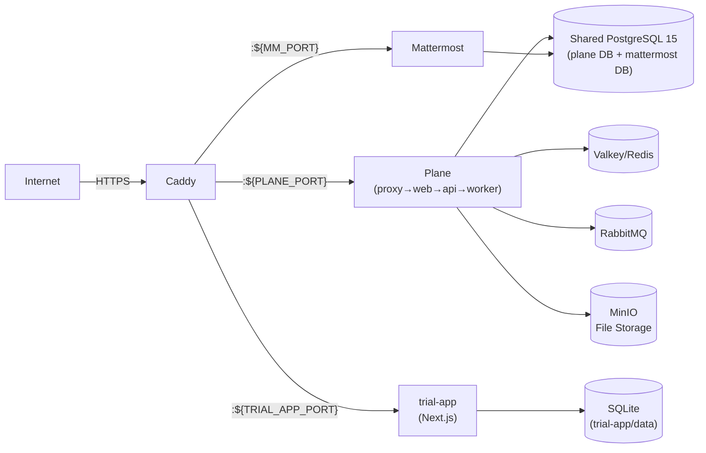

# Genasis Server Setup Guide

> Plane + Mattermost + Caddy — 하나의 docker-compose로 전체 서버 스택 배포.

## Prerequisites

- Docker Engine 24+ & Docker Compose v2
- 도메인 2개 (예: `plane.yourdomain.com`, `mm.yourdomain.com`)
- DNS A 레코드가 서버 IP를 가리키도록 설정
- 포트 80, 443 오픈 (Caddy 자동 TLS)

## Quick Start (단일 운영자)

```bash
# 1. 이 디렉토리로 이동
cd servers/

# 2. 환경 변수 자동 생성 (포트 자동 할당 + 시크릿 자동 생성)
./scripts/setup-user-env.sh
# 또는 수동: cp .env.example .env && $EDITOR .env

# 3. 서비스 기동 (Plane + Mattermost + 통합 PostgreSQL)
docker compose up -d

# 4. (선택) trial-app 같이 띄우기
cd ../trial-app && docker compose up -d

# 5. Caddy 설정 (호스트에 Caddy가 설치된 경우)
sudo cp Caddyfile /etc/caddy/Caddyfile.genasis
# /etc/caddy/Caddyfile에 `import /etc/caddy/Caddyfile.genasis` 추가
sudo systemctl reload caddy
```

## Multi-tenant — 한 호스트에서 여러 운영자가 동시 사용

ADR-015 참조. 각 운영자는 본인 계정에서 헬퍼 스크립트를 실행하면
컨테이너·네트워크·볼륨·외부 노출 포트가 자동으로 격리됩니다.

```bash
# Alice (uid 1001) 가 본인 계정에서:
cd servers/
./scripts/setup-user-env.sh
# → COMPOSE_PROJECT_NAME=genasis-alice
#   PLANE_PORT=38401  MM_PORT=38501  TRIAL_APP_PORT=3101
#   /work/.../servers/.env 와 trial-app/.env 자동 작성

docker compose up -d                                # Plane + MM
( cd ../trial-app && docker compose up -d )          # trial-app

# Bob (uid 1002) 가 본인 계정에서 동일 절차 → 자동으로
#   COMPOSE_PROJECT_NAME=genasis-bob
#   PLANE_PORT=38402  MM_PORT=38502  TRIAL_APP_PORT=3102
# 충돌 없이 공존.
```

스크립트 동작:
- `COMPOSE_PROJECT_NAME=genasis-${USER}` 으로 컨테이너/볼륨 자동 격리
- 포트 = base + (uid % 50) — `ss`/`lsof`로 점유 여부 확인 후 비어있는 다음 슬롯 자동 탐색
- `openssl rand -hex 30` 으로 모든 비밀번호·시크릿 자동 생성
- `servers/.env`와 `trial-app/.env`를 같은 `TRIAL_SHARED_SECRET` 으로 동기화 → Rust 트라이얼 프로바이더가 곧바로 본인 trial-app으로 라우팅됨

### Caddy per-user 라우팅 패턴

각 운영자가 본인 sub-도메인을 갖도록 Caddyfile 을 분리합니다.

```caddyfile
# /etc/caddy/Caddyfile (전역, root가 한 번 작성)
import /etc/caddy/sites/genasis-*.caddy
```

```caddyfile
# /etc/caddy/sites/genasis-alice.caddy (alice 전용)
alice-plane.example.com { reverse_proxy localhost:38401 }
alice-mm.example.com    { reverse_proxy localhost:38501 }
alice-trial.example.com { reverse_proxy localhost:3101 }
```

운영자별 파일을 추가/제거하면 `sudo systemctl reload caddy` 한 번으로
반영됩니다.

### ⚠️ 다중 사용자 운영 시 주의사항

1. **`COMPOSE_PROJECT_NAME` 미지정 금지** — 디렉토리명 기반 fallback 으로
   다른 운영자의 볼륨을 덮어쓰는 사고가 발생할 수 있음. 헬퍼 스크립트가
   항상 명시적으로 설정.
2. **메모리 예산** — 운영자당 ≈ **5–7GB** (plane × 12 컨테이너 + mm + 통합
   pg + redis + mq + minio). 32GB 호스트 기준 동시 4명이 한계.
3. **디스크 사용량** — 사용자별 `pg-shared-data`, `plane-uploads`, `mm-data`
   볼륨이 누적 — 첨부파일이 많으면 N×선형 증가. `docker system df` 로 추적.
4. **TLS rate limit** — 동일 등록 도메인 기준 Let's Encrypt 50 certs/주
   한도. 운영자 50명을 넘어서면 와일드카드 1장으로 회피 권장.
5. **포트 점유 사전 확인** — 헬퍼 스크립트가 자동 체크하지만 수동 편집
   시에는 `ss -tln | grep :38XXX` 로 사전 점검.
6. **백업 충돌** — 통합 PG 인스턴스가 동시에 dump 되면 잠금 발생. cron
   시각을 운영자별로 어긋나게 두거나 락파일 운영.
7. **trial-app `./data` 바인드 마운트 → 명명 볼륨 변경됨** — 기존 배포는
   `docker cp` 로 데이터 이전 필요 (마이그레이션 가이드 참조).

## Architecture



ADR-015 — Postgres 통합 결정. 두 인스턴스 → 한 인스턴스로 ~400MB
RAM 절감 + 백업 1벌. 트레이드오프와 마이그레이션 절차는
[`docs/MIGRATE-PG-CONSOLIDATION.md`](../docs/MIGRATE-PG-CONSOLIDATION.md) 참조.

## Genasis에 필요한 키 추출 방법

genasis가 Plane/Mattermost와 연동하려면 아래 키들이 필요합니다.
`genasis.toml`에 설정하거나 `.env.agents`에 환경변수로 넣습니다.

### 1. Plane API Key

```
1. 브라우저에서 https://plane.yourdomain.com 접속
2. 로그인 → 좌측 하단 프로필 아이콘 → Settings
3. API Tokens → "Create API Token"
4. Name: "genasis", Expiration: Never → Create
5. 생성된 토큰 복사 → genasis.toml의 [plane] 또는 PLANE_API_KEY 환경변수
```

### 2. Plane Workspace Slug

```
1. Plane 대시보드에서 좌측 상단 workspace 이름 확인
2. URL에서 확인: https://plane.yourdomain.com/<workspace-slug>/...
3. → genasis.toml [plane] workspace_slug = "<slug>"
```

### 3. Plane User UUID (agent별)

```
1. Plane → Settings → Members
2. 각 멤버의 프로필 → URL에서 UUID 확인
   또는 API: GET /api/v1/workspaces/<slug>/members/
3. agent별로 .env.agents에 설정:
   PLANE_USER_ID_PM=<uuid>
   PLANE_USER_ID_FRONTEND=<uuid>
   PLANE_USER_ID_BACKEND=<uuid>
   ...
```

> 💡 Plane user를 agent별로 하나씩 만들면 이슈 할당이 가능합니다.
> `genasis init`이 자동으로 생성하도록 지원합니다 (Playwright 기반).

### 4. Mattermost Bot Token (agent별)

```
1. https://mm.yourdomain.com → 시스템 콘솔 → Integrations → Bot Accounts
2. "Enable Bot Account Creation" → true
3. Integrations → Bot Accounts → "Add Bot Account"
4. Username: genasis-pm (또는 genasis-frontend 등)
5. Role: Member
6. 생성 후 "Token" 복사
7. .env.agents에 설정:
   MM_TOKEN_PM=<token>
   MM_TOKEN_FRONTEND=<token>
   ...
```

### 5. Mattermost Team ID

```
1. 시스템 콘솔 → User Management → Teams
2. 사용할 팀 클릭 → URL에서 team_id 확인
3. 또는 API: GET /api/v4/teams → id 필드
4. → MM_TEAM_ID 환경변수
```

## genasis.toml 설정 예시

```toml
[project]
name = "my-project"
domain = "myapp.com"

[plane]
url = "https://plane.yourdomain.com"
workspace_slug = "my-workspace"
flavor = "auto"

[mattermost]
url = "https://mm.yourdomain.com"
flavor = "auto"

[agents]
version = "1.0.0"
registry = "https://github.com/claude-genasis/genasis/releases"
auto_check = true
```

## Troubleshooting

| 증상 | 해결 |
|---|---|
| Caddy "permission denied" | `sudo setcap cap_net_bind_service=+ep $(which caddy)` |
| Plane 502 | `docker compose logs api` — DB migration 대기 중일 수 있음 (첫 기동 시 1-2분) |
| MM WebSocket 끊김 | Caddyfile의 WebSocket header 설정 확인 |
| Plane API 401 | API token 만료 확인. "Never" 만료로 재생성 |
| `genasis init` Playwright 오류 | `node >= 18` + `npx playwright install chromium` 필요 |
