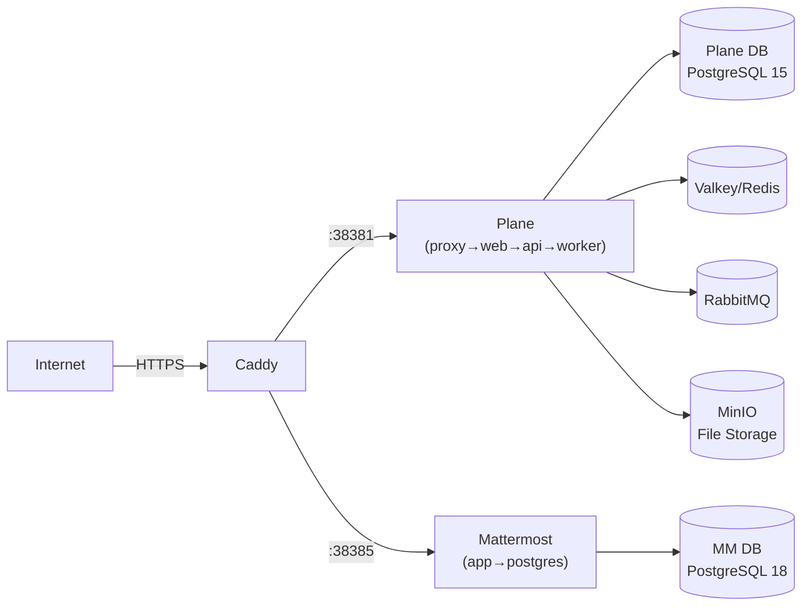

# Genasis Server Setup Guide

> Plane + Mattermost + Caddy — 하나의 docker-compose로 전체 서버 스택 배포.

## Prerequisites

- Docker Engine 24+ & Docker Compose v2
- 도메인 2개 (예: `plane.yourdomain.com`, `mm.yourdomain.com`)
- DNS A 레코드가 서버 IP를 가리키도록 설정
- 포트 80, 443 오픈 (Caddy 자동 TLS)

## Quick Start

```bash
# 1. 이 디렉토리로 이동
cd servers/

# 2. 환경 변수 설정
cp .env.example .env
# .env를 열어 도메인, 비밀번호 등 수정

# 3. 서비스 기동
docker compose up -d

# 4. Caddy 설정 (호스트에 Caddy가 설치된 경우)
sudo cp Caddyfile /etc/caddy/Caddyfile.genasis
# /etc/caddy/Caddyfile에 `import /etc/caddy/Caddyfile.genasis` 추가
sudo systemctl reload caddy
```

## Architecture



## Genasis에 필요한 키 추출 방법

genasis가 Plane/Mattermost와 연동하려면 아래 키들이 필요합니다.
`genasis.toml`에 설정하거나 `.env.agents`에 환경변수로 넣습니다.

### 1. Plane API Key

```
1. 브라우저에서 https://plane.yourdomain.com 접속
2. 로그인 → 좌측 하단 프로필 아이콘 → Settings
3. API Tokens → "Create API Token"
4. Name: "genasis", Expiration: Never → Create
5. 생성된 토큰 복사 → genasis.toml의 [plane] 또는 PLANE_API_KEY 환경변수
```

### 2. Plane Workspace Slug

```
1. Plane 대시보드에서 좌측 상단 workspace 이름 확인
2. URL에서 확인: https://plane.yourdomain.com/<workspace-slug>/...
3. → genasis.toml [plane] workspace_slug = "<slug>"
```

### 3. Plane User UUID (agent별)

```
1. Plane → Settings → Members
2. 각 멤버의 프로필 → URL에서 UUID 확인
   또는 API: GET /api/v1/workspaces/<slug>/members/
3. agent별로 .env.agents에 설정:
   PLANE_USER_ID_PM=<uuid>
   PLANE_USER_ID_FRONTEND=<uuid>
   PLANE_USER_ID_BACKEND=<uuid>
   ...
```

> 💡 Plane user를 agent별로 하나씩 만들면 이슈 할당이 가능합니다.
> `genasis init`이 자동으로 생성하도록 지원합니다 (Playwright 기반).

### 4. Mattermost Bot Token (agent별)

```
1. https://mm.yourdomain.com → 시스템 콘솔 → Integrations → Bot Accounts
2. "Enable Bot Account Creation" → true
3. Integrations → Bot Accounts → "Add Bot Account"
4. Username: genasis-pm (또는 genasis-frontend 등)
5. Role: Member
6. 생성 후 "Token" 복사
7. .env.agents에 설정:
   MM_TOKEN_PM=<token>
   MM_TOKEN_FRONTEND=<token>
   ...
```

### 5. Mattermost Team ID

```
1. 시스템 콘솔 → User Management → Teams
2. 사용할 팀 클릭 → URL에서 team_id 확인
3. 또는 API: GET /api/v4/teams → id 필드
4. → MM_TEAM_ID 환경변수
```

## genasis.toml 설정 예시

```toml
[project]
name = "my-project"
domain = "myapp.com"

[plane]
url = "https://plane.yourdomain.com"
workspace_slug = "my-workspace"
flavor = "auto"

[mattermost]
url = "https://mm.yourdomain.com"
flavor = "auto"

[agents]
version = "1.0.0"
registry = "https://github.com/claude-genasis/genasis/releases"
auto_check = true
```

## Troubleshooting

| 증상 | 해결 |
|---|---|
| Caddy "permission denied" | `sudo setcap cap_net_bind_service=+ep $(which caddy)` |
| Plane 502 | `docker compose logs api` — DB migration 대기 중일 수 있음 (첫 기동 시 1-2분) |
| MM WebSocket 끊김 | Caddyfile의 WebSocket header 설정 확인 |
| Plane API 401 | API token 만료 확인. "Never" 만료로 재생성 |
| `genasis init` Playwright 오류 | `node >= 18` + `npx playwright install chromium` 필요 |
